<div align="center">

# NodeRoom

### A live room where humans and NodeAgents edit together — without clobbering each other.

**Public room chat, a private NodeAgent, and a shared spreadsheet / note / post-it wall —
with a `lock → draft → smart-merge` model so a human and an AI agent edit the same cells
through the same versioned concurrency control.**

`multi-panel room` · `public + private agents` · `affected-range lock` · `draft-for-merge` · `per-room traces` · `live Convex + real LLM`

[Why Convex](#why-convex-and-why-not) · [Audience fluency](#audience-world-proof-artifacts) · [Lessons](#lessons-from-building-noderoom) · [Sequences](#live-collaboration-sequence) · [Why & HALO](docs/WHY_NODEAGENT_AND_HALO.md) · [Quickstart](#quickstart) · [Agent runtime](docs/AGENT_RUNTIME.md) · [Agent eval](docs/AGENT_EVAL.md) · [Model eval matrix](docs/eval/MODEL_EVAL_MATRIX.md) · [Agent wiki](docs/AGENT_WIKI.md) · [Design](docs/DESIGN.md) · [Stack](docs/STACK.md) · [Walkthrough](docs/WALKTHROUGH.md) · [Architecture](docs/ARCHITECTURE.md) · [Open gaps](docs/GAPS_NOT_DONE.md)

[Interview notes](docs/INTERVIEW_NOTES.md) · [Over-engineering audit](docs/OVERENGINEERING_AUDIT.md) · [Improvement roadmap](docs/IMPROVEMENT_ROADMAP.md) · [Operating budget](docs/OPERATING_BUDGET.md) · [Audience workloads](docs/AUDIENCE_WORKLOADS.md)

</div>

---

NodeRoom is a collaborative room where a **public room NodeAgent** and your **private NodeAgent**
work alongside humans on a shared spreadsheet, note, and post-it wall. The hard part — and the
point — is that **an agent and a human never silently overwrite each other**: every edit carries a
per-element version (CAS), an agent claims an *affected range* with a lock that makes it read-only
(but still readable as context), a blocked agent **drafts** changes around the lock, and on unlock
the draft **smart-merges** and can never clobber committed work.

It runs in **two modes from the same code**:

- **No keys** — a deterministic in-memory engine + scripted agents. `npm run demo` / `npm run dev`.
- **Live** — a real **Convex** backend (reactive, optimistic) + a server-side model-routed LLM
  agent selected by `AGENT_MODEL`. Routes are promoted by ladder evidence, not provider brand.
  Verified end-to-end: the agent locks → CAS-edits → releases on real infra and the UI
  syncs reactively.

<div align="center">

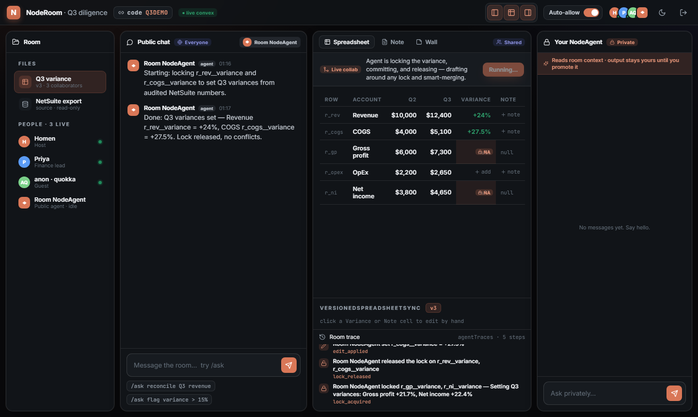

<sub>Four peer panels — <b>Room</b> (files + people) · <b>Public chat</b> + Room NodeAgent · the <b>Q3 variance
spreadsheet</b> with the live-collab bar and the <b>Room trace</b> inside · your <b>private NodeAgent</b>.
Here the real agent has filled the variance column live on Convex.</sub>

</div>

<div align="center">

### The headline, shown literally — two clients, one room, live

</div>

A change in one client appears in the other **with no refresh**, and a **server-led agent**'s work reaches **every** client. Captured **multi-pane** — one browser context per client — with the [`feature-walkthrough-gif`](https://github.com/HomenShum/feature-walkthrough-gif#live-collaboration-multi-pane) skill (a single cursor can't show cross-client sync; this can). Two angles:

**① A fresh room, from empty.** Client&nbsp;A creates a brand-new room — a Q3 sheet with an **empty variance column** — and Client&nbsp;B joins. Client&nbsp;A runs the real Room NodeAgent (`/ask reconcile Q3 revenue`); the agent fills the empty variance **live on both clients** — the clean empty→reconciled reveal:

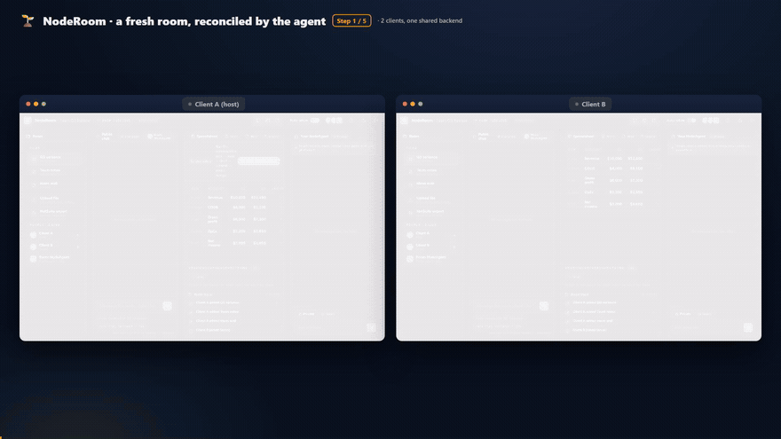

**② The busy shared room.** The same capability in the live `Q3DEMO` room (with dozens of real guests already present): a human chat message syncs A→B, then `/ask reconcile Q3 revenue` runs and its result broadcasts to all — authentic, amid real concurrent activity:


<sub>Both: <b>independent</b> browser clients (separate Convex sessions) side by side; sync is Convex reactive <code>useQuery</code>, the agent is server-led (<code>internalMutation</code> + scheduler) so its writes land on every client at once. A single-cursor screen capture can show neither — multi-pane is the only honest way to film a collaborative app.</sub>

## Watch it work — live walkthroughs

**Try it yourself → [noderoom.live](https://noderoom.live)** — join with a room code or start a
room; no account needed. **Status: live beta** on a dev Convex deployment. Production-readiness is
tracked **gate by gate** in [`docs/PRODUCTION_READINESS.md`](docs/PRODUCTION_READINESS.md): the
no-clobber spine, agent reliability, and the public-app abuse surface (prompt-injection fencing,
join rate-limits + caps, cumulative daily spend cap, telemetry retention) are **proven by tests**;
OpenRouter's live data policy, rate-limiting + lock fencing under real concurrency, and cron SLA are
**honestly marked "needs a live audit,"** which is what keeps "beta" on
([`docs/GAPS_NOT_DONE.md`](docs/GAPS_NOT_DONE.md) has the narrative).
One privacy note before you bring real data: `/free` routes work through community free-tier
models whose providers may log prompts — keep sensitive GTM/finance figures out of `/free` runs
(the paid interactive lane does not use those routes).

Every clip below is a **captured walkthrough of the real running app** (noderoom.live, live
Convex backend, real agent runs) — not a staged hero shot. You see the empty state, the cursor
glide to each click (with a ripple), the loading state, and the result, with step captions and a
progress bar. Regenerate any time with `npm run walkthroughs` (capture) + `npm run walkthroughs:render`.

### Join a live room & chat
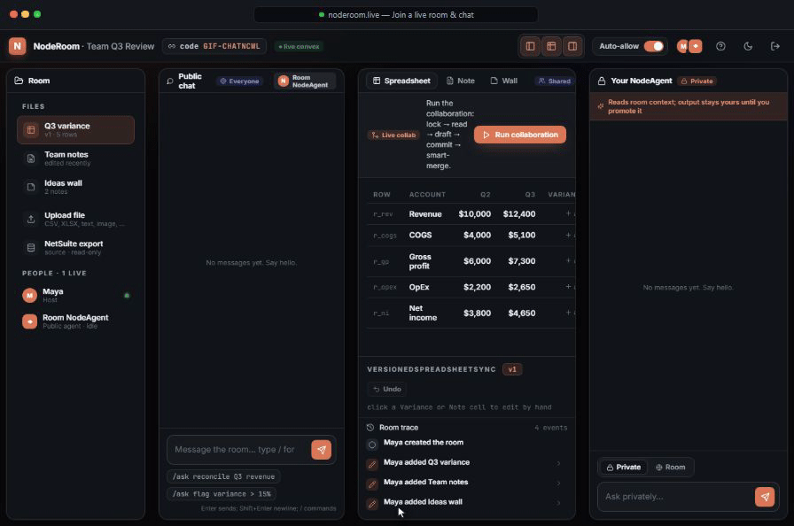

### Edit the sheet — and take it back (Undo / Ctrl+Z)


### Ask the Room agent to do the work (`/ask`)


### GTM research import — updates, never duplicates


### Review mode — approve agent edits at the cell

<sub>Live run, real LLM: with auto-allow off the agent's writes become inline proposals you approve at the cell. (Capturing this walkthrough originally exposed a real agent bug — the model was never told review mode existed and either burned its budget or quit without writing; fixed with a room-policy briefing + two harness guards. See <code>docs/dogfood/FRICTION_LOG.md</code>.)</sub>

<sub>Method: Playwright drives the live app through a versioned spec
([`scripts/walkthroughs/specs.ts`](scripts/walkthroughs/specs.ts)), captures clean per-state frames +
cursor targets into `remotion/walkthrough.data.js`, and a Remotion composition overlays the animated
cursor, captions, and progress bar. Packaged as a reusable skill:
[`.claude/skills/readme-walkthroughs`](.claude/skills/readme-walkthroughs/SKILL.md).</sub>

### Watch the narrated episodes (click a poster — plays in your browser, with sound)

Three rendered explainers are linked below, assembled from the live captures above + real code
panels, an animated mental-model diagram, and ElevenLabs narration. Current batch media QA is
tracked in `docs/eval/MEDIA_JUDGE.md`; it is publishing evidence for the assets, not a replacement
for production gates.

| The builder story (58s) | The investment-room story (42s) | The two-stacks story (50s) |
|---|---|---|
| [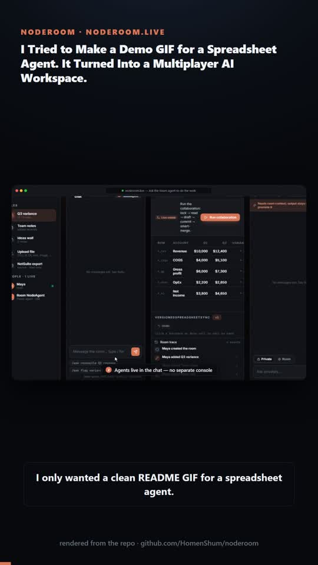](https://noderoom.live/episodes/noderoom-live-collab-v1.mp4) | [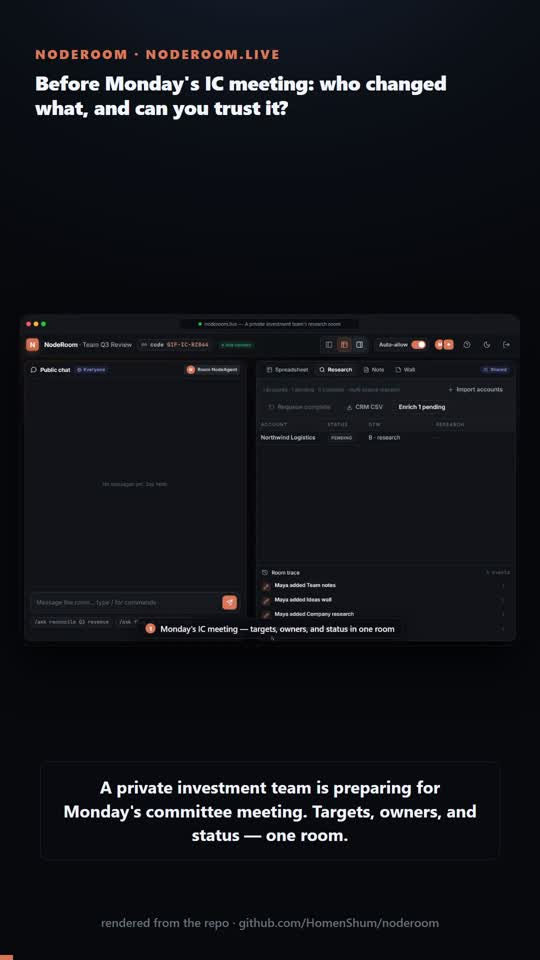](https://noderoom.live/episodes/private-investment-room-v1.mp4) | [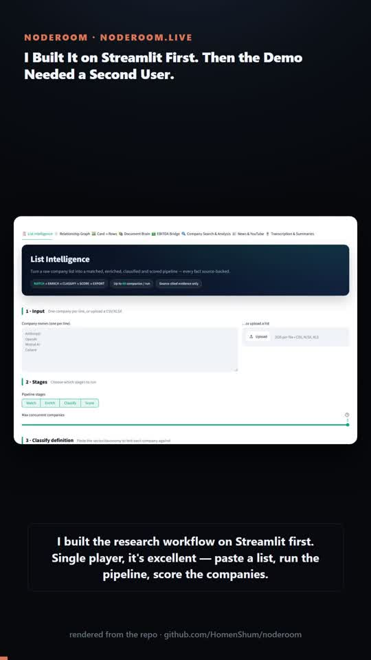](https://noderoom.live/episodes/stack-before-after-v1.mp4) |
| Naive agent clobbers a human → the code that fixes it → review mode live | A private investment team's room: provenance, proposals, versioned history — fictional data only | The REAL Streamlit baseline (ParselyFi) → where typical stacks structurally stop → the same workflow in a live room |

**Media QA.** The tracked README GIFs, workflow previews, and episode renders are
now batch-judgeable with Gemini video understanding: `npm run
media:gemini-judge -- --all`. GIFs are converted to temporary MP4 with ffmpeg,
then each asset gets a concrete verdict for clarity, visual design, consistency,
evidence quality, legibility, and professional-workflow relevance. Use
`--include-ignored` only when intentionally judging local capture intermediates.
Latest aggregate:
[`docs/eval/MEDIA_JUDGE.md`](docs/eval/MEDIA_JUDGE.md).

## Workflow Skill Previews

HALO is only useful if it changes the actual user-agent interaction, not just a
score file. Each workflow below has a visual preview, the user contract it must
preserve, and the eval/trace evidence that gates promotion. Refresh them with
`npm run workflow:previews`. Evidence levels are explicit:
`workflow-preview-gifs.ts` produces screenshot-composed workflow cards,
`render-workflow-preview.ts` produces trace replays, and `workflow:app-previews`
captures the real DOM in memory mode. A GIF is visual evidence, not a production
gate. Full evidence and research links:
[`docs/WORKFLOW_PREVIEWS.md`](docs/WORKFLOW_PREVIEWS.md).

Current media QA marks the public `/ask` spreadsheet preview and proposal/wall
preview as visual `fix-then-publish`; the workflow contracts remain documented,
but those GIFs should be rerendered before being treated as showcase assets.

### Public `/ask` Spreadsheet Reconciliation

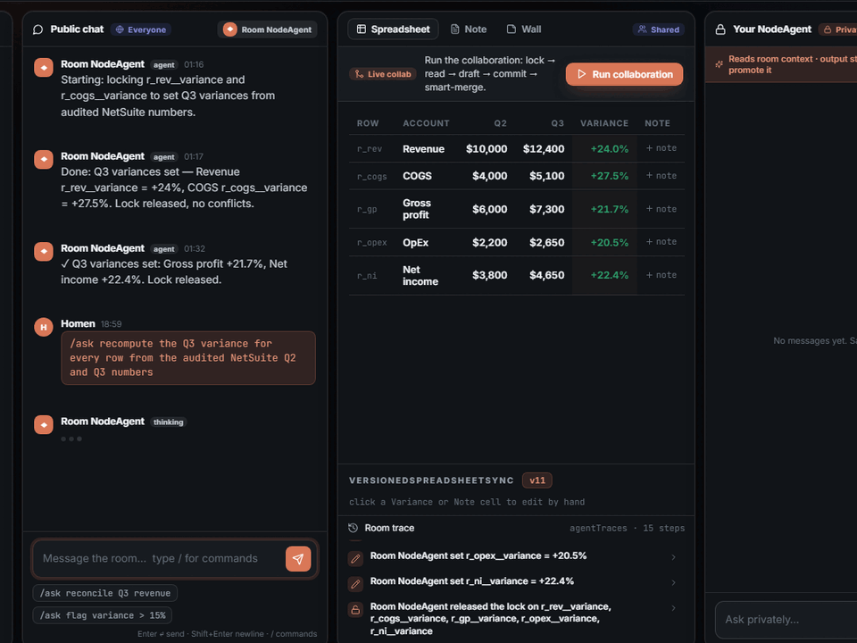

User types `/ask reconcile Q3 revenue`; the Room NodeAgent creates/reuses an
`agentJobs` root, locks exact cells, reads versions, writes with CAS, releases,
and leaves visible room trace receipts.

### GTM Research Enrichment

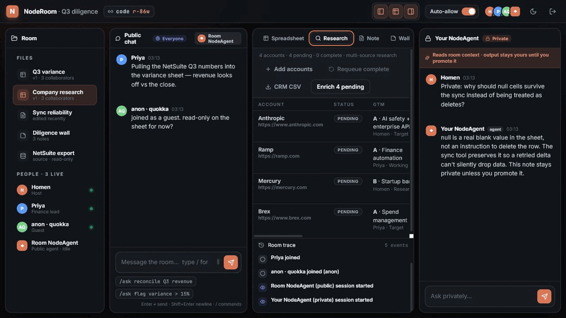

User adds or requeues accounts, then the agent enriches only pending/stale rows
with source-backed `CellPayload` values, CRM fields, citations, and freshness.

### Grounded Wiki And Note Update

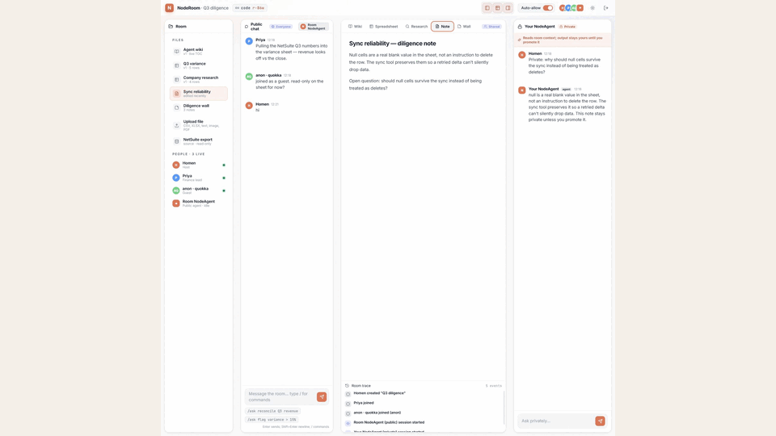

User asks for a room summary; the NodeAgent discovers artifacts, reads the
source sheet, writes a grounded note/wiki update, and keeps private context out
of public surfaces unless promoted.

### Proposal Review And Wall Collaboration

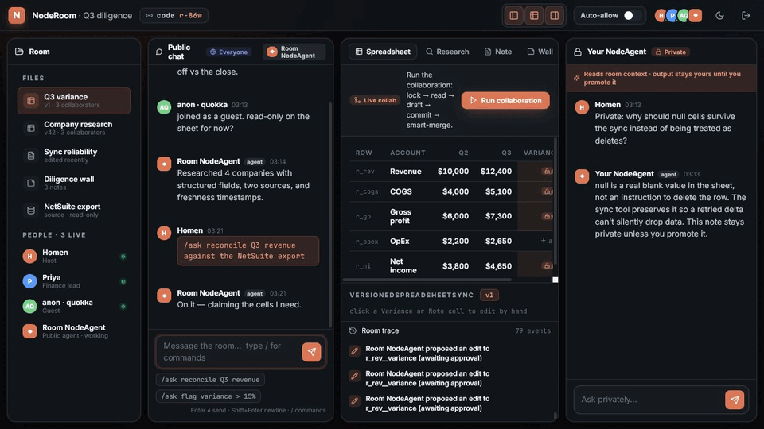

With Auto-allow off, agent writes become host-reviewed proposals. Wall edits and
approvals stay versioned artifact mutations with conflicts surfaced in the UI.

### Long-Running `/free` Job And HALO Handoff

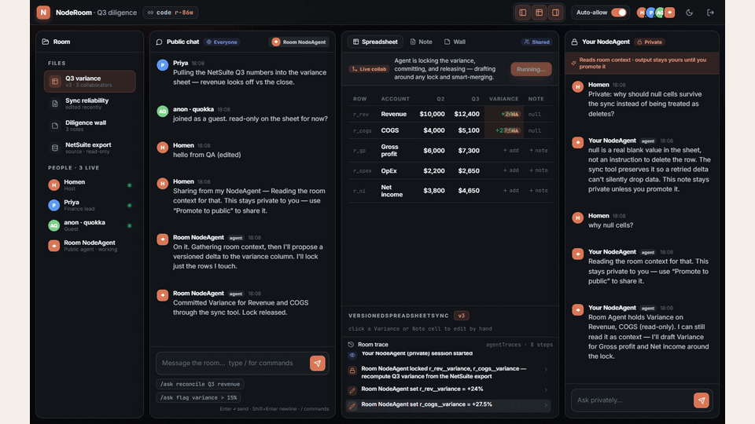

User starts slow free-auto work through `/free`; the same `agentJobs` contract
shows status, attempts, details, traces, receipts, and the HALO regression
handoff evidence.

The HALO ladder also renders trace-replayed skill previews from real ladder JSON
(`l1-read` through `l6-long-horizon`) in `docs/eval/workflow-previews/`, so a
workflow change has a small visual proof, not only a text score.

## Audience-World Proof Artifacts

NodeRoom's distribution story should not be "look at this AI workspace." The stronger proof is:
**here is what happens when high-trust teams need to coordinate research, decisions, documents,
spreadsheets, advisors, and AI without losing discretion, accuracy, provenance, or control.**
That matters for GTM sales teams and finance/banker workflows, and it matters even more for
private-client contexts where the buyer recognizes the operating texture before they trust the
software.

The repo now treats that as an eval surface, not marketing copy:

- Audience research lives in [`episodes/_audiences/`](episodes/_audiences/). The current canonical
  lane is [`family-office.yaml`](episodes/_audiences/family-office.yaml), which captures values,
  repeated questions, recognizable artifacts, product mappings, trust signals, and source notes.
- The reusable agent contract is [`docs/skills/audience-fluency/SKILL.md`](docs/skills/audience-fluency/SKILL.md):
  audience research → client-world map → scenario translation → lexicon mining → trust-signal check
  → cultural-fluency eval.
- The first affluent/private-investment scenario is
  [`episodes/private-investment-room-v1/brief.md`](episodes/private-investment-room-v1/brief.md):
  a private investment team preparing for an IC meeting, where the product proof is not "AI fills
  cells" but "who changed what, from which source, and what can the principal safely review?"
- The already-rendered generic engineering explainer is
  [`episodes/noderoom-live-collab-v1/report.md`](episodes/noderoom-live-collab-v1/report.md), with
  Gemini video-understanding judge evidence at
  [`episodes/noderoom-live-collab-v1/judge.md`](episodes/noderoom-live-collab-v1/judge.md).

Run `npm run content:fluency:check` to keep this layer honest. Current status is **yellow**:
the audience context, private-investment brief, rendered episode, and Gemini
media judge are present, but content-fluency/trust-signal review and current
media judge defects still need to be closed before it can be called
production-proven.

## Why Convex (and why not)

NodeRoom's entire product is one loop: **human edit → optimistic client store → agent action →
internal mutation → reactive query stream → every screen updates**. Convex is the only piece of
infrastructure in this repo because that loop is exactly what it sells natively: transactional
mutations (serializable OCC), reactive subscriptions over WebSockets, and a scheduler — the
pub/sub, cache-invalidation, and message-broker layers you'd otherwise hand-build. The no-clobber
spine (per-element CAS + affected-range locks + draft-merge) rides *on top* of Convex's OCC; the
database's own concurrency control protects transactions, and the app-level versions protect
*intent* — both layers are needed, and [docs/ARCHITECTURE.md](docs/ARCHITECTURE.md) shows where each one catches what.

**The pedigree is real.** Convex was built by Dropbox infrastructure veterans — Jamie Turner
(ex-Dropbox senior engineering leadership) and James Cowling, the MIT PhD (under Turing-laureate
Barbara Liskov) who architected **Magic Pocket**, the exabyte-scale storage system that moved
Dropbox off S3. They built Convex after a decade of watching every team rebuild the same
sync/invalidation machinery they'd built at Dropbox. The engine is hardened by **deterministic
simulation testing** — the database, message bus, and runtime execute in a single-threaded
simulated sandbox where network drops, clock drift, and write collisions are injected millions of
times, so race conditions are caught deterministically before release.

**And the honest trade-offs** (why it isn't everywhere, and why we accepted them):

| Trade-off | Reality | Why it's acceptable *here* |
|---|---|---|
| Runtime coupling | Schema, transactions, and functions are tied to Convex's engine — no lift-and-shift to raw SQL over a weekend | The engine seams (`RoomTools`, the in-memory `RoomEngine`) keep the collaboration logic portable; Convex is the *port*, not the *spine* |
| OLTP, not OLAP | This is a real-time transactional store; scanning billions of rows for analytics is the wrong tool | NodeRoom is the textbook OLTP case: small hot documents, high-frequency concurrent reads/writes, agents and humans interleaved |
| Enterprise adoption lag | Conservative stacks take a decade to absorb a new paradigm | A spike that exists to prove agent-collaboration patterns should optimize for iteration speed, not procurement checklists |

What this combination unlocks is the category NodeRoom lives in: **AI-augmented collaborative
canvases** — where a background agent's mutation and a human's keystroke flow through the same
transaction log and the same reactive stream, so neither ever waits on (or clobbers) the other.
The same loop powers the adjacent categories — self-healing QA sandboxes where a human corrects a
stuck agent mid-run, and multi-agent operational simulations watched by many operators — without
an enterprise-sized DevOps budget. Full stack rationale: [docs/STACK.md](docs/STACK.md).

## Lessons From Building NodeRoom

This repo is intentionally written as a learning artifact, not just a runnable
demo. The main lesson from iterating on NodeRoom is that useful professional AI
systems are mostly **harness engineering and context engineering**. The model is
allowed to reason and propose; bounded tools own mutation, versions, permissions,
traceability, file evidence, budgets, and recovery. That is the through-line from
the first lock/CAS spreadsheet demo to the current GTM, finance, file parsing,
long-running job, and QA matrix work.

The professional workflow review changed the project. A local corpus of 70
spreadsheet files became the eval backlog: 23 CSVs, 47 XLSX files, 46
GTM/company-research files, 11 finance/ops files, 47 header-level PII signals,
16 formula-bearing workbooks, and 18 merged-cell workbooks. Private rows were
not committed; the durable artifact is the workflow shape. See
[`docs/eval/PROFESSIONAL_WORKFLOW_EVALS.md`](docs/eval/PROFESSIONAL_WORKFLOW_EVALS.md)
and [`evals/professionalWorkflows.ts`](evals/professionalWorkflows.ts).

### What The Professional Files Taught

| Workflow | User job | Harness lesson |
|---|---|---|
| GTM sales / company research | Upload PitchBook, ParselyFi, JPM, sector-tagging, and AMO-style lists; classify and enrich accounts; preserve CRM fields; cite sources. | Do not let the agent write loose text. ENRICH / CLASSIFY / RESOLVE writes need `CellPayload` values with status, confidence, and evidence. |
| Finance / banker workflows | Upload spend exports, transaction files, timecards, timesheets, and income/expense templates; reconcile or populate bounded cells. | Preserve formulas and layout, skip already-correct cells, cite source rows, and mask sensitive values in public output. |
| Parser and document workflows | Work across CSV/XLSX plus PDFs, Office files, screenshots, OCR, and layout/bounding boxes. | Keep raw room files canonical; provider file ids are cache metadata. Provider extraction and LiteParse-style local parsing both normalize into evidence-bearing artifacts. |
| Long-running research / ops | Run slow free models, bulk classification, and multi-file enrichment past one action window. | Split work into budgeted slices, compact context, checkpoint state, record attempts, and resume through durable jobs rather than trusting one giant call. |
| Interview / QA workflows | Explain exactly what the agent did and how it was verified. | Treat traces, wiki updates, evals, and the QA matrix as product surfaces, not afterthoughts. |

### How The Agent Harness Evolved

1. **Prompt wrapper -> agent harness.** `src/agent/runtime.ts` is a bounded loop:
   context -> one model step -> validated tool calls -> tool results -> repeat.
   The three seams in [`src/agent/types.ts`](src/agent/types.ts) are model,
   tools, and `RoomTools`, so the same loop runs with a scripted model,
   in-memory engine, live Convex backend, and provider routes.

2. **Static prompt -> protocol plus just-in-time context.**
   [`src/agent/systemPrompt.ts`](src/agent/systemPrompt.ts) carries the rules:
   look first, claim exact ranges, edit with the version read, release, and
   narrate. [`src/agent/context.ts`](src/agent/context.ts) injects the current
   sheet, versions, locks, awareness, and artifact refs. The version tags are
   what make CAS possible.

3. **Database OCC -> app-level no-clobber.** Convex optimistic concurrency
   protects transactions, not stale intent. NodeRoom still needs per-element
   versions. A lock prevents races; CAS catches stale writes; a blocked agent
   drafts instead of forcing. The L1-L7 ladder in [`evals/ladder.ts`](evals/ladder.ts)
   makes that measurable.

4. **Scalar spreadsheet values -> evidence-bearing cell payloads.** GTM and
   finance workflows need answers users can audit. Parser extraction,
   enrichment, classification, reconciliation, and wiki/report updates carry
   source evidence back to the durable room artifact. See
   [`tests/workflowEvals.test.ts`](tests/workflowEvals.test.ts) and
   [`tests/providerParserAdapter.test.ts`](tests/providerParserAdapter.test.ts).

5. **One file id -> two identities.** Raw Convex/NodeRoom file and artifact ids
   are the system of record. Gemini/OpenAI/Claude/OpenRouter file ids are
   provider caches. This keeps permissions, provenance, and cache expiry from
   being mixed together.

6. **Chat-only UI -> room workbench.** The room now has public chat, private
   NodeAgent, clickable files, spreadsheet, note/wiki, wall, room trace,
   drag-to-chat artifact refs, proposal review, host accept-all, and host-gated
   auto-accept. The UI is not decoration; it is how humans inspect evidence and
   control agent writes.

7. **Single action -> durable sliced workflow.** Mutating or long-running agent
   commands create or reuse a durable `agentJobs` row; private read-only advise
   can stay a one-call private reply until it needs continuation or mutation.
   `/ask` runs the first slice immediately for responsive UX; if it exhausts
   step or time budget, it checkpoints cursor state and resumes through the same
   Workflow/Workpool slice runner. The continuation function is still named
   `freeAutoWorkflow` from its first use case, but it preserves the job's model
   policy, so `/ask` and `/free` share the durable contract. `/free` is a
   model-policy shortcut that forces
   `openrouter/free-auto`, not a second agent architecture. The remaining
   production hardening is stricter deadline/tool abort behavior, provider
   request idempotency where available, and model health/quarantine. See
   [`docs/LONG_RUNNING_AGENTS.md`](docs/LONG_RUNNING_AGENTS.md).

8. **Model benchmark -> model routing gate.** The cheapest model that passes a
   flat research benchmark is not automatically safe for collaboration. Live
   provider results are recorded in
   [`docs/eval/live-provider-agent-ladder-2026-06-08.md`](docs/eval/live-provider-agent-ladder-2026-06-08.md):
   provider connectivity is not the same as lock/CAS/draft safety.

9. **Ad hoc docs -> governed memory.** The wiki and docs use stable sections,
   clickable artifact refs, room-visible evidence, and private-context rules.
   The self-updating wiki skill is documented in
   [`docs/skills/self-updating-wiki/SKILL.md`](docs/skills/self-updating-wiki/SKILL.md).

10. **Manual confidence -> append-only QA ledger.** Every new user-facing
    feature, agent tool, provider route, or production invariant should update
    [`docs/qa/production-matrix.json`](docs/qa/production-matrix.json) and run
    `npm run qa:matrix`. The generated QA cockpit below is how the README stays
    honest as the system grows.

11. **One backend -> data by access pattern.** Convex/realtime state owns room
    truth, artifact versions, messages, locks, proposals, traces, and
    permissions. Object storage owns large uploads and generated exports. A hot
    cache should hold only version-keyed ephemeral data such as presence, room
    tails, recent sheet ranges, idempotency windows, and semantic answer cache.
    CDN is for static assets and explicitly public artifacts, while serverless
    actions/workers own bursty parsing, retrieval, model calls, exports, and
    evals.

12. **AI code -> simplification gate.** New architecture is treated as a first
    draft until it has a direct workflow hook, a test/eval, and a reason a
    simpler existing module cannot own it. The current watch list is in
    [`docs/OVERENGINEERING_AUDIT.md`](docs/OVERENGINEERING_AUDIT.md).

The detailed interview version of this story lives in
[`docs/INTERVIEW_NOTES.md`](docs/INTERVIEW_NOTES.md). The product support map
for the reviewed GTM and finance files lives in
[`docs/PROFESSIONAL_SPREADSHEET_WORKFLOWS.md`](docs/PROFESSIONAL_SPREADSHEET_WORKFLOWS.md).

The full **design rationale** — *every* architecture "why", the trade-offs, the live-collaboration
differences versus the past **Streamlit (ParselyFi)** and **Next.js + SSE GraphStore (MewAgent)**
projects, and the **HALO self-improvement loop** (how a replayable trace becomes a Codex / Claude Code
handoff so the agent improves its own harness, eval-gated) — lives in
[`docs/WHY_NODEAGENT_AND_HALO.md`](docs/WHY_NODEAGENT_AND_HALO.md). The founder thesis there: a solo
builder can't hand-verify every trace, but professional workflows (IB diligence, GTM sales, middle-market
banking, corporate-finance analysis, marketing) are *researchable online* — so the internet supplies the
spec, the eval supplies the contract, and the loop supplies the labor.

## Provider-Step Journal

The long-running path uses a durable model-step journal so Workflow retries do
not re-call a provider after a completed model response has already been
recorded. This is the reliability boundary behind the "run past 10 minutes"
claim: checkpoint state resumes the job, while the journal prevents duplicate
provider billing for completed steps.

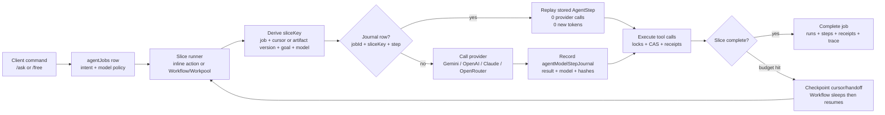
```mermaid
flowchart LR
  A["Client command<br/>/ask or /free"] --> B["agentJobs row<br/>intent + model policy"]
  B --> C["Slice runner<br/>inline action or Workflow/Workpool"]
  C --> D["Derive sliceKey<br/>job + cursor or artifact version + goal + model"]
  D --> E{"Journal row?<br/>jobId + sliceKey + step"}
  E -- "yes" --> F["Replay stored AgentStep<br/>0 provider calls<br/>0 new tokens"]
  E -- "no" --> G["Call provider<br/>Gemini / OpenAI / Claude / OpenRouter"]
  G --> H["Record agentModelStepJournal<br/>result + model + hashes"]
  F --> I["Execute tool calls<br/>locks + CAS + receipts"]
  H --> I
  I --> J{"Slice complete?"}
  J -- "yes" --> K["Complete job<br/>runs + steps + receipts + trace"]
  J -- "budget hit" --> L["Checkpoint cursor/handoff<br/>Workflow sleeps then resumes"]
  L --> C
```

The remaining edge case is a crash before the provider response is committed to
the journal; provider request idempotency keys are the next adapter-level
hardening where supported.

## Quickstart

```bash
npm install

# ── No keys: deterministic engine + scripted agents ──────────────────────────
npm run demo            # collaboration model: lock → draft → smart-merge, printed
npm run demo:agent      # the agent harness: lock-prevents vs CAS-catches, live conflict→retry
npm run eval            # the golden suite (4/4 deterministic cases)
npm run dev             # the multi-panel app (in-memory) → http://localhost:5260

# ── Live: real Convex backend + real LLM agent ───────────────────────────────
npx convex dev                                  # creates a deployment + generates types
npx convex env set AGENT_MODEL gemini-3.5-flash # or another ladder-approved route
npx convex env set GOOGLE_GENERATIVE_AI_API_KEY ... # set the key for the selected route
# Alternative route keys may include OPENAI_API_KEY, ANTHROPIC_API_KEY, or OPENROUTER_API_KEY.
npx convex env set SEED_ADMIN_TOKEN <admin-secret>
npx convex run seed:seedDemoRoom '{"adminToken":"<admin-secret>"}'
# Optional: add "hostAuthToken":"<32+ random chars, no spaces>" if you need a host browser session.
# Already seeded before member tokens? Repair in place without reseeding artifacts:
npx convex run seed:backfillDemoAuthTokens '{"adminToken":"<admin-secret>"}'
# Existing deployments with legacy raw member tokens:
npx convex run seed:migrateLegacyAuthTokens '{"adminToken":"<admin-secret>"}'
npm run dev             # now reads/writes live Convex (optimistic); the agent runs server-side

# ── Verify ───────────────────────────────────────────────────────────────────
npm run typecheck   &&   npm test   &&   npm run build      # tsc, full tests, vite build
```

## Architecture

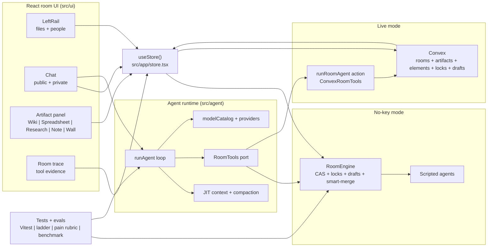
```mermaid
flowchart LR
  subgraph Client["React room UI (src/ui)"]
    LeftRail["LeftRail<br/>files + people"]
    Chat["Chat<br/>public + private"]
    ArtifactPanel["Artifact panel<br/>Wiki | Spreadsheet | Research | Note | Wall"]
    Trace["Room trace<br/>tool evidence"]
  end

  Store["useStore()<br/>src/app/store.tsx"]

  subgraph MemoryMode["No-key mode"]
    RoomEngine["RoomEngine<br/>CAS + locks + drafts + smart-merge"]
    ScriptedAgents["Scripted agents"]
  end

  subgraph LiveMode["Live mode"]
    Convex["Convex<br/>rooms + artifacts + elements + locks + drafts"]
    AgentAction["runRoomAgent action<br/>ConvexRoomTools"]
  end

  subgraph AgentRuntime["Agent runtime (src/agent)"]
    Loop["runAgent loop"]
    Context["JIT context + compaction"]
    Tools["RoomTools port"]
    Models["modelCatalog + providers"]
  end

  Evals["Tests + evals<br/>Vitest | ladder | pain rubric | benchmark"]

  LeftRail --> Store
  Chat --> Store
  ArtifactPanel --> Store
  Trace --> Store
  Store --> RoomEngine
  Store --> Convex
  RoomEngine --> ScriptedAgents
  Chat --> Loop
  Loop --> Context
  Loop --> Tools
  Loop --> Models
  Tools --> RoomEngine
  Tools --> AgentAction
  AgentAction --> Convex
  Convex --> Store
  Evals --> RoomEngine
  Evals --> Loop
```

## The three layers

```
  UI (src/ui)  ──useStore()──▶  src/app/store.tsx  ──▶  RoomEngine (in-memory)   ← no keys
                                       └──────────────▶  Convex (useQuery + CAS) ← live
  Agent (src/agent)  ──RoomTools──▶  InMemoryRoomTools  |  ConvexRoomTools (convex/)
```

1. **The collaboration engine** (`src/engine/`) — the truth. Every artifact is a bag of
   **elements** (`{ id, version, value }`), so locks, CAS, drafts, and smart-merge are **one**
   generic mechanism. Pure, deterministic, 12 scenario tests.
2. **The agent harness** (`src/agent/`) — context engineering + tool construction + a bounded loop
   with an **injectable model** (scripted or routed real provider) and a **swappable backend** (in-memory
   or Convex). Context **compaction** keeps long runs bounded. See [`docs/AGENT_RUNTIME.md`](docs/AGENT_RUNTIME.md).
3. **The store seam** (`src/app/store.tsx`) — the UI calls `useStore()`; one provider is the
   in-memory engine, the other is live Convex with **optimistic updates**. The components don't change.

## The collaboration model

- **CAS** — `applyCellEdit` checks the element `version`; a stale base returns `{conflict, expected, actual}`
  **as data, never a throw**. (Convex's OCC alone does *not* stop a stale-base clobber — the app-level version does.)
- **Lock** — `proposeLock(elementIds)` makes an affected range read-only for non-holders; reads still
  return it (**locked ≠ invisible**). The lock *prevents* races; CAS *catches* the ones with no lock.
- **Draft → smart-merge** — a blocked agent drafts around the lock; on release the draft applies on
  untouched elements, no-ops if already equal, and **flags-without-applying if diverged**. Committed work is never clobbered.
- **Auto-allow** — when OFF, agent edits become proposals for host approve/reject; humans always apply directly.

## Live collaboration sequence

This is the actual multi-user path readers should hold in their head. The
browser may paint optimistically, but Convex mutations own durable writes, the
NodeAgent writes through the same checked mutations as humans, and Workflow /
Workpool only continues a checkpointed job; it is not the source of truth.

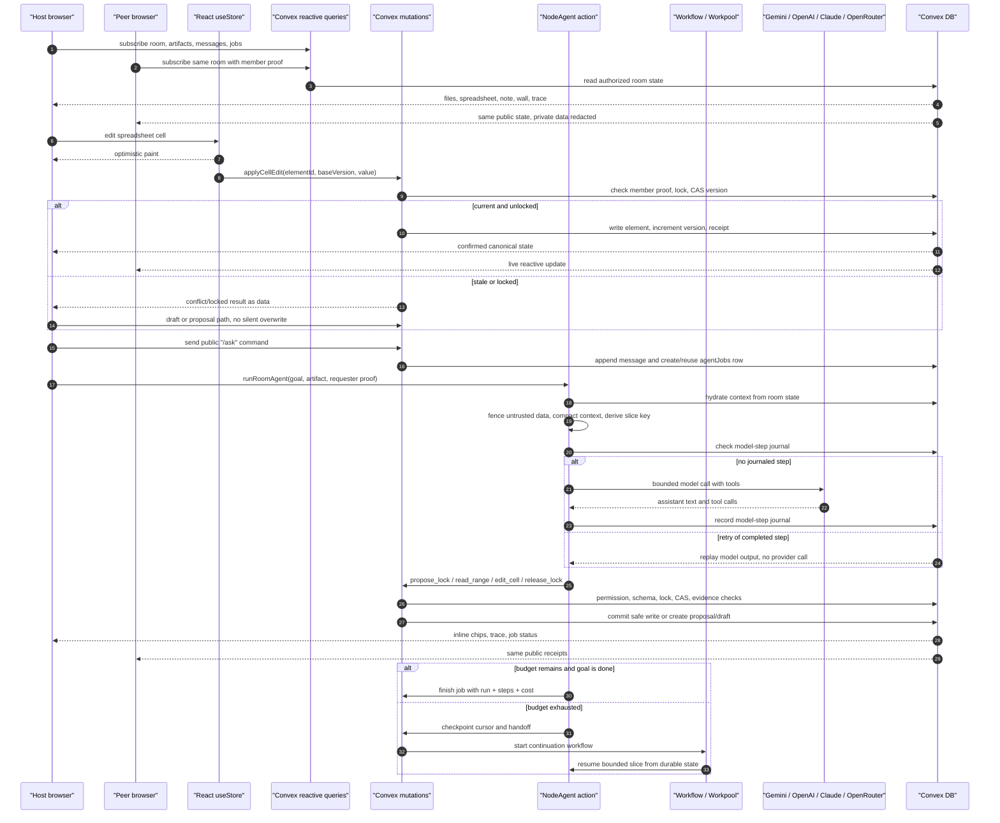
```mermaid
sequenceDiagram
  autonumber
  participant Host as "Host browser"
  participant Peer as "Peer browser"
  participant Store as "React useStore"
  participant Query as "Convex reactive queries"
  participant Mutation as "Convex mutations"
  participant Agent as "NodeAgent action"
  participant Flow as "Workflow / Workpool"
  participant LLM as "Gemini / OpenAI / Claude / OpenRouter"
  participant DB as "Convex DB"

  Host->>Query: subscribe room, artifacts, messages, jobs
  Peer->>Query: subscribe same room with member proof
  Query->>DB: read authorized room state
  DB-->>Host: files, spreadsheet, note, wall, trace
  DB-->>Peer: same public state, private data redacted

  Host->>Store: edit spreadsheet cell
  Store-->>Host: optimistic paint
  Store->>Mutation: applyCellEdit(elementId, baseVersion, value)
  Mutation->>DB: check member proof, lock, CAS version
  alt current and unlocked
    Mutation->>DB: write element, increment version, receipt
    DB-->>Host: confirmed canonical state
    DB-->>Peer: live reactive update
  else stale or locked
    Mutation-->>Host: conflict/locked result as data
    Host->>Mutation: draft or proposal path, no silent overwrite
  end

  Host->>Mutation: send public "/ask" command
  Mutation->>DB: append message and create/reuse agentJobs row
  Host->>Agent: runRoomAgent(goal, artifact, requester proof)
  Agent->>DB: hydrate context from room state
  Agent->>Agent: fence untrusted data, compact context, derive slice key
  Agent->>DB: check model-step journal
  alt no journaled step
    Agent->>LLM: bounded model call with tools
    LLM-->>Agent: assistant text and tool calls
    Agent->>DB: record model-step journal
  else retry of completed step
    DB-->>Agent: replay model output, no provider call
  end
  Agent->>Mutation: propose_lock / read_range / edit_cell / release_lock
  Mutation->>DB: permission, schema, lock, CAS, evidence checks
  Mutation->>DB: commit safe write or create proposal/draft
  DB-->>Host: inline chips, trace, job status
  DB-->>Peer: same public receipts
  alt budget remains and goal is done
    Agent->>Mutation: finish job with run + steps + cost
  else budget exhausted
    Agent->>Mutation: checkpoint cursor and handoff
    Mutation->>Flow: start continuation workflow
    Flow->>Agent: resume bounded slice from durable state
  end
```

The long form, including file/provider extraction and architecture alternatives
against client-side SSE, REST polling, CRDT/local-first, and worker-queue
designs, lives in
[`docs/LIVE_COLLABORATION_SEQUENCES.md`](docs/LIVE_COLLABORATION_SEQUENCES.md).

## The agent — runtime, context, eval

The agent is the centerpiece, built to be *explained* and *trusted*. **Type `/ask <goal>`
in the public chat to drive the Room NodeAgent end-to-end** — it claims a lock, reads, CAS-edits,
and releases, live (the real `runRoomAgent` action when on Convex; the real in-memory harness with no keys).

- **Runtime + context engineering + tool backend** → [`docs/AGENT_RUNTIME.md`](docs/AGENT_RUNTIME.md).
  Three seams (model · tools · RoomTools), the loop, the system-prompt protocol + JIT context, and
  the CAS mutation that makes "no silent clobber" true.
- **Evaluation framework** → [`docs/AGENT_EVAL.md`](docs/AGENT_EVAL.md). Who the users are, their use
  cases, the golden-case schema, single/multi/long-running references, and 10 metrics led by
  **no-silent-clobber rate**. Runnable: `npm run eval` (deterministic) / `npm run eval:real`.
- **Context compaction** (`src/agent/compaction.ts`) — elides stale `read_range` results (Claude
  "context editing" pattern), preserves the turn structure (Hermes), keeps the latest state + recent turns.
- **Library stack** (TipTap, dnd-kit, lucide, assistant-ui, the `@convex-dev/*` components) → [`docs/STACK.md`](docs/STACK.md).

<!-- QA_COCKPIT_START -->
## Production QA cockpit

This section is generated from `docs/qa/production-matrix.json`. When the system grows, append or update a matrix row, then run `npm run qa:matrix`; CI can run `npm run qa:matrix:check` to catch stale docs.

<sub>15 feature guarantees tracked | 5 green | 9 yellow | 1 red | 1 live model route(s) cleared L1-L4 in the latest recorded ladder.</sub>


| Feature area | Status | Required production gate |
|---|---|---|
| Files + spreadsheet | Yellow | Parser fixtures, provider parser adapter tests, live file preview smoke, and Convex raw-file canonicalization. |
| Public/private chat + agent | Yellow | Scope separation tests, room member proof, and browser smoke for public/private panels. |
| Trace + proposals | Green | Host-only controls, proposal resolution tests, UI consent modal, and no silent direct-write bypass. |
| Research + ops workflows | Yellow | Deterministic workflow evals pass, provider parser smoke is green, and model routes are ladder-gated before interactive promotion. |
| Notes + spreadsheet agent | Green | Cross-file RoomTools test, grounded wiki write test, and CAS conflict checks. |
| Wall | Green | Create/delete operation tests and browser smoke for Wall tab. |
| Multi-user production paths | Yellow | Room auth proof, Convex codegen/typecheck, duplicate-operation idempotency, load/concurrency smoke, and deployment observability. |
| Long-running /free jobs | Yellow | Forced multi-slice test, crash-after-checkpoint resume, duplicate stale lease rejection, and live /free smoke. |
| Provider parser | Green | Adapter separation tests, live provider smoke, redacted errors, and artifact evidence checks. |
| QA system | Green | Matrix schema tests plus qa:matrix --check as a docs-sync drift gate, not a quality gate. |
| Browser E2E dogfood | Red | Playwright or equivalent real-browser specs for two-context cell edits, optimistic chat failure/retry, public/private leak checks, wall CRUD, job controls, and proposal conflict feedback. |
| Unified NodeAgent jobs | Yellow | Interactive /ask and /free both create or reuse agentJobs, artifact writes emit receipts, job details are browser-visible, notebook graph mutations enqueue embeddings, and live browser/backend smoke proves linked runs/steps. |
| Agent improvement loop | Yellow | Deterministic loop passes, live provider/Convex/UI media lanes run when keys are present, and failures generate a handoff before chart promotion. |
| Demo/media evidence quality | Yellow | Gemini 3.5 Flash batch-judges every GIF/MP4 after capture/render refresh; P0 defects block publishing and P1 defects stay visible until fixed. |

| Live route | Provider | L1 | L2 | L3 | L4 | Promotion call |
|---|---|---:|---:|---:|---:|---|
| `gemini-3.5-flash` | Gemini | PASS | PASS | PASS | PASS | eligible for interactive collaboration promotion after repeated runs |
| `gpt-5.4-mini` | OpenAI | PASS | PASS | FAIL | PASS | parser/read-only/background until conflict rung passes |
| `claude-haiku-4-5` | Anthropic | PASS | PASS | PASS | FAIL | parser/read-only/background until blocked-range rung passes |
| `openai/gpt-4o-mini` | OpenRouter | PASS | PASS | PASS | FAIL | parser/read-only/background until blocked-range rung passes |
| `openrouter/free-auto` | OpenRouter free-auto router | PASS | FAIL | PASS | TIMEOUT | opt-in /free only; hit step budget on L2 despite correct value/provenance and timed out L4 |
| `openrouter/free-auto top-5 candidates` | OpenRouter router-expanded ladder | PASS | PASS | PASS | TIMEOUT | not promotable; summarizes routed top free candidates, see concrete rows |
| `nvidia/nemotron-3-super-120b-a12b:free` | OpenRouter free candidate | PASS | PASS | PASS | TIMEOUT | best free candidate for /free; not interactive because L4 times out |
| `nvidia/nemotron-3-ultra-550b-a55b:free` | OpenRouter free candidate | FAIL | FAIL | FAIL | FAIL | do not route; invalid JSON in live ladder |
| `qwen/qwen3-coder:free` | OpenRouter free candidate | FAIL | FAIL | FAIL | FAIL | do not route; provider retry errors in live ladder |
| `openrouter/owl-alpha` | OpenRouter free candidate | FAIL | FAIL | PASS | FAIL | not safe; mutates during read and misses required draft |
| `qwen/qwen3-next-80b-a3b-instruct:free` | OpenRouter free candidate | FAIL | FAIL | FAIL | FAIL | do not route; provider retry errors in live ladder |
| `gpt-5.4-nano` | OpenAI | PASS | FAIL | FAIL | FAIL | research benchmark winner candidate only when collaboration safety is not required |
| `gpt-5.4` | OpenAI | PASS | FAIL | PASS | PASS | requires rerun because L2 time-budget failure blocks promotion |

Research benchmark route: `deepseek/deepseek-v4-flash` is the cheapest current v3 composite-synthesis model clearing 9/9 checks at $0.0034 per run. Collaboration routing still uses the ladder gate above, not benchmark cost alone.

Full QA ledger: [`docs/PRODUCTION_GUARANTEE_MATRIX.md`](docs/PRODUCTION_GUARANTEE_MATRIX.md).
<!-- QA_COCKPIT_END -->

## The collaboration ladder (L1–L7)

**Captured live from the running app.** These are the **actual NodeRoom DOM** (memory mode),
screenshotted frame-by-frame by a Playwright run
([`e2e/capture-previews.spec.ts`](e2e/capture-previews.spec.ts) · `npm run workflow:app-previews`) —
not mockups, not slideshows.

*The Room NodeAgent fills the Q3 variance column — lock → read the version → CAS-edit → release — with the room trace updating live:*

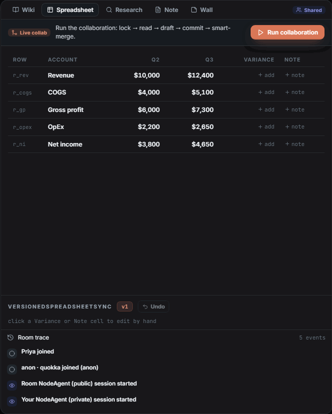

*A human edits a variance cell by hand — the same versioned CAS path the agent uses, so neither side clobbers the other:*

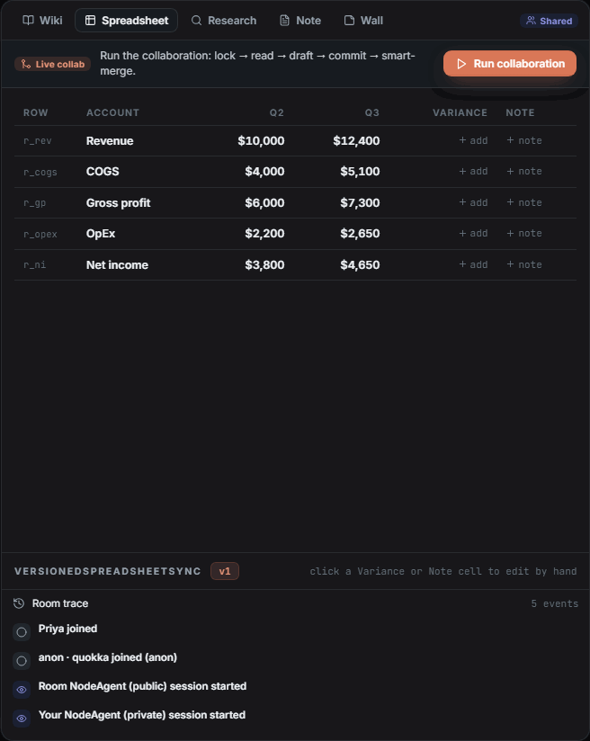

*GTM research enrichment — the agent enriches only the pending accounts with source-backed values:*

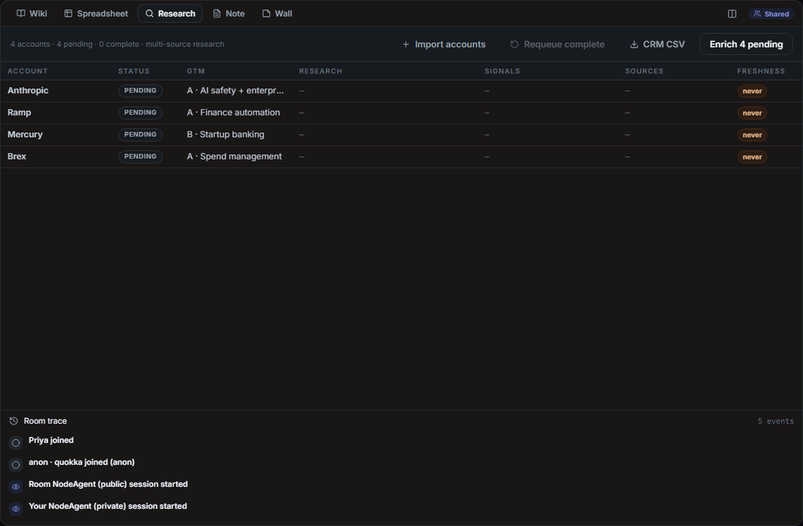

The per-rung previews below are **trace replays** — the same agent-runtime tool calls (L1–L3 from a live
`gemini-3.5-flash` run, L4/L6 from the deterministic engine) drawn into a clean sheet by
[`scripts/render-workflow-preview.ts`](scripts/render-workflow-preview.ts), so each rung has an isolated
visual of the `lock → CAS → draft → smart-merge` protocol the [HALO loop](#agent-improvement-loop)
re-verifies every cycle. The rungs L1–L7 are the [`evals/ladder.ts`](evals/ladder.ts) bar that turns
"completed" into "right tool, no clobber, in budget."

**L7 · RESUME (slice death + cold continuation)** is the newest rung and tests the promise long-running
jobs actually depend on: slice 1 gets the full task but a step budget that kills it mid-way (a real
exhaustion + handoff, not a simulated flag); while the agent is dead a human revises one of its
completed cells; slice 2 is a **fresh context** — no conversation memory, only room state and the
handoff — and must finish only the remaining targets. Pass requires: completed work untouched, the
human's between-slice revision left standing, fresh read provenance for every slice-2 edit, and no
lock shortcut. This is the rung that separates "can edit a sheet" from "can be trusted with a
checkpointed background job."

### Evidence levels

The README uses four evidence labels deliberately:

| Label | Meaning |
|---|---|
| DOM preview | Playwright captured the real NodeRoom UI, usually in memory mode, to verify the visible workflow. |
| Deterministic replay | A scripted or fixture trace replayed through the real harness without provider nondeterminism. |
| Live provider | A real model/provider produced the agent trace or media judge result. |
| Live Convex | The path crossed the deployed Convex backend and reactive clients, not only the in-memory engine. |

Promotion claims require the level named in the QA matrix; a nice GIF is not a
production gate by itself.

### L1 · Read — answer without touching

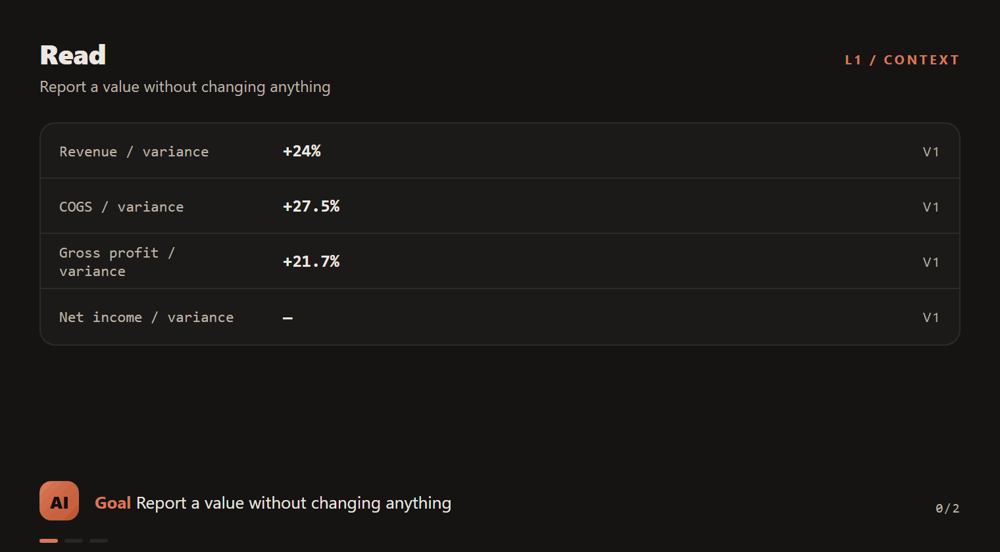

The agent reports a cell's value and changes nothing. The discipline is *not writing*: read the exact
cell, return it, stop.
**Research / repo:** just-in-time context + read-before-write — Anthropic, *Effective context
engineering for AI agents*; the scratchpad-first pattern.

### L2 · Edit with CAS — claim, read the version, compare-and-set

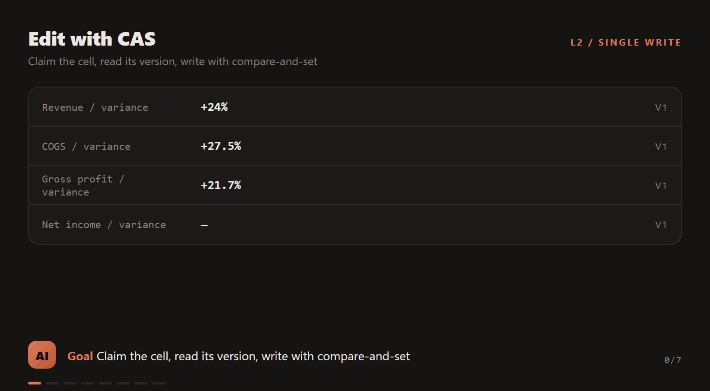

The agent locks the exact cell, reads its `version`, and writes with that version as the CAS baseline.
A write whose baseline is stale is rejected, not applied.
**Research / repo:** application-level optimistic concurrency beyond DB OCC — per-element `version` in
[`convex/schema.ts`](convex/schema.ts) + the `applyCellEdit` check; classic OCC (Kung & Robinson, 1981).

### L3 · No clobber — a human edits mid-write

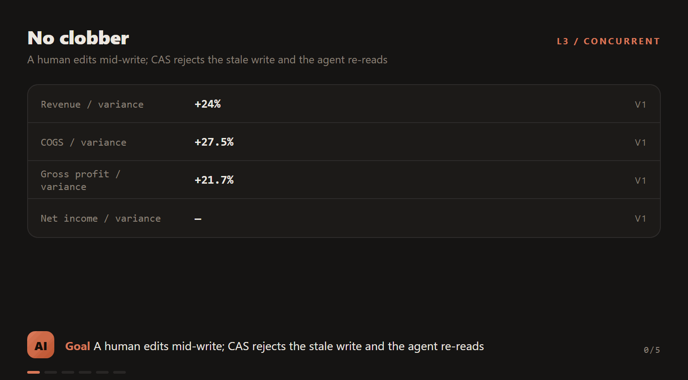

A human edits the same cell while the agent is working. The agent's stale-baseline write hits a
**conflict** — surfaced as *data*, not an exception — so it re-reads and retries. Committed human work
is never overwritten.
**Research / repo:** conflict-as-data + retry — Convex transactional OCC is necessary but not sufficient;
the per-element CAS check is what prevents the clobber.
the conflict-as-data / async-reliability pattern.

### L4 · Draft when blocked — the range is locked

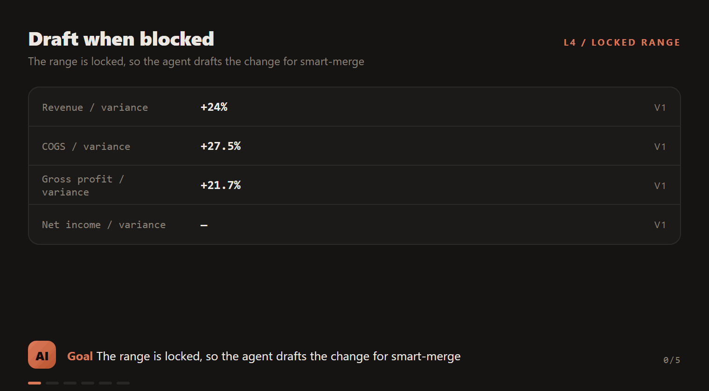

Another agent holds an affected-range lock. Instead of forcing, the agent **drafts** its change
(`create_draft`) for smart-merge on unlock, and never writes directly through the lock.
**Research / repo:** propose/draft + smart-merge over force-write — proposal/draft tables in
[`convex/schema.ts`](convex/schema.ts); the scratchpad-first pattern,
Anthropic *Building Effective Agents*.

### L5 · Large range — 600 rows, load only the window

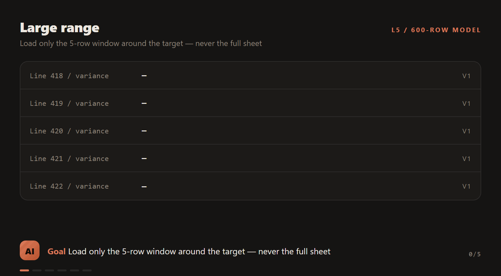

A 600-row operating model; the agent loads only the 5-row window around the target, never the full
sheet, touches only the allowed cell, and stays inside a bounded context budget.
**Research / repo:** just-in-time context windows over full-snapshot loading — `rangeContext` in
[`evals/ladder.ts`](evals/ladder.ts); Anthropic *Effective context engineering*.

### L6 · Long horizon — many cells, repeated conflicts, compaction

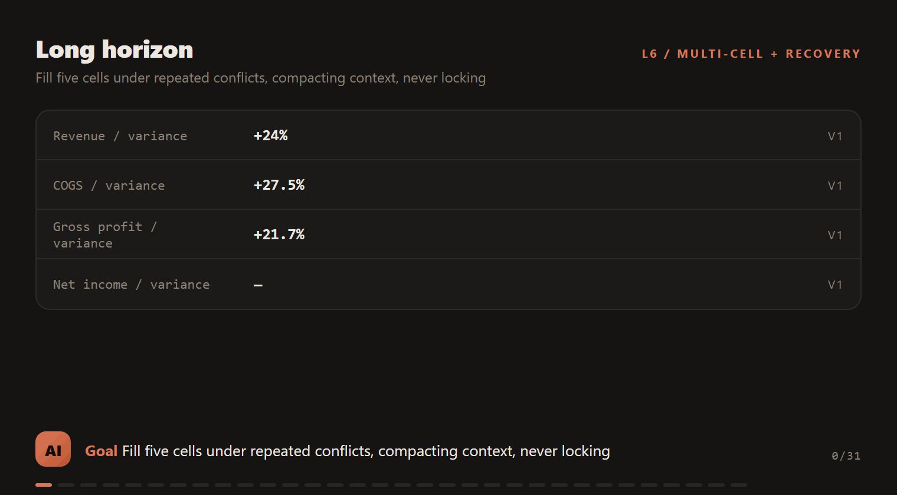

Fill five cells under repeated concurrent edits, **compacting context** as the window fills, recovering
from each conflict, never locking, all inside a wall-clock budget.
**Research / repo:** orchestrator durability + context compaction —
the orchestrator-workers pattern,
the layered-memory pattern; Anthropic *Effective context engineering*.

> The previews replay genuine agent-runtime traces (the tool protocol + CAS results are real).
> Live provider evidence exists for selected L1-L4 routes; the free-auto/top-5 router ladder
> failed overall. L5-L6 preview evidence is deterministic unless a separate live run is recorded.

## Agent improvement loop

NodeRoom uses the same loop described in OpenAI's Agents SDK cookbook: real traces, human/model
feedback, reusable evals, a validation gate, and a Codex handoff — then it repeats.

**HALO — Hierarchical Agent Loop Optimization**

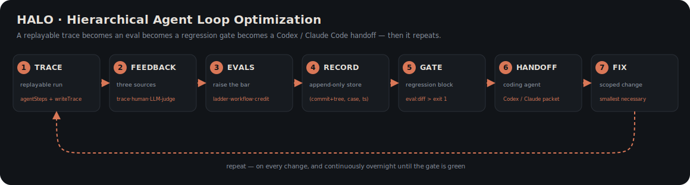

| # | Stage | What happens | Where in this repo |
|---|---|---|---|
| 1 | **Trace** | every agent run records a replayable trace (tools, args, results, versions) | `writeTraceArtifact` (`evals/ladder.ts`) · `agentSteps` (convex) |
| 2 | **Feedback** | three sources score the run: trace signals, human, LLM-judge | trace checks · review · judge |
| 3 | **Evals** | each rung raises the bar from "completed" to "right tool, no clobber, in budget" | `evals/ladder.ts` (L1–L7) · `tests/workflowEvals.test.ts` · `evals/creditEval.ts` |
| 4 | **Record** | append-only store keyed by `(commit + worktree, case, ts)` with per-check booleans + trace ref | `evals/evalStore.ts` → `docs/eval/eval-runs.jsonl` |
| 5 | **Gate** | cross-version diff names the degraded case **and the exact check that broke** | `npm run eval:diff` (exit 1 on regression) |
| 6 | **Handoff** | the failing trace + ranked recommendations become a Codex / Claude Code packet | [`docs/WHY_NODEAGENT_AND_HALO.md`](docs/WHY_NODEAGENT_AND_HALO.md) handoff contract |
| 7 | **Fix** | the smallest necessary workflow/harness change lands; previews refresh if user interaction changed; the loop re-gates | `npm run workflow:previews` · back to stage 1 |

The repo-owned runner is:

```bash
npm run agent:improve              # deterministic workflow + ladder evidence
npm run agent:improve -- --live    # add provider parser, free route discovery, Convex /free smoke
npm run agent:improve -- --full-live
npm run agent:improve -- --ui-media=docs/eval/ui-recordings/<recording-or-screenshot>
```

Run the whole loop continuously until a clock deadline. Deterministic-only is the default safe overnight
shape; full-live adds provider spend, the current benchmark contract, and the free-auto router ladder:

```bash
npm run halo:overnight -- --skip-e2e --skip-live --until "2026-06-09T17:00:00Z" --sleep-minutes 25
npm run halo:overnight -- --full-live --ui-media=docs/eval/ui-recordings/live-ui-walkthrough-20260608.mp4 --until "2026-06-09T17:00:00Z" --sleep-minutes 30
npm run halo:supervise -- -Until "2026-06-10T17:00:00Z" -PollSeconds 300
npm run halo:status -- --strict --require-supervisor
npm run halo:status -- --strict --require-supervisor --record
npm run halo:snapshots
```

Each cycle writes `docs/eval/halo-runs/<runId>/status.json` (live state) and `summary.jsonl` (every step of every cycle).
The runner also maintains `docs/eval/halo-runs/.active-run.json`; a second runner exits before writing
run artifacts while a live lock points at an active process.
The supervisor waits behind the active lock, then starts the next deterministic
loop through the handoff deadline, so a long full-live run can finish without a
duplicate writer and coverage still continues afterward.
The Windows cron wrapper checks for an existing supervisor before launch, so
scheduled fires do not create short-lived duplicate supervisors.
The strict status command is the handoff guard: it reports lock age, deadline,
latest events, router-ladder artifact state, active process tree, and supervisor
liveness, and exits nonzero if coverage is missing or duplicated.
Add `--record` to append the same report to
`docs/eval/halo-runs/status-snapshots.jsonl` for the handoff trail.
`npm run halo:snapshots` renders the JSONL trail to
`docs/eval/halo-runs/status-snapshots.md`.
Current overnight run notes: [`docs/eval/HALO_OVERNIGHT_RUN.md`](docs/eval/HALO_OVERNIGHT_RUN.md).

Live run status (regenerated every loop) — each bar is one loop step:

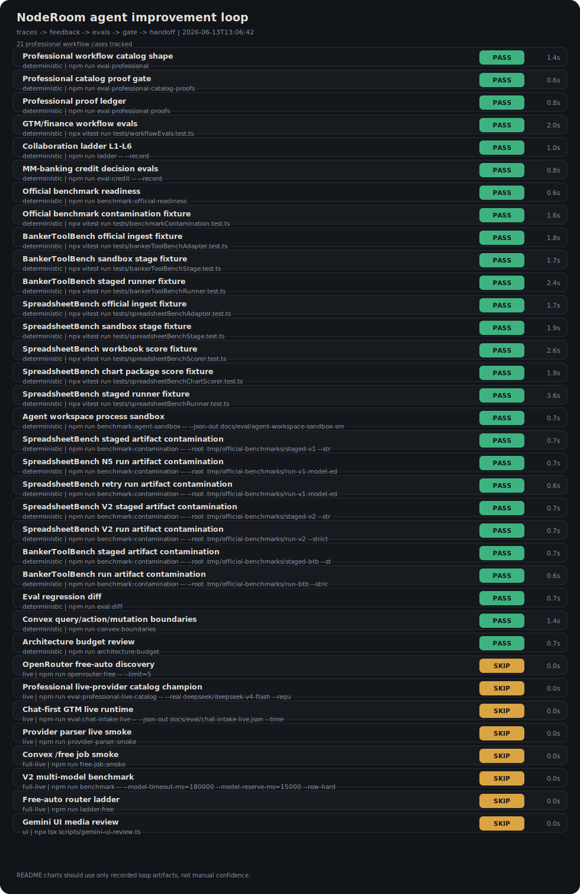

Latest loop report: [`docs/eval/agent-improvement-loop.md`](docs/eval/agent-improvement-loop.md).
The full founder-level rationale, past-project comparison, and HALO handoff contract live in
[`docs/WHY_NODEAGENT_AND_HALO.md`](docs/WHY_NODEAGENT_AND_HALO.md).
Architecture ownership/budget gate: `npm run architecture:budget -- --strict`.

## Benchmark Harness / v3 Composite-Synthesis Run

The agent is model-agnostic (one `AgentModel` seam), so the diligence-research task can run across
providers and the cheapest model that clears the **boolean gate** wins. Providers are routed by
**NodeBench's `modelCatalog.ts`** (copied verbatim — reuse, not reinvent), reaching cheap + free
models through OpenRouter's OpenAI-compatible endpoint. The checked-in `docs/eval/results.json`
is the latest verified run of the listed routes, not proof that all models and all scenarios were
rerun.

**The charts are downstream of a real run — never hand-drawn.** `npm run benchmark` writes
`docs/eval/results.json` (real $/latency/tokens from `agentRuns`, real pass% from deterministic
checks); `npm run benchmark:charts` renders these SVGs from it. Reproduce it yourself.

**Why v3 exists (an honest history).** Two earlier benchmark generations were invalidated on
review and are not comparable to v3: the v1 low-level runs executed with a broken fetch path
(every `fetch_source` failed, so two checks measured the network, not the model), and the v2
single-call composite let a deterministic harness template author the row fields — every check
graded our own code, and a content-free "no claim asserted" template passed `NO_FABRICATION`
vacuously. v3 (`company-research-v3-composite-synthesis`) splits the workflow so each layer is
measured for what it owns: a **fetch preflight** aborts before any model spend if the environment
cannot fetch; `fetch_row_sources` (harness) locks the row and returns fenced source snippets;
**the model synthesizes the four research fields in its own words**; `write_row` (harness)
validates with zod and does the CAS writes, citations, freshness, status, and lock release. A
**content floor** in `STRUCTURED_FIELDS` rejects both disclaimer-shaped non-answers and
from-memory text with no derivation from the fetched evidence, and the LLM judge grades the
model-authored summaries against the actual fetched snippets.

Latest verified v3 run (3 companies, per-row trace refs in `docs/eval/traces/benchmark/`):

| Route | Gate | Cost/run | Time | What the gate saw |
|---|---|---|---|---|
| `deepseek/deepseek-v4-flash` | **9/9** | $0.0034 | 91s | Real grounded synthesis on every row ("Anthropic is an AI safety and research company best known for creating Claude…") |
| `openrouter/free-auto` → `nemotron-3-super-120b:free` | 7/9 | $0.0000 | 216s | Failed `STRUCTURED_FIELDS` + `NO_FABRICATION`: wrote "the snippets do not contain a description…" — the exact disclaimer-shaped non-answer the content floor exists to reject |

That contrast is the point: the gate now **differentiates synthesis quality** instead of grading
harness choreography. The cheapest route clearing the full gate is promotion evidence for the
background research workflow only; collaboration routing still uses the lock/CAS/draft ladder.
Run `npm run benchmark` or `npm run benchmark:free` to refresh it.

The broader supported-model bakeoff is tracked separately in
[`docs/eval/MODEL_EVAL_MATRIX.md`](docs/eval/MODEL_EVAL_MATRIX.md). Dry-run the
whole route/scenario plan with `npm run eval:model-matrix -- --json-out
docs/eval/model-eval-matrix-plan.json`; run it live with
`npm run eval:model-matrix:live` when you intentionally want the full
OpenRouter/native route spend. That matrix covers the v3 research task plus
L1-L4 collaboration scenarios, so a model cannot be promoted from research
quality alone.

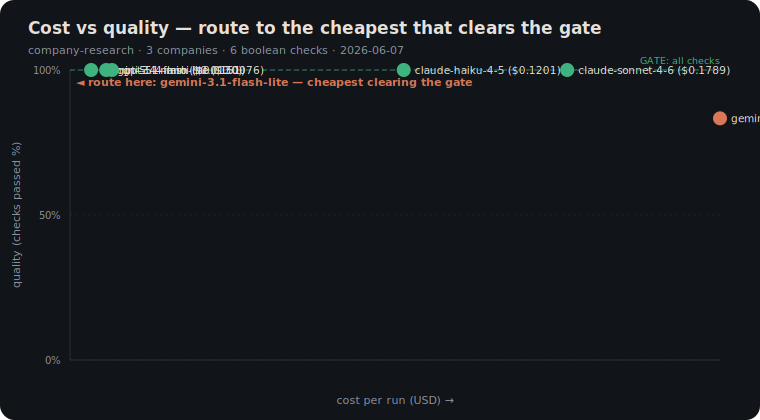
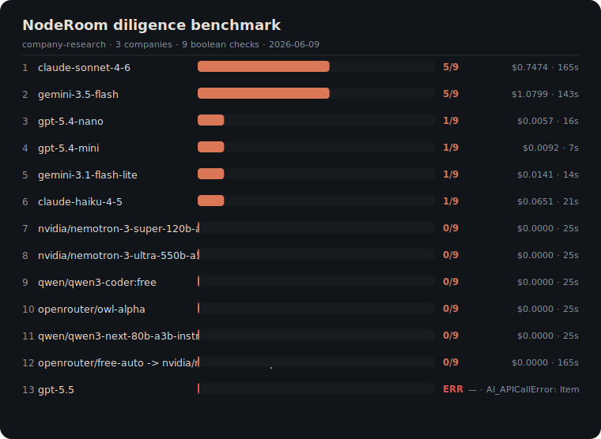

Legacy run (`company-research`, older deterministic checks: `ALL_COMPLETE · EVERY_ROW_SOURCED ·
SOURCES_FETCHED · COMPLETED_IN_BUDGET`):

Legacy models, cheapest → priciest. **6 boolean checks** — 4 deterministic (complete · sourced ·
fetched-not-invented · in-budget) + 2 **LLM-judge** (`NO_FABRICATION`, `RIGHT_ENTITY`, judged by
`gemini-3.1-flash-lite`, calibrated to flag only invented *specifics* — synthesis is the product,
not hallucination, per `grounded_eval`):

| model | provider | checks | $/run | latency |
|---|---|---|---|---|
| `gemini-3.1-flash-lite` | Google | **6/6 ✓** | **$0.0076** | 10 s |
| `gpt-5.4-nano` | OpenAI | 6/6 ✓ | $0.0130 | 60 s |
| `gpt-5.4-mini` | OpenAI | 6/6 ✓ | $0.0151 | 15 s |
| `claude-haiku-4-5` | Anthropic | 6/6 ✓ | $0.1201 | 34 s |
| `claude-sonnet-4-6` | Anthropic | 6/6 ✓ | $0.1789 | 44 s |
| `gemini-3.5-flash` | Google | 5/6 ✗fabrication | $0.2339 | 58 s |

**Legacy routing call (pre-v2 benchmark):** `gemini-3.1-flash-lite` wins outright — **cheapest
($0.0076), fastest (10 s), 6/6**. The *priciest* model, `gemini-3.5-flash` ($0.2339), is the
**only one that fabricated a specific** not in its sources — dominated on both axes. More expensive
≠ better; route to the cheapest that clears the gate. (That's the LLM-judge earning its place — the
4 deterministic checks alone scored everyone 6/6.)

**Honest caveat (first-principles):** the research run above is a *floor* task — summarize
well-documented companies — so quality is near-saturated (5 of 6 perfect) and **cost dominates**.
A quality-*spread* benchmark needs the **task ladder** below.

### Task ladder - where models actually diverge

`npm run ladder:real` runs each model up a complexity ladder (the spec's keystone): read,
edit, conflict-recovery, blocked-must-draft, large range, and long-horizon recovery. It prints
a failure heatmap that a single-task chart cannot show (`evals/ladder.ts`):

```
model                     L1  L2  L3  L4  L5  L6
scripted                  ok  ok  ok  ok  ok  ok
<real model>              ok  ok  ok  no  ... ...
```

L1 read-only; L2 single CAS edit; L3 concurrent-edit no-clobber; L4 locked-range must-draft;
L5 large-sheet range discipline; L6 compaction plus repeated conflict recovery.

**The finding the flat benchmark hid:** `gemini-3.1-flash-lite` *won* the research benchmark
outright (cheapest, fastest, 6/6), but it **fails L4**: when another agent holds the lock it
doesn't draft, it forces. So the routing call is
*task-dependent*: cheapest model for solo work, a collaboration-safe model once edits contend.
That safety tradeoff is invisible on a cost-quality chart and obvious on the ladder. **A good
model isn't the smartest-sounding one; it's the cheapest that safely completes the hardest level
without corrupting shared state.**

The **notebook / cross-collaboration / risk-attack** harnesses are the sequenced next milestones;
the full task-ladder spec is in [`docs/AUDIT.md`](docs/AUDIT.md).

**Diagnosis wins (analyst, not guesswork — each found by the `probe.ts`, then fixed):**
- **Gemini 3.x thinking models** (`gemini-3.5-flash`, `gemini-3.1-flash-lite`) first failed —
  *"function call missing a thought_signature"*. They require their `thought_signature`
  round-tripped across tool turns; the harness now preserves provider metadata per tool call
  (`ToolCall.providerMetadata` → replayed in `toSdkMessages`). 2.5-class models don't need it.
- **`claude-*` 404'd locally** with a valid key → a stale shell `ANTHROPIC_BASE_URL` missing
  `/v1`; the runner now loads `.env.local` first (`loadEnv.ts`) so providers capture the right URL.
- Earlier: AI-SDK **version skew** (pinned providers to v2), OpenRouter **Responses→`.chat()`**,
  OpenRouter **lazy key** capture.

**Still open (documented, not hidden):**
- **`gpt-5.5`** (flagship *reasoning* model) hits the OpenAI-Responses-API analog of the Gemini
  issue — a `function_call` needs its reasoning item round-tripped. The metadata round-trip needs
  extending to OpenAI's reasoning path; the **GPT-5.4 tier works clean**.
- **OpenRouter free tier** is task-dependent. It is useful for explicit `/free`
  and budgeted background experiments, but the current v3 GTM research
  benchmark keeps it at 7/9 because it fails the content floor, and the live
  L1-L4 lock/CAS/draft ladder times out or fails on blocked-range behavior. Do
  not promote it as the default shared-room editor.

Model ids are **discovery-verified** (parallel subagents + a live probe corrected
`claude-*.5`→`claude-*-5`, dropped shut-down `gemini-3.1-flash-lite-preview`, added
`gemini-3.5-flash` / `gpt-5.5`). `modelCatalog.ts` is the single source of truth.

## Repo structure

```
noderoom/
├── src/
│   ├── engine/    # collaboration engine — CAS · lock · draft · smart-merge (pure, tested)
│   ├── agent/     # agent harness — context · tools · runtime · model seam · compaction · plans
│   ├── app/       # store (engine | Convex seam) · roomStore · main · styles
│   └── ui/        # Landing · RoomShell · Chat · Artifact · LeftRail
├── convex/        # live backend — schema + rooms · artifacts(CAS) · locks · drafts · messages · the agent action
├── evals/         # golden cases + the eval runner
├── demo/          # CLI: collaboration demo + agent demo
├── tests/         # 20 scenarios — engine · agent runtime · compaction
└── docs/          # AGENT_RUNTIME · AGENT_EVAL · DESIGN · STACK · WALKTHROUGH · ARCHITECTURE
```

## License

MIT © [Homen Shum](https://github.com/homenshum). Distilled from NodeBench AI / ScratchNode.
