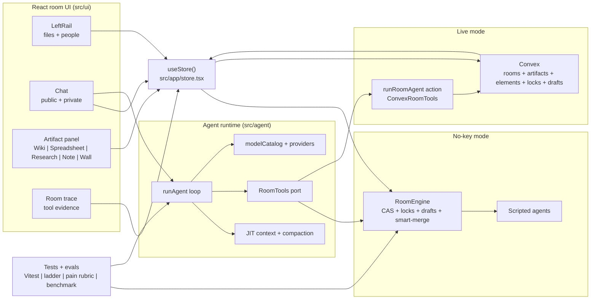

<div align="center">

# NodeRoom

### A live room where humans and NodeAgents edit together — without clobbering each other.

**Public room chat, a private NodeAgent, and a shared spreadsheet / note / post-it wall —
with a `lock → draft → smart-merge` model so a human and an AI agent edit the same cells
through the same versioned concurrency control.**

`multi-panel room` · `public + private agents` · `affected-range lock` · `draft-for-merge` · `per-room traces` · `live Convex + real LLM`

[Lessons](#lessons-from-building-noderoom) · [Quickstart](#quickstart) · [Agent runtime](docs/AGENT_RUNTIME.md) · [Agent eval](docs/AGENT_EVAL.md) · [Agent wiki](docs/AGENT_WIKI.md) · [Design](docs/DESIGN.md) · [Stack](docs/STACK.md) · [Walkthrough](docs/WALKTHROUGH.md) · [Architecture](docs/ARCHITECTURE.md) · [Open gaps](docs/GAPS_NOT_DONE.md)

[Interview notes](docs/INTERVIEW_NOTES.md)

</div>

---

NodeRoom is a collaborative room where a **public room NodeAgent** and your **private NodeAgent**
work alongside humans on a shared spreadsheet, note, and post-it wall. The hard part — and the
point — is that **an agent and a human never silently overwrite each other**: every edit carries a
per-element version (CAS), an agent claims an *affected range* with a lock that makes it read-only
(but still readable as context), a blocked agent **drafts** changes around the lock, and on unlock
the draft **smart-merges** and can never clobber committed work.

It runs in **two modes from the same code**:

- **No keys** — a deterministic in-memory engine + scripted agents. `npm run demo` / `npm run dev`.
- **Live** — a real **Convex** backend (reactive, optimistic) + a real **Anthropic** agent running
  server-side. Verified end-to-end: the agent locks → CAS-edits → releases on real infra and the UI
  syncs reactively.

<div align="center">


<sub>Four peer panels — <b>Room</b> (files + people) · <b>Public chat</b> + Room NodeAgent · the <b>Q3 variance
spreadsheet</b> with the live-collab bar and the <b>Room trace</b> inside · your <b>private NodeAgent</b>.
Here the real agent has filled the variance column live on Convex.</sub>

</div>

## Lessons From Building NodeRoom

This repo is intentionally written as a learning artifact, not just a runnable
demo. The main lesson from iterating on NodeRoom is that useful professional AI
systems are mostly **harness engineering and context engineering**. The model is
allowed to reason and propose; bounded tools own mutation, versions, permissions,
traceability, file evidence, budgets, and recovery. That is the through-line from
the first lock/CAS spreadsheet demo to the current GTM, finance, file parsing,
long-running job, and QA matrix work.

The professional workflow review changed the project. A local corpus of 70
spreadsheet files became the eval backlog: 23 CSVs, 47 XLSX files, 46
GTM/company-research files, 11 finance/ops files, 47 header-level PII signals,
16 formula-bearing workbooks, and 18 merged-cell workbooks. Private rows were
not committed; the durable artifact is the workflow shape. See
[`docs/eval/PROFESSIONAL_WORKFLOW_EVALS.md`](docs/eval/PROFESSIONAL_WORKFLOW_EVALS.md)
and [`evals/professionalWorkflows.ts`](evals/professionalWorkflows.ts).

### What The Professional Files Taught

| Workflow | User job | Harness lesson |
|---|---|---|
| GTM sales / company research | Upload PitchBook, ParselyFi, JPM, sector-tagging, and AMO-style lists; classify and enrich accounts; preserve CRM fields; cite sources. | Do not let the agent write loose text. ENRICH / CLASSIFY / RESOLVE writes need `CellPayload` values with status, confidence, and evidence. |
| Finance / banker workflows | Upload spend exports, transaction files, timecards, timesheets, and income/expense templates; reconcile or populate bounded cells. | Preserve formulas and layout, skip already-correct cells, cite source rows, and mask sensitive values in public output. |
| Parser and document workflows | Work across CSV/XLSX plus PDFs, Office files, screenshots, OCR, and layout/bounding boxes. | Keep raw room files canonical; provider file ids are cache metadata. Provider extraction and LiteParse-style local parsing both normalize into evidence-bearing artifacts. |
| Long-running research / ops | Run slow free models, bulk classification, and multi-file enrichment past one action window. | Split work into budgeted slices, compact context, checkpoint state, record attempts, and resume through durable jobs rather than trusting one giant call. |
| Interview / QA workflows | Explain exactly what the agent did and how it was verified. | Treat traces, wiki updates, evals, and the QA matrix as product surfaces, not afterthoughts. |

### How The Agent Harness Evolved

1. **Prompt wrapper -> agent harness.** `src/agent/runtime.ts` is a bounded loop:
   context -> one model step -> validated tool calls -> tool results -> repeat.
   The three seams in [`src/agent/types.ts`](src/agent/types.ts) are model,
   tools, and `RoomTools`, so the same loop runs with a scripted model,
   in-memory engine, live Convex backend, and provider routes.

2. **Static prompt -> protocol plus just-in-time context.**
   [`src/agent/systemPrompt.ts`](src/agent/systemPrompt.ts) carries the rules:
   look first, claim exact ranges, edit with the version read, release, and
   narrate. [`src/agent/context.ts`](src/agent/context.ts) injects the current
   sheet, versions, locks, awareness, and artifact refs. The version tags are
   what make CAS possible.

3. **Database OCC -> app-level no-clobber.** Convex optimistic concurrency
   protects transactions, not stale intent. NodeRoom still needs per-element
   versions. A lock prevents races; CAS catches stale writes; a blocked agent
   drafts instead of forcing. The L1-L6 ladder in [`evals/ladder.ts`](evals/ladder.ts)
   makes that measurable.

4. **Scalar spreadsheet values -> evidence-bearing cell payloads.** GTM and
   finance workflows need answers users can audit. Parser extraction,
   enrichment, classification, reconciliation, and wiki/report updates carry
   source evidence back to the durable room artifact. See
   [`tests/workflowEvals.test.ts`](tests/workflowEvals.test.ts) and
   [`tests/providerParserAdapter.test.ts`](tests/providerParserAdapter.test.ts).

5. **One file id -> two identities.** Raw Convex/NodeRoom file and artifact ids
   are the system of record. Gemini/OpenAI/Claude/OpenRouter file ids are
   provider caches. This keeps permissions, provenance, and cache expiry from
   being mixed together.

6. **Chat-only UI -> room workbench.** The room now has public chat, private
   NodeAgent, clickable files, spreadsheet, note/wiki, wall, room trace,
   drag-to-chat artifact refs, proposal review, host accept-all, and host-gated
   auto-accept. The UI is not decoration; it is how humans inspect evidence and
   control agent writes.

7. **Single action -> durable sliced workflow.** `/ask` stays the fast
   interactive path. `/free` is the background path: a durable `agentJobs` row,
   Workflow/Workpool slices, leases, cursor/handoff, resolved-model attempts,
   cancel/retry controls, and trace evidence. The architecture is built; the
   remaining production hardening is duplicate enqueue idempotency, stricter
   deadline/tool abort behavior, model health/quarantine, and durable
   exactly-once provider-step journaling. See
   [`docs/LONG_RUNNING_AGENTS.md`](docs/LONG_RUNNING_AGENTS.md).

8. **Model benchmark -> model routing gate.** The cheapest model that passes a
   flat research benchmark is not automatically safe for collaboration. Live
   provider results are recorded in
   [`docs/eval/live-provider-agent-ladder-2026-06-08.md`](docs/eval/live-provider-agent-ladder-2026-06-08.md):
   provider connectivity is not the same as lock/CAS/draft safety.

9. **Ad hoc docs -> governed memory.** The wiki and docs use stable sections,
   clickable artifact refs, room-visible evidence, and private-context rules.
   The self-updating wiki skill is documented in
   [`docs/skills/self-updating-wiki/SKILL.md`](docs/skills/self-updating-wiki/SKILL.md).

10. **Manual confidence -> append-only QA ledger.** Every new user-facing
    feature, agent tool, provider route, or production invariant should update
    [`docs/qa/production-matrix.json`](docs/qa/production-matrix.json) and run
    `npm run qa:matrix`. The generated QA cockpit below is how the README stays
    honest as the system grows.

11. **One backend -> data by access pattern.** Convex/realtime state owns room
    truth, artifact versions, messages, locks, proposals, traces, and
    permissions. Object storage owns large uploads and generated exports. A hot
    cache should hold only version-keyed ephemeral data such as presence, room
    tails, recent sheet ranges, idempotency windows, and semantic answer cache.
    CDN is for static assets and explicitly public artifacts, while serverless
    actions/workers own bursty parsing, retrieval, model calls, exports, and
    evals.

The detailed interview version of this story lives in
[`docs/INTERVIEW_NOTES.md`](docs/INTERVIEW_NOTES.md). The product support map
for the reviewed GTM and finance files lives in
[`docs/PROFESSIONAL_SPREADSHEET_WORKFLOWS.md`](docs/PROFESSIONAL_SPREADSHEET_WORKFLOWS.md).

## Quickstart

```bash
npm install

# ── No keys: deterministic engine + scripted agents ──────────────────────────
npm run demo            # collaboration model: lock → draft → smart-merge, printed
npm run demo:agent      # the agent harness: lock-prevents vs CAS-catches, live conflict→retry
npm run eval            # the golden suite (4/4 deterministic cases)
npm run dev             # the multi-panel app (in-memory) → http://localhost:5260

# ── Live: real Convex backend + real LLM agent ───────────────────────────────
npx convex dev                                  # creates a deployment + generates types
npx convex env set ANTHROPIC_API_KEY sk-ant-…   # the agent's model key (Convex env)
npx convex env set SEED_ADMIN_TOKEN <admin-secret>
npx convex run seed:seedDemoRoom '{"adminToken":"<admin-secret>"}'
# Optional: add "hostAuthToken":"<32+ random chars, no spaces>" if you need a host browser session.
# Already seeded before member tokens? Repair in place without reseeding artifacts:
npx convex run seed:backfillDemoAuthTokens '{"adminToken":"<admin-secret>"}'
# Existing deployments with legacy raw member tokens:
npx convex run seed:migrateLegacyAuthTokens '{"adminToken":"<admin-secret>"}'
npm run dev             # now reads/writes live Convex (optimistic); the agent runs server-side

# ── Verify ───────────────────────────────────────────────────────────────────
npm run typecheck   &&   npm test   &&   npm run build      # tsc, full tests, vite build
```

## Architecture



## The three layers

```
  UI (src/ui)  ──useStore()──▶  src/app/store.tsx  ──▶  RoomEngine (in-memory)   ← no keys
                                       └──────────────▶  Convex (useQuery + CAS) ← live
  Agent (src/agent)  ──RoomTools──▶  InMemoryRoomTools  |  ConvexRoomTools (convex/)
```

1. **The collaboration engine** (`src/engine/`) — the truth. Every artifact is a bag of
   **elements** (`{ id, version, value }`), so locks, CAS, drafts, and smart-merge are **one**
   generic mechanism. Pure, deterministic, 12 scenario tests.
2. **The agent harness** (`src/agent/`) — context engineering + tool construction + a bounded loop
   with an **injectable model** (scripted or real Anthropic) and a **swappable backend** (in-memory
   or Convex). Context **compaction** keeps long runs bounded. See [`docs/AGENT_RUNTIME.md`](docs/AGENT_RUNTIME.md).
3. **The store seam** (`src/app/store.tsx`) — the UI calls `useStore()`; one provider is the
   in-memory engine, the other is live Convex with **optimistic updates**. The components don't change.

## The collaboration model

- **CAS** — `applyCellEdit` checks the element `version`; a stale base returns `{conflict, expected, actual}`
  **as data, never a throw**. (Convex's OCC alone does *not* stop a stale-base clobber — the app-level version does.)
- **Lock** — `proposeLock(elementIds)` makes an affected range read-only for non-holders; reads still
  return it (**locked ≠ invisible**). The lock *prevents* races; CAS *catches* the ones with no lock.
- **Draft → smart-merge** — a blocked agent drafts around the lock; on release the draft applies on
  untouched elements, no-ops if already equal, and **flags-without-applying if diverged**. Committed work is never clobbered.
- **Auto-allow** — when OFF, agent edits become proposals for host approve/reject; humans always apply directly.

## The agent — runtime, context, eval

The agent is the centerpiece, built to be *explained* and *trusted*. **Type `/ask <goal>`
in the public chat to drive the Room NodeAgent end-to-end** — it claims a lock, reads, CAS-edits,
and releases, live (the real `runRoomAgent` action when on Convex; the real in-memory harness with no keys).

- **Runtime + context engineering + tool backend** → [`docs/AGENT_RUNTIME.md`](docs/AGENT_RUNTIME.md).
  Three seams (model · tools · RoomTools), the loop, the system-prompt protocol + JIT context, and
  the CAS mutation that makes "no silent clobber" true.
- **Evaluation framework** → [`docs/AGENT_EVAL.md`](docs/AGENT_EVAL.md). Who the users are, their use
  cases, the golden-case schema, single/multi/long-running references, and 10 metrics led by
  **no-silent-clobber rate**. Runnable: `npm run eval` (deterministic) / `npm run eval:real`.
- **Context compaction** (`src/agent/compaction.ts`) — elides stale `read_range` results (Claude
  "context editing" pattern), preserves the turn structure (Hermes), keeps the latest state + recent turns.
- **Library stack** (TipTap, dnd-kit, lucide, assistant-ui, the `@convex-dev/*` components) → [`docs/STACK.md`](docs/STACK.md).

<!-- QA_COCKPIT_START -->
## Production QA cockpit

This section is generated from `docs/qa/production-matrix.json`. When the system grows, append or update a matrix row, then run `npm run qa:matrix`; CI can run `npm run qa:matrix:check` to catch stale docs.

<sub>10 feature guarantees tracked | 6 green | 4 yellow | 1 live model route(s) cleared L1-L4 in the latest recorded ladder.</sub>


| Feature area | Status | Required production gate |
|---|---|---|
| Files + spreadsheet | Yellow | Parser fixtures, provider parser adapter tests, live file preview smoke, and Convex raw-file canonicalization. |
| Public/private chat + agent | Green | Scope separation tests, room member proof, and browser smoke for public/private panels. |
| Trace + proposals | Green | Host-only controls, proposal resolution tests, UI consent modal, and no silent direct-write bypass. |
| Research + ops workflows | Yellow | Deterministic workflow evals pass, provider parser smoke is green, and model routes are ladder-gated before interactive promotion. |
| Notes + spreadsheet agent | Green | Cross-file RoomTools test, grounded wiki write test, and CAS conflict checks. |
| Wall | Green | Create/delete operation tests and browser smoke for Wall tab. |
| Multi-user production paths | Yellow | Room auth proof, Convex codegen/typecheck, duplicate-operation idempotency, load/concurrency smoke, and deployment observability. |
| Long-running /free jobs | Yellow | Forced multi-slice test, crash-after-checkpoint resume, duplicate stale lease rejection, and live /free smoke. |
| Provider parser | Green | Adapter separation tests, live provider smoke, redacted errors, and artifact evidence checks. |
| QA system | Green | Matrix schema tests and qa:matrix --check drift detection. |

| Live route | Provider | L1 | L2 | L3 | L4 | Promotion call |
|---|---|---:|---:|---:|---:|---|
| `gemini-3.5-flash` | Gemini | PASS | PASS | PASS | PASS | eligible for interactive collaboration promotion after repeated runs |
| `gpt-5.4-mini` | OpenAI | PASS | PASS | FAIL | PASS | parser/read-only/background until conflict rung passes |
| `claude-haiku-4-5` | Anthropic | PASS | PASS | PASS | FAIL | parser/read-only/background until blocked-range rung passes |
| `openai/gpt-4o-mini` | OpenRouter | PASS | PASS | PASS | FAIL | parser/read-only/background until blocked-range rung passes |
| `gpt-5.4-nano` | OpenAI | PASS | FAIL | FAIL | FAIL | research benchmark winner candidate only when collaboration safety is not required |
| `gpt-5.4` | OpenAI | PASS | FAIL | PASS | PASS | requires rerun because L2 time-budget failure blocks promotion |

Research benchmark route: `gemini-3.1-flash-lite` is the cheapest recorded model clearing 6/6 checks at $0.0076 per run. Collaboration routing still uses the ladder gate above, not benchmark cost alone.

Full QA ledger: [`docs/PRODUCTION_GUARANTEE_MATRIX.md`](docs/PRODUCTION_GUARANTEE_MATRIX.md).
<!-- QA_COCKPIT_END -->

## Multi-model benchmark

The agent is model-agnostic (one `AgentModel` seam), so the diligence-research task runs across
providers and the cheapest model that clears the **boolean gate** wins. Providers are routed by
**NodeBench's `modelCatalog.ts`** (copied verbatim — reuse, not reinvent), reaching cheap + free
models through OpenRouter's OpenAI-compatible endpoint.

**The charts are downstream of a real run — never hand-drawn.** `npm run benchmark` writes
`docs/eval/results.json` (real $/latency/tokens from `agentRuns`, real pass% from deterministic
checks); `npm run benchmark:charts` renders these SVGs from it. Reproduce it yourself.


Latest run (`company-research`, deterministic checks: `ALL_COMPLETE · EVERY_ROW_SOURCED ·
SOURCES_FETCHED · COMPLETED_IN_BUDGET`):

Latest models, cheapest → priciest. **6 boolean checks** — 4 deterministic (complete · sourced ·
fetched-not-invented · in-budget) + 2 **LLM-judge** (`NO_FABRICATION`, `RIGHT_ENTITY`, judged by
`gemini-3.1-flash-lite`, calibrated to flag only invented *specifics* — synthesis is the product,
not hallucination, per `grounded_eval`):

| model | provider | checks | $/run | latency |
|---|---|---|---|---|
| `gemini-3.1-flash-lite` | Google | **6/6 ✓** | **$0.0076** | 10 s |
| `gpt-5.4-nano` | OpenAI | 6/6 ✓ | $0.0130 | 60 s |
| `gpt-5.4-mini` | OpenAI | 6/6 ✓ | $0.0151 | 15 s |
| `claude-haiku-4-5` | Anthropic | 6/6 ✓ | $0.1201 | 34 s |
| `claude-sonnet-4-6` | Anthropic | 6/6 ✓ | $0.1789 | 44 s |
| `gemini-3.5-flash` | Google | 5/6 ✗fabrication | $0.2339 | 58 s |

**The routing call (and a real surprise):** `gemini-3.1-flash-lite` wins outright — **cheapest
($0.0076), fastest (10 s), 6/6**. The *priciest* model, `gemini-3.5-flash` ($0.2339), is the
**only one that fabricated a specific** not in its sources — dominated on both axes. More expensive
≠ better; route to the cheapest that clears the gate. (That's the LLM-judge earning its place — the
4 deterministic checks alone scored everyone 6/6.)

**Honest caveat (first-principles):** the research run above is a *floor* task — summarize
well-documented companies — so quality is near-saturated (5 of 6 perfect) and **cost dominates**.
A quality-*spread* benchmark needs the **task ladder** below.

### Task ladder - where models actually diverge

`npm run ladder:real` runs each model up a complexity ladder (the spec's keystone): read,
edit, conflict-recovery, blocked-must-draft, large range, and long-horizon recovery. It prints
a failure heatmap that a single-task chart cannot show (`evals/ladder.ts`):

```
model                     L1  L2  L3  L4  L5  L6
scripted                  ok  ok  ok  ok  ok  ok
<real model>              ok  ok  ok  no  ... ...
```

L1 read-only; L2 single CAS edit; L3 concurrent-edit no-clobber; L4 locked-range must-draft;
L5 large-sheet range discipline; L6 compaction plus repeated conflict recovery.

**The finding the flat benchmark hid:** `gemini-3.1-flash-lite` *won* the research benchmark
outright (cheapest, fastest, 6/6), but it **fails L4**: when another agent holds the lock it
doesn't draft, it forces. So the routing call is
*task-dependent*: cheapest model for solo work, a collaboration-safe model once edits contend.
That safety tradeoff is invisible on a cost-quality chart and obvious on the ladder. **A good
model isn't the smartest-sounding one; it's the cheapest that safely completes the hardest level
without corrupting shared state.**

The **notebook / cross-collaboration / risk-attack** harnesses are the sequenced next milestones;
the full task-ladder spec is in [`docs/AUDIT.md`](docs/AUDIT.md).

**Diagnosis wins (analyst, not guesswork — each found by the `probe.ts`, then fixed):**
- **Gemini 3.x thinking models** (`gemini-3.5-flash`, `gemini-3.1-flash-lite`) first failed —
  *"function call missing a thought_signature"*. They require their `thought_signature`
  round-tripped across tool turns; the harness now preserves provider metadata per tool call
  (`ToolCall.providerMetadata` → replayed in `toSdkMessages`). 2.5-class models don't need it.
- **`claude-*` 404'd locally** with a valid key → a stale shell `ANTHROPIC_BASE_URL` missing
  `/v1`; the runner now loads `.env.local` first (`loadEnv.ts`) so providers capture the right URL.
- Earlier: AI-SDK **version skew** (pinned providers to v2), OpenRouter **Responses→`.chat()`**,
  OpenRouter **lazy key** capture.

**Still open (documented, not hidden):**
- **`gpt-5.5`** (flagship *reasoning* model) hits the OpenAI-Responses-API analog of the Gemini
  issue — a `function_call` needs its reasoning item round-tripped. The metadata round-trip needs
  extending to OpenAI's reasoning path; the **GPT-5.4 tier works clean**.
- **OpenRouter free tier** — reachable (the probe gets text back) but **fails the multi-step
  agentic tool-loop** (rate-limited). Reachable, not dependable.

Model ids are **discovery-verified** (parallel subagents + a live probe corrected
`claude-*.5`→`claude-*-5`, dropped shut-down `gemini-3.1-flash-lite-preview`, added
`gemini-3.5-flash` / `gpt-5.5`). `modelCatalog.ts` is the single source of truth.

## Repo structure

```
noderoom/
├── src/
│   ├── engine/    # collaboration engine — CAS · lock · draft · smart-merge (pure, tested)
│   ├── agent/     # agent harness — context · tools · runtime · model seam · compaction · plans
│   ├── app/       # store (engine | Convex seam) · roomStore · main · styles
│   └── ui/        # Landing · RoomShell · Chat · Artifact · LeftRail
├── convex/        # live backend — schema + rooms · artifacts(CAS) · locks · drafts · messages · the agent action
├── evals/         # golden cases + the eval runner
├── demo/          # CLI: collaboration demo + agent demo
├── tests/         # 20 scenarios — engine · agent runtime · compaction
└── docs/          # AGENT_RUNTIME · AGENT_EVAL · DESIGN · STACK · WALKTHROUGH · ARCHITECTURE
```

## License

MIT © [Homen Shum](https://github.com/homenshum). Distilled from NodeBench AI / ScratchNode.
