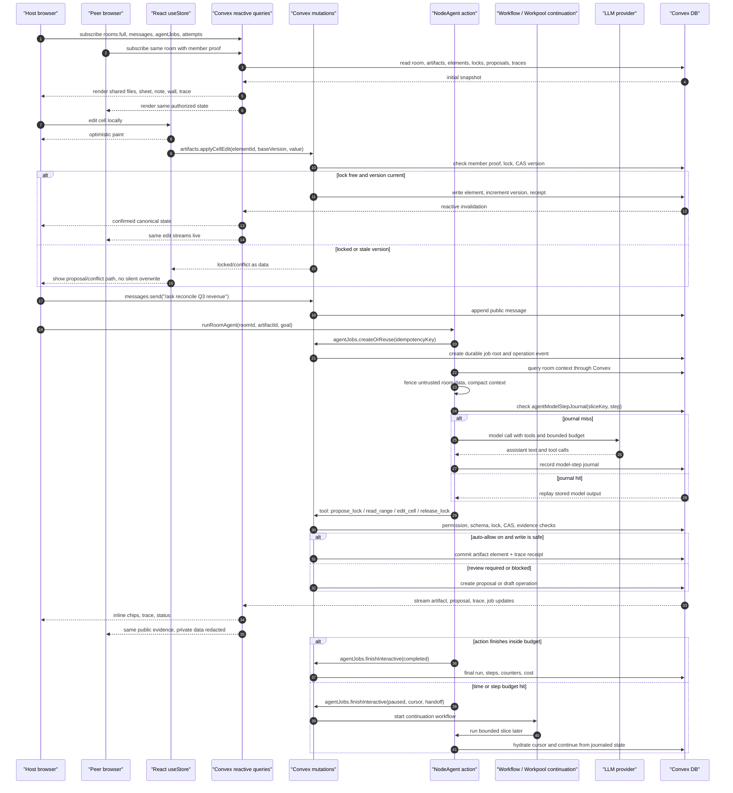
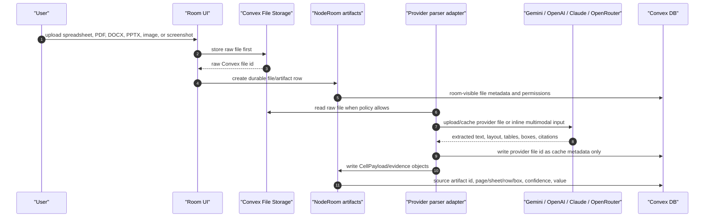

# Live Collaboration Sequences

This is the detailed runtime map behind the README architecture diagram. The
short version: NodeRoom treats Convex as the room source of truth, not the
browser. Human edits can paint optimistically, but durable state changes go
through Convex mutations; NodeAgent actions call providers and tools, then write
through the same checked mutation path as humans.

## Current Production Shape



The continuation workflow is historically named `freeAutoWorkflow`, because it
started as the `/free` runner. In current code it preserves the job's model
policy, so it can continue an interactive `/ask` job as well as a free-auto job.
The durable user-facing contract remains `agentJobs`; workflow ids are runtime
metadata.

## Provider File And Evidence Flow



Raw Convex file ids and NodeRoom artifact ids are durable. Provider file ids are
cache handles that can expire or be rebuilt. Mixing those identities would break
permissions, retention, and provenance.

## Why Not Keep The Client-Side GraphStore Pattern?

The old client-side GraphStore shape was useful for a single browser: a server
streamed `client_action` events over SSE, and the browser's in-memory store
executed local CRUD. In a shared room, that creates drift: one user's browser
becomes the hidden source of truth while other users subscribe to stale or
reconstructed state.

NodeRoom keeps the domain lessons from GraphStore but moves the durable
business logic into Convex mutations:

```text
legacy client_action event
  -> NodeAgent tool proposal
  -> permission + schema + version + lock check
  -> Convex mutation or draft operation
  -> mutation receipt + trace + reactive query update
```

## Architecture Choices Compared

| Architecture | Best fit | What breaks for NodeRoom | NodeRoom choice |
|---|---|---|---|
| Client-side SSE + in-memory GraphStore | Single-user document builders, demos, local-first prototypes | Other users cannot trust or observe the same state; retries can replay client actions differently; provider/tool work is hard to audit | Keep only as historical reference and import/eval compatibility label |
| REST CRUD + polling | Simple admin panels, low-collaboration apps | Poor live collaboration feel, higher stale-read risk, extra polling state, weak room trace continuity | Use Convex reactive queries instead |
| CRDT/local-first document | Rich offline text/canvas editing with peer merges | Great for text shapes, weaker for evidence-bearing finance/GTM operations that require server-side provider calls, spend limits, role checks, and audit trails | Could complement future rich notes; not the current source of truth |
| Queue worker fleet | Heavy parsing, ETL, exports, batch enrichment | Strong for throughput, but adds separate auth, progress, and result streaming layers | Use workers for local parser/OCR lanes when needed; keep `agentJobs` as the user-facing root |
| Convex action + mutation + Workflow/Workpool | Multi-user rooms with reactive state, server-side tools, transactional writes, durable continuations | Requires discipline: actions cannot be the source of truth; every side effect needs a mutation receipt and idempotency story | Current production shape |

## Readiness Gate

This diagram is not itself proof. The corresponding gates are:

- deterministic runtime tests for CAS, locks, drafts, idempotency, journals, and
  privacy;
- browser E2E for public/private chat, files, spreadsheet, wall, proposals, and
  multi-user state;
- live provider ladders before a model is promoted to interactive collaboration;
- live Convex smoke for `/ask`, `/free`, workflow continuation, and parser/file
  adapters;
- Gemini media review for the actual GIF/MP4 evidence shown in the README.

The open production gaps remain tracked in
[`GAPS_NOT_DONE.md`](GAPS_NOT_DONE.md); this page is the sequence map those gaps
must satisfy.
