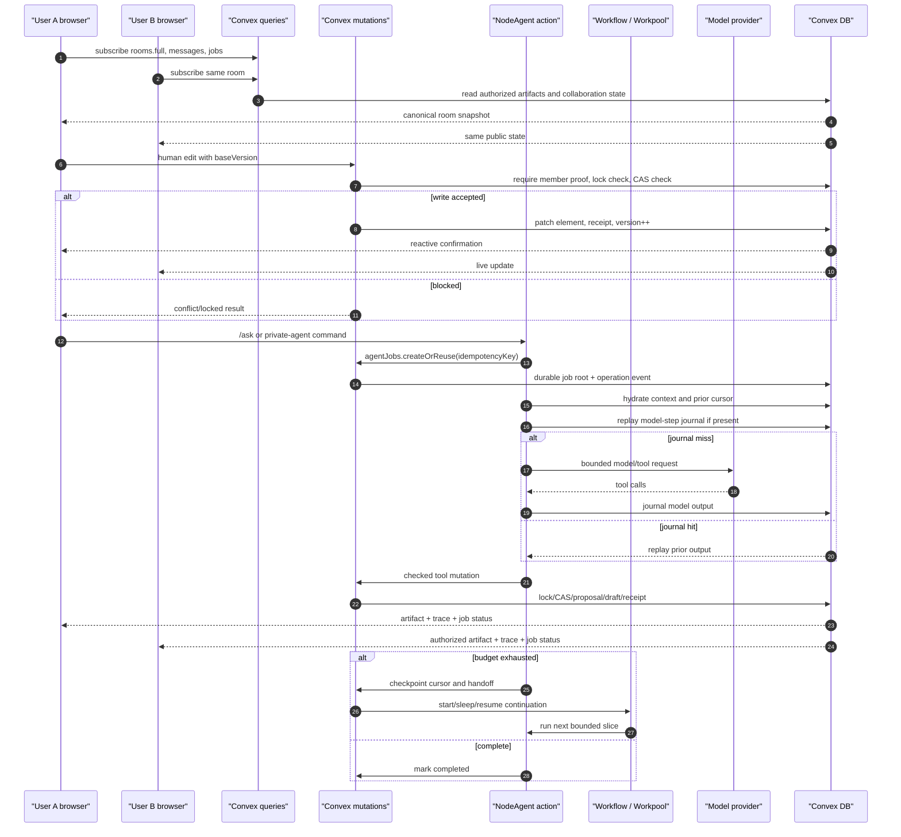
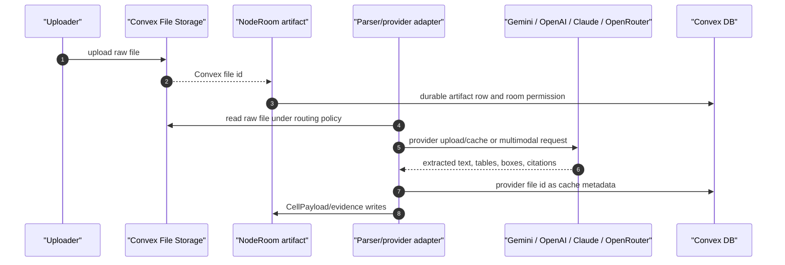

# NodeAgent Architecture

This is the contract for NodeRoom's unified NodeAgent job architecture. Every
mutating or durable agent command (`/ask`, `/free`, and private Room-lane
actions) creates or reuses an `agentJobs` row; `/ask` runs an immediate first
slice for responsive UX, and any slice that exhausts budget checkpoints into
the Workflow/Workpool runner. Private read-only advise is currently a one-call
private reply path and does not create an `agentJobs` row. `/free` is only a
model-policy shortcut for `openrouter/free-auto`, not a separate runtime. The historical
MewAgent/GraphStore design is useful as a domain reference, but not as a
runtime model.

The migration principle:

```text
MewAgent client_action event
  -> NodeAgent tool proposal
  -> permission + schema + version + lock check
  -> Convex mutation or draft operation
  -> mutation receipt + trace + reactive query update
```

`client_action` should not be a production primitive in NodeRoom. It can remain
as an import/eval compatibility label, but the actual executor is Convex:
queries read state, actions call models and external services, and mutations own
every durable state change.

Architecture is not a license to add unused layers. New runtime pieces must pass
the simplification gate in [`OVERENGINEERING_AUDIT.md`](OVERENGINEERING_AUDIT.md):
they need a direct workflow hook, a test or live eval, and a clear reason the
existing artifact/job modules cannot own the behavior.

HALO/Codex handoffs also have an architecture budget. Allowed scope is the files
or modules named by the failing trace/eval. Default implementation scope is the
existing agent runtime/tools/context, Convex job/tool adapters, and eval
fixtures. New tables, services, UI surfaces, graph/wiki/embedding expansion, or
weakened CAS/lock/draft/auth/eval gates require human approval.

## Unified Runtime Shape

Current NodeRoom has one agent persistence shape with different entrypoints:

```text
Interactive /ask
  -> create/reuse agentJobs row
  -> runRoomAgent action
  -> agentRuns row
  -> agentSteps rows
  -> direct mutations through ConvexRoomTools
  -> Workflow / Workpool continuation if the first slice checkpoints

Free-auto /free
  -> create/reuse agentJobs row with modelPolicy=openrouter/free-auto
  -> agentJobAttempts rows
  -> agentRuns / agentSteps per slice
  -> Workflow / Workpool continuation
```

This matters because any job can become long-running:

- a public `/ask` can hit a model, tool, or action deadline;
- a notebook restructuring job can touch hundreds of nodes;
- a wiki refresh can require parsing files and citing sources;
- spreadsheet enrichment can run across many rows;
- embedding sync can fan out across changed graph objects;
- a private agent task can wait on public locks or host approval.

The product now has one user-facing durable job contract. Some jobs finish
inside the first action slice; others checkpoint and continue. The UI should not
care which case occurred; it reads messages, job status, attempts, receipts, and
trace evidence through Convex queries, while optimistic updates keep human
actions responsive.

## Current vs Target

The repo already has pieces of this architecture, but the target contract should
not overstate what is enforced today.

| Area | Current implementation | Target contract |
|---|---|---|
| Interactive agent | public `/ask` and private Room-lane actions create/reuse an `agentJobs` row, run `runRoomAgent` with `ConvexRoomTools`, and auto-hand off to Workflow when budget is exhausted; private advise is still a read-only one-call private reply | private/system/automation entrypoints share the same job root and result view when they mutate or need durable continuation |
| Background jobs | `/free` uses the same `agentJobs`, attempts, workflow slices, and job lease with `modelPolicy=openrouter/free-auto` | every entrypoint can checkpoint through the same slice runner |
| Job schema | `agentJobs` is still artifact-scoped in places | jobs target artifacts, notebooks, wiki pages, spreadsheet ranges, or no surface |
| Artifact conflicts | `locks` plus CAS are the write-enforcement path | coordinate leases/locks are checked by every write mutation |
| `agentLeases` | job-slice/execution lease plus target design docs | target-level leases for notebook/wiki/range writes, reconciled with `locks` |
| Operation ledger | bounded job-level and aggregate slice events plus `agentSteps`, receipts, and room trace | every action/query/mutation/model/tool/scheduler boundary records a bounded event |
| Wiki | currently also represented as artifact/note elements in live tools | `wikiPages`/`wikiRevisions` become the canonical revision surface |
| Notebook graph | schema/mutations and some receipts/embedding enqueue exist | agent tools, endpoint validation, private visibility, leases, soft delete, and draft structural ops |
| Tool registry | static Zod tools exist | versioned registry with permission, scope, risk, lease, idempotency, and composite-tool policy |
| Improvement loop | `npm run agent:improve` exists for deterministic/live lanes | production traces feed feedback, eval generation, HALO diagnosis, and handoff rows |

## Standard Flow

```text
Client command
  -> agentJobs.create mutation
  -> agentJobs.enqueue mutation / workflow start
  -> agentJobRunner.runSlice action
  -> internal queries read room, graph, artifacts, wiki, traces
  -> agentModelStepJournal replay check for this job/slice/step
  -> model returns tool calls, then the AgentStep is immediately journaled
  -> tool registry validates permissions and schemas
  -> mutations apply checked state changes or create draft operations
  -> mutation receipts, step trace, and job cursor are persisted
  -> scheduler/workflow continues if needed
  -> reactive queries update every authorized client
```

The action can return a quick summary to the caller, but that return value is
not the source of truth. The source of truth is the job row, the durable steps,
the mutation receipts, and the canonical domain rows.

## Live Multi-User / Multi-Agent Sequence Diagrams

The full reader-facing version lives in
[`LIVE_COLLABORATION_SEQUENCES.md`](LIVE_COLLABORATION_SEQUENCES.md). The
contract below is the implementation-level summary.





Raw Convex file ids and NodeRoom artifact ids are durable. Provider file ids are
cache metadata only.

## Request Envelope

`NodeAgentRequest` is the user intent captured before side effects.

```ts
type NodeAgentRequest = {
  roomId: Id<"rooms">;
  actorId: string;
  actorType: "user" | "agent";
  actorProofId?: string;

  commandText: string;
  entrypoint: "public_ask" | "private_agent" | "free" | "system" | "automation";
  scope: "public_room" | "private_user" | "team";

  // Target surfaces. At least one should normally be present.
  targetArtifactId?: Id<"artifacts">;
  targetNotebookId?: Id<"notebooks">;
  targetWikiPageId?: Id<"wikiPages">;
  targetRootNodeId?: Id<"nodes">;
  currentNodeId?: Id<"nodes">;
  selectedNodeIds?: Id<"nodes">[];
  selectedElementIds?: string[];
  selectedRanges?: Array<{
    artifactId: Id<"artifacts">;
    sheetId?: string;
    range: string;
  }>;
  sourceArtifactIds?: Id<"artifacts">[];

  // Safety and execution policy.
  autoAllow: boolean;
  approvalPolicy: "read_only" | "draft_first" | "auto_commit_safe" | "host_review";
  evidencePolicy: "public_only" | "private_allowed" | "mixed_requires_redaction";
  maxSteps?: number;
  maxRuntimeMs?: number;
  maxMutationCount?: number;
  maxAffectedNodes?: number;
  modelPolicy?: string;
  traceLevel?: "summary" | "standard" | "full_operation_ledger";

  idempotencyKey: string;
  createdAt: number;
};
```

Important rules:

- `commandText` is not authorization. It is just intent.
- `scope` selects what evidence the agent may read.
- `evidencePolicy` selects what evidence the agent may cite or write back.
- Target contract: `approvalPolicy` determines whether mutating tools commit or
  write drafts. Current artifact writes enforce the room `autoAllow` boundary:
  auto-allow off returns `pending_approval`; auto-allow on commits through
  lock/CAS. `approvalPolicy` and `agentDraftOperations` are the generalized
  target surfaces.
- `idempotencyKey` lives on `agentJobs`, not only `agentRuns`, so duplicate
  submits cannot create duplicate jobs.
- `targetArtifactId`, `targetNotebookId`, `targetWikiPageId`, and
  `targetRootNodeId` allow one agent run to coordinate spreadsheet, wiki, and
  notebook work without collapsing all surfaces into one table.
- Current implementation note: the live `agentJobs` root is still
  artifact-scoped. Graph/wiki/range/no-surface target fields are design fields
  until `agentJobs` no longer requires an `artifactId`.
- Client-local optimistic state is never trusted as request truth. If the client
  has pending optimistic mutations, the request may include correlation IDs in
  metadata, but the server still reads canonical Convex rows before acting.

## Result Contract

`NodeAgentResult` is a materialized view over durable job rows, not a single
action return payload.

```ts
type NodeAgentResult = {
  jobId: Id<"agentJobs">;
  status:
    | "queued"
    | "running"
    | "awaiting_approval"
    | "paused"
    | "completed"
    | "failed"
    | "cancelled";

  finalText?: string;
  workProducts: WorkProduct[];
  mutationsApplied: MutationReceipt[];
  draftsCreated: DraftOperationReceipt[];
  traceEvents: AgentTraceEvent[];
  operationCounts: {
    actionSlices: number;
    queries: number;
    mutations: number;
    modelCalls: number;
    toolCalls: number;
    schedulerHandoffs: number;
    receipts: number;
  };
  runIds: Id<"agentRuns">[];
  latestCursor?: AgentCursor;
  activeLeaseIds?: Id<"agentLeases">[];
  embeddingJobIds?: Id<"embeddingJobs">[];

  memoryUpdateIds?: Id<"agentMemories">[];
  patternUpdateIds?: Id<"agentPatterns">[];
};
```

Work products are explicit typed references:

```ts
type WorkProduct =
  | { kind: "node"; nodeId: Id<"nodes">; title?: string }
  | { kind: "relation"; relationId: Id<"relations"> }
  | { kind: "artifact"; artifactId: Id<"artifacts"> }
  | { kind: "wiki_revision"; wikiPageId: Id<"wikiPages">; revisionId: string }
  | { kind: "spreadsheet_range"; artifactId: Id<"artifacts">; elementIds: string[] }
  | { kind: "summary"; text: string };
```

The old `final_summary` becomes a final job log plus optional `finalText`.
Memory and learned tool patterns become durable rows, not local graph nodes named
`__MewAgentMemory__` or `__MewAgentPatterns__`.

## Unified Job Tables

The existing `agentJobs` table should become the root for every mutating or
durable agent request.
`agentRuns` remains telemetry for a model execution attempt or slice.
`agentSteps` remains the append-only tool trajectory.

Target tables:

```text
agentJobs
  roomId
  actor
  entrypoint
  scope
  commandText
  request
  status
  priority
  approvalPolicy
  modelPolicy
  harnessVersion
  toolRegistryVersion
  evalSuiteVersion?
  idempotencyKey
  workflowId
  cursor
  handoff
  latestRunId
  attempts
  maxAttempts
  actionSliceCount
  queryCount
  mutationCount
  modelCallCount
  toolCallCount
  schedulerHandoffCount
  receiptCount
  leaseId
  leaseUntil
  nextRunAt
  finalText
  error
  createdAt
  updatedAt
  completedAt

agentJobAttempts
  jobId
  runId
  attempt
  status
  resolvedModel
  stopReason
  ms
  tokens
  cost
  error
  scheduledNextAt
  startedAt
  endedAt

agentModelStepJournal
  jobId
  sliceKey
  step
  model
  inputHash
  outputHash
  result
  createdAt
  updatedAt

agentRuns
  jobId?
  roomId
  agentId
  model
  goal
  steps
  toolCalls
  conflictsSurvived
  inputTokens
  outputTokens
  costUsd
  ms
  exhausted
  stopReason
  remainingMs
  deadlineAt
  handoff
  idempotencyKey
  createdAt

agentSteps
  jobId
  runId
  roomId
  idx
  phase
  operationEventIds
  tool
  args
  result
  status
  affectedObjectIds
  mutationReceiptIds
  recordHash
  prevStepHash
  ts

agentOperationEvents
  jobId
  runId?
  stepId?
  sequence
  kind: action | query | mutation | model_call | tool_call | scheduler | lease | checkpoint
  name
  targetKind?
  targetId?
  inputHash?
  outputHash?
  payloadMode: full | hash_only | sampled | redacted
  retentionClass: hot | compacted | archive
  status
  countDelta
  affectedIds
  startedAt
  completedAt

agentMutationReceipts
  jobId
  runId?
  stepId?
  mutationName
  permission
  inputHash
  output
  affectedIds
  beforeVersions
  afterVersions
  traceId?
  createdAt

agentDraftOperations
  jobId
  proposedBy
  operationName
  input
  affectedIds
  status
  approvalRequiredBy
  createdAt
  resolvedAt

agentLeases
  jobId
  runId?
  roomId
  targetKind: notebook | node | relation | artifact | element | range | wiki_page | wiki_block
  targetId
  mode: read | write | structural
  status: active | released | expired | stolen
  expiresAt
  createdAt
  releasedAt
```

The minimum implementation change is to make `runRoomAgent` create or claim an
`agentJobs` row first, then execute the first slice immediately. The fast path
still feels interactive; it just has the same durable root as `/free`. Current
private read-only advise remains outside this root until it needs mutation,
approval, resumability, or cost/trace accounting.

`agentSteps` is the human and eval trajectory: what the model tried, which
tools it used, and what work product resulted. `agentOperationEvents` is the
infrastructure ledger. Current code records bounded job-level and aggregate
slice events for create/start, scheduler, leases, checkpoints, and aggregate
action/model/tool counts. Per-query and per-mutation operation rows remain the
target contract so the system can answer "how many action/query/mutation pings
did this job use?" without parsing prose logs.

### Operation Ledger Bounds

`agentOperationEvents` must not become an unbounded hot trace dump. The durable
contract is:

- job counters are always incremented and never sampled;
- sensitive payloads are redacted before persistence;
- high-volume query/action payloads can be stored as hashes after a threshold;
- failed jobs, eval failures, and handoff evidence keep fuller payloads longer;
- compacted rows retain `kind`, `name`, `status`, hashes, timings, counts, and
  affected IDs even when raw input/output is dropped;
- exported eval/handoff evidence should prefer failure traces over complete
  successful traces.

This keeps the ledger good enough for HALO diagnosis and cost accounting without
turning every long-running job into a permanent multi-megabyte hot record.

## Job Lifecycle

Use one lifecycle for public, private, notebook, wiki, spreadsheet, and
background jobs:

```text
created
  -> queued
  -> claiming
  -> reading_context
  -> planning
  -> executing_tools
  -> drafting_operations
  -> awaiting_approval
  -> committing
  -> scheduling_followups
  -> summarizing
  -> completed
```

Terminal states:

```text
completed
failed
cancelled
blocked
```

State transitions are mutations. Actions can request a transition, but they do
not directly rewrite arbitrary job state.

## Convex Ping-Pong

Convex has a useful constraint: mutations are deterministic and transactional;
actions can call models and networks but cannot be trusted as transaction
boundaries. NodeAgent should lean into that split.

```text
mutation createJob
  - validate actor proof
  - insert job
  - start workflow or schedule first slice

action runJobSlice
  - claim lease through mutation
  - run queries for context
  - call model / tools / search / parser / embeddings
  - call mutations for each checked write
  - finish slice through mutation

mutation applyToolMutation
  - validate actor/job permission
  - validate schema
  - check scope and visibility
  - check versions / locks / approval policy
  - apply write or create draft
  - write receipt and trace
```

This is why `client_action` is the wrong abstraction for production. It suggests
the client is the command executor. In NodeRoom, the browser only submits intent
and subscribes to durable state.

### Step Accounting

Target contract: every ping-pong boundary should write an
`agentOperationEvents` row:

```text
mutation createJob
  -> operation kind=mutation name=agentJobs.create

action runJobSlice
  -> operation kind=action name=agentJobRunner.runSlice

query readNotebookContext
  -> operation kind=query name=notebook.readContext

mutation createChildNode
  -> operation kind=mutation name=nodes.createChildNode

scheduler continueJob
  -> operation kind=scheduler name=agentJobs.scheduleNextSlice
```

The job row keeps materialized counters for fast UI display. Today those
counters are more complete than the per-boundary ledger; the target ledger is
the durable source. This matters for long-running work because a "single step"
may contain multiple reads, a model call, several checked mutations, an
embedding job enqueue, and a scheduler continuation.

### Optimistic UI Boundary

Human edits can still use Convex optimistic updates for responsiveness. The
client may overlay a local block insertion or cell edit while the matching
mutation is in flight. That is separate from NodeAgent execution:

```text
human direct edit
  -> client optimistic localStore update
  -> Convex mutation
  -> server row catches up or rolls back

NodeAgent edit
  -> agent job action
  -> internal query/mutation ping-pong
  -> server row changes
  -> clients reactively observe canonical state
```

Agent jobs should not emit `client_action` or require the browser to apply local
graph commands. If a human optimistic edit races an agent mutation, the server
version/lease check decides the winner. A rejected human mutation drops the
optimistic overlay; an accepted mutation reconciles through the same reactive
query as any other write.

## Notebook Graph Domain

NodeRoom already has `artifacts` and `elements` for sheets, notes, and wall
stickies. A notebook graph should sit beside that model, not replace it.

Recommended domain:

```text
notebooks
  roomId
  title
  ownerId?
  visibility
  rootNodeId
  defaultRelationTypeId
  version
  createdAt
  updatedAt

nodes
  roomId
  notebookId
  authorId
  kind: note | folder | wiki_ref | artifact_ref | source | claim | task | agent_summary
  title
  content
  contentFormat: plain | markdown | lexical | json
  visibility
  accessMode
  version
  isDeleted
  canonicalRelationId?
  sourceArtifactId?
  sourceElementId?
  createdByJobId?
  updatedByJobId?
  createdAt
  updatedAt

relations
  roomId
  notebookId
  fromObjectKind: node | relation | artifact | element | range | wiki_page | wiki_block
  fromId
  toObjectKind: node | relation | artifact | element | range | wiki_page | wiki_block
  toId
  relationTypeId
  authorId
  visibility
  version
  isDeleted
  positionKey
  listType: all | note_content | pinned | pointer | outline
  createdByJobId?
  updatedByJobId?
  createdAt
  updatedAt

relationTypes
  roomId
  notebookId?
  key
  label
  reverseLabel
  description?
  visibility
  isSystem
  version
  createdAt
  updatedAt
```

Object endpoints should be normalized in code, even if Convex stores them as
`fromObjectKind/fromId` pairs:

```ts
type GraphObjectRef =
  | { kind: "node"; id: Id<"nodes"> }
  | { kind: "relation"; id: Id<"relations"> }
  | { kind: "artifact"; id: Id<"artifacts"> }
  | { kind: "element"; artifactId: Id<"artifacts">; elementId: string }
  | { kind: "range"; artifactId: Id<"artifacts">; sheetId?: string; range: string }
  | { kind: "wiki_page"; id: Id<"wikiPages"> }
  | { kind: "wiki_block"; pageId: Id<"wikiPages">; blockId: string };
```

Important modeling decisions:

- Relations can point to nodes, other relations, artifacts, spreadsheet
  elements, or wiki pages. This preserves Mew's hypergraph value without making
  every surface pretend to be a note.
- Notebook `nodes` are where personal/private structured knowledge lives.
- Wiki pages remain the shared room memory surface. Notebook nodes can cite or
  link wiki pages, but private notebook content must not be used in public wiki
  updates unless promoted.
- Spreadsheet cells stay `elements`; graph relations can cite them with
  `toObjectKind: "element"` and `toId: "<artifactId>:<elementId>"`.
- `positionKey` should be a fractional order key, not a mutable integer index,
  so reordering does not rewrite every sibling.

System relation types should be seeded per room or globally and referenced by
stable `key` values:

| Key | Use |
|---|---|
| `contains` | notebook parent/child and outline hierarchy |
| `cites` | note or wiki claim cites source, artifact, element, or page |
| `references` | weak cross-surface pointer without evidentiary claim |
| `derived_from` | generated summary, wiki revision, or node came from source |
| `summarized_by` | spreadsheet row/range or artifact summarized by node/wiki |
| `updates` | new note appends information to older note without overwrite |
| `related_to` | symmetric loose conceptual relation |
| `supports` | evidence supports a claim |
| `contradicts` | evidence conflicts with a claim |
| `blocks` | task/process dependency |

Custom relation types are allowed, but `relationTypes.create` should dedupe by
`roomId + notebookId + key` and protect system keys from accidental overwrite.

### Graph Endpoint Invariants

Before graph mutations are promoted, relation endpoints need hard validation:

- endpoint references must decode to one canonical `GraphObjectRef` shape;
- both endpoints must exist and belong to the same room unless the relation type
  explicitly allows an external source reference;
- relation visibility cannot exceed the most restrictive endpoint visibility;
- private notebook nodes require owner/member checks, not only room membership;
- relations to deleted targets either tombstone with the target or become
  `target_missing` suggestions, never silent live edges;
- spreadsheet ranges should use canonical `{ artifactId, sheetId?, range }`
  encoding rather than ambiguous string concatenation;
- wiki targets should point to the current canonical wiki surface.

Current wiki note: live tools still treat the wiki as an artifact/note element
in places. Until `wikiPages`/`wikiRevisions` are the canonical write path,
relations should point to the artifact/doc element that actually changes, not a
future `wiki_page` or `wiki_block` row that was not involved in the mutation.

## Leases And Cross-Surface Work

Long-running jobs need leases because the agent may read one surface and write
another several seconds later. Leases are not authorization. They are temporary
conflict-control records scoped to concrete targets.

Current implementation note: artifact cell writes are still protected by the
existing `locks` table plus CAS. Existing `agentLeases` are job/slice execution
leases and should not be treated as write-enforcement until every relevant
mutation checks them. The migration choice must be explicit:

```text
Option A: keep locks as canonical artifact conflict control
  - agentLeases only coordinate job execution and non-artifact target leases
  - artifact writes continue to call active-lock checks

Option B: generalize locks into agentLeases
  - every write mutation checks target leases
  - locks become a compatibility view or thin wrapper around agentLeases
```

Until that migration is complete, docs and UI should say "locks/CAS protect
artifact writes" and "agentLeases are the target cross-surface lease model."

```text
agentLeases
  targetKind: notebook | node | relation | artifact | element | range | wiki_page | wiki_block
  targetId
  mode: read | write | structural
  ownerJobId
  expiresAt
```

Use leases for:

- notebook structural moves and relation reorders;
- spreadsheet cell or range writes;
- wiki block/page draft commits;
- cross-surface pipelines where a spreadsheet range feeds a wiki update;
- batch jobs that need stable membership while processing item rows.

Example cross-surface pipeline:

```text
job reads spreadsheet A1:B10
  -> acquires read lease on spreadsheet range
  -> acquires write lease on target wiki block
  -> action summarizes data
  -> mutation writes wiki draft/revision
  -> mutation releases leases
  -> scheduler continues embedding/wiki index followups
```

If a human edit targets a leased object, the mutation should either reject with
a conflict that rolls back the optimistic overlay or accept only if the lease
mode allows concurrent edits. The browser does not resolve this locally.

## Node / Relation Mutation Map

Mew GraphStore transactions become Convex mutations. The agent calls tools, and
the tool registry routes to these mutations.

| Old GraphStore transaction | NodeAgent mutation | Commit policy |
|---|---|---|
| `addNode` | `nodes.createNode` | safe if under owned/private root; otherwise approval |
| `addChildNode` | `nodes.createChildNode` | same transaction creates node + parent relation |
| `updateNode` | `nodes.updateNodeContent` | CAS on `expectedVersion`; append update child by default for research updates |
| `removeNode` | `nodes.softDeleteNode` | draft-first for agent actions unless tiny/owned |
| `addRelation` | `relations.createRelation` | safe for low-risk private links; approval for public links |
| `updateRelation` | `relations.updateRelation` | CAS on relation version |
| `removeRelation` | `relations.softDeleteRelation` | usually safe with receipt |
| `replaceRelationLink` | `relations.replaceEndpoint` | draft-first if moving shared structure |
| `updateRelationPositionsList` | `relations.reorder` | CAS on containing node/list version |
| `setIsPublic` | `visibility.setObjectVisibility` | host/user approval; cascade plan first |
| `addRelationType` | `relationTypes.create` | dedupe by key/label before create |
| `updateRelationType` | `relationTypes.update` | protect system keys; CAS on version |
| `removeRelationType` | `relationTypes.archive` | require replacement type if relations still use it |
| custom type cleanup | `relationTypes.merge` | draft-first; rewrites affected relation type IDs |
| default relation type | `notebooks.setDefaultRelationType` | notebook owner/host only |
| `pinRelation` | `relations.addToList(listType="pinned")` | safe with version check |
| `unpinRelation` | `relations.removeFromList(listType="pinned")` | safe with version check |
| `addRelationToList` | `relations.addToList` | safe with version check |
| `removeRelationFromList` | `relations.removeFromList` | safe with version check |

Example mutation contract:

```ts
type CreateChildNodeInput = {
  jobId: Id<"agentJobs">;
  notebookId: Id<"notebooks">;
  parentId: Id<"nodes">;
  node: {
    kind: "note" | "folder" | "agent_summary" | "source" | "claim";
    title?: string;
    content: string;
    contentFormat: "plain" | "markdown" | "lexical" | "json";
    visibility: "private" | "room" | "public";
  };
  relation?: {
    relationTypeId?: Id<"relationTypes">;
    listType?: "outline" | "note_content";
    afterRelationId?: Id<"relations">;
  };
  expectedParentVersion?: number;
  idempotencyKey: string;
};

type CreateChildNodeOutput = {
  nodeId: Id<"nodes">;
  relationId: Id<"relations">;
  nodeVersion: number;
  parentVersion: number;
  mutationReceiptId: Id<"agentMutationReceipts">;
  embeddingSync: "scheduled";
};
```

## Draft-First Operations

Some tools should never mutate immediately:

- moving or deleting more than a small number of nodes;
- changing public visibility or cascade flags;
- updating wiki pages from mixed public/private evidence;
- reorganizing a notebook hierarchy;
- replacing relation endpoints in a shared room;
- batch edits above the job's safety threshold.

Those tools write `agentDraftOperations` rows and move the job to
`awaiting_approval`. A host or owner approves the draft, and a mutation applies
the operation against the current versions. If the baseline diverged, the draft
becomes `needs_rebase`, not a blind write.

## Tool Permission Registry

All model-visible tools should be registered data, even if the implementation is
static TypeScript. The registry is how NodeAgent explains tools to the model and
how the server enforces the same policy.

```ts
type NodeAgentTool<I, O> = {
  name: string;
  version: number;
  description: string;
  inputSchema: unknown;
  outputSchema: unknown;
  category: "read" | "draft" | "mutate" | "external" | "workflow";
  handler: "query" | "mutation" | "action";
  permission:
    | "room.read"
    | "room.write"
    | "notebook.read"
    | "notebook.write"
    | "wiki.write"
    | "artifact.write"
    | "external.fetch";
  scopePolicy: "public_only" | "private_allowed" | "mixed_requires_redaction";
  leasePolicy?: {
    mode: "none" | "read" | "write" | "structural";
    targetResolver: string;
  };
  approval: {
    required: boolean;
    when?: string;
  };
  risk: "low" | "medium" | "high";
  idempotent: boolean;
  recordsOperationEvent: true;
  maxBatchSize?: number;
  timeoutMs?: number;
};
```

Example registry entries:

```ts
const createChildNodeTool = {
  name: "notebook.create_child_node",
  version: 1,
  category: "mutate",
  handler: "mutation",
  permission: "notebook.write",
  scopePolicy: "private_allowed",
  leasePolicy: { mode: "write", targetResolver: "parent_node" },
  approval: { required: false, when: "private owned notebook and small content" },
  risk: "low",
  idempotent: true,
  recordsOperationEvent: true,
};

const reorganizeNotebookTool = {
  name: "notebook.propose_reorganization",
  version: 1,
  category: "draft",
  handler: "mutation",
  permission: "notebook.write",
  scopePolicy: "private_allowed",
  leasePolicy: { mode: "structural", targetResolver: "target_root_subtree" },
  approval: { required: true },
  risk: "high",
  idempotent: true,
  recordsOperationEvent: true,
  maxBatchSize: 100,
};
```

The runtime should record the registry version in each `agentStep`, so evals can
replay what the model was allowed to do.

### Composite Tools

The model should not always see thousands of low-level Convex mutations. For
repeated workflows, expose composite tools that expand into checked reads,
drafts, mutations, receipts, embedding jobs, and scheduler continuations.

Examples:

```text
notebook.research_and_create_notes
notebook.append_sourced_updates
notebook.propose_reorganization
notebook.create_learning_path
wiki.refresh_from_public_sources
spreadsheet.summarize_range_to_wiki
```

A composite tool is still accountable. Target architecture records every
internal query, mutation, model call, and scheduler continuation as
`agentOperationEvents`, while the composite tool call remains the higher-level
`agentStep` visible to the user and eval harness. Current implementation is
coarser: it records aggregate job/slice/tool events and mutation receipts, then
should expand toward per-boundary operation events as composites move into
production `ROOM_TOOLS`.

Current implementation note: the v3 benchmark in `scripts/benchmark/run.ts`
uses a two-call composite shape. `fetch_row_sources` owns row lock, source
fetch, and fenced evidence snippets; the model authors the research fields from
those snippets; `write_row` owns validation, CAS writes, citations, freshness,
status, and release. The retired v2 `research_company_row` proof tool is
retained only for historical trace parsing and tests, because it let the
deterministic harness author the row fields. Promoting a research workflow to
production still requires the same registry metadata as any other tool:
permission, scope, approval policy, idempotency key, operation events, mutation
receipts, and trace retention.

## Embedding CRUD

Embeddings are derived state. They must never block the core graph mutation.

```text
node/relation/artifact mutation commits
  -> mutation records embedding work item
  -> embedding action computes vector
  -> embedding mutation writes vector row
  -> search queries use latest complete embedding version
```

Tables:

```text
embeddingJobs
  roomId
  sourceKind: node | relation | artifact | element | wiki_page
  sourceId
  contentHash
  status: queued | running | completed | failed
  attempts
  nextRunAt
  error
  createdByJobId?
  createdAt
  updatedAt

embeddings
  roomId
  sourceKind
  sourceId
  sourceVersion
  contentHash
  provider
  model
  dimension
  vector
  visibility
  createdAt
```

Embedding CRUD is intentionally small:

| Operation | Mutation/action | Rule |
|---|---|---|
| schedule | `embeddingJobs.enqueueForSource` mutation | called by graph/wiki/artifact mutations after commit |
| claim | `embeddingJobs.claimNext` mutation | action lease with retry/backoff |
| compute | `embeddingRunner.compute` action | external provider call; no DB write except through mutation |
| write | `embeddings.upsertForSource` mutation | only if `sourceVersion` and `contentHash` still match |
| mark stale | `embeddingJobs.markStale` mutation | source changed while job was running |
| delete/tombstone | `embeddings.tombstoneForSource` mutation | source soft-delete or visibility loss |
| search | `embeddings.searchVisible` query/action | filters by room, visibility, scope, and source version |

The enqueue mutation should dedupe by
`roomId + sourceKind + sourceId + contentHash`, so repeated node saves or
retried agent slices do not create duplicate vector work. If a source changes
while an embedding action is running, the write mutation should reject the stale
`sourceVersion` and enqueue a fresh job.

Mutation output should say only that sync was scheduled:

```ts
type UpdateNodeOutput = {
  nodeId: Id<"nodes">;
  oldVersion: number;
  newVersion: number;
  mutationReceiptId: Id<"agentMutationReceipts">;
  embeddingSyncStatus: "scheduled" | "not_required";
};
```

Search rules:

- public queries can only read public/room-visible embeddings;
- private agent queries may read the user's private embeddings;
- public answers must record `privateContextUsed: false`;
- stale embeddings are acceptable for ranking, but writes always use DB versions.

## Wiki, Notebook, Spreadsheet

NodeAgent needs three durable surfaces with different contracts:

```text
Notebook graph
  - personal/team knowledge structure
  - nodes and relations
  - private by default
  - agent may append notes, link concepts, propose reorganizations

Wiki
  - room-visible shared memory
  - stable page structure and revisions
  - public evidence only unless private content was promoted
  - agent writes draft revisions first

Spreadsheet/artifacts
  - operational data
  - elements with version CAS and locks
  - formula/dependency-aware affected ranges
  - agent writes bounded cell deltas with evidence
```

Surface-specific write rules:

| Surface | Native unit | Agent default | Human direct edit |
|---|---|---|---|
| Notebook | node, relation, relation list | append/link/draft structural changes | optimistic mutation allowed with version check |
| Wiki | page revision or block revision | draft revision, host review for public pages | optimistic text edit allowed if unlocked |
| Spreadsheet | element/cell/range | bounded delta with range lease | optimistic cell edit allowed unless leased |
| Artifact canvas | element | bounded element patch | optimistic element edit allowed unless leased |

NodeAgent should use relations for cross-surface meaning and native mutations
for surface writes. For example, summarizing `A1:B10` into a wiki page creates a
wiki revision and a `derived_from` relation to the spreadsheet range; it does
not copy the spreadsheet cells into notebook nodes unless the user asked for a
notebook work product.

Cross-surface links should be relations, not copied text:

```text
notebook node -> cites -> wiki page
notebook node -> cites -> spreadsheet element
wiki page -> references -> artifact
spreadsheet row -> summarized_by -> notebook node
agent summary -> produced_from -> trace/run/source
```

## Continuous Improvement Loop

The operation ledger is only the substrate. The improvement loop turns real
runs into reusable evals and implementation handoffs:

```text
agentJob trace
  -> human feedback / LLM judge feedback / eval-gate failure
  -> trace-derived eval draft
  -> research validation / contested-opinion review
  -> architecture fit analysis
  -> eval suite run
  -> HALO-style harness diagnosis
  -> ranked Codex or Claude Code handoff
  -> branch implementation
  -> full regression gate
  -> merge or reject
```

This maps the OpenAI cookbook pattern onto NodeAgent: traces explain what
happened, feedback says what mattered, research decides whether the eval
measures the right thing, architecture fit decides whether existing NodeAgent
tools already handle the case, HALO diagnoses harness-level changes, and
Codex/Claude Code implements only the smallest change that passes the gate.

### Improvement Loop Tables

```text
agentFeedback
  roomId
  jobId?
  runId?
  stepId?
  source: human | llm_judge | eval_gate | system
  severity
  summary
  expectedBehavior
  prohibitedBehavior?
  evidenceRefs
  createdBy
  createdAt

agentEvalCases
  sourceFeedbackIds
  sourceTraceRefs
  sourceResearchPacketIds
  workflowDomain
  title
  persona
  startingState
  commandText
  expectedStateAssertions
  expectedTraceAssertions
  rubric
  confidenceLevel: candidate | research_validated | contested | human_verified
  gateMode: none | advisory | blocking
  sourceConsensus
  contestedClaims?
  architectureFit
  status: draft | active | archived
  createdAt
  promotedAt?

agentEvalRuns
  evalCaseId
  commitSha
  harnessVersion
  toolRegistryVersion
  modelPolicy
  status
  score: {
    overall
    checks: Array<{ id, pass, confidence?, evidenceRefs }>
  }
  failureSummary?
  traceExportRef?
  createdAt

agentHarnessDiagnoses
  sourceEvalRunIds
  sourceFeedbackIds
  failureCluster
  diagnosis
  rankedChanges
  confidence
  createdAt

agentHarnessHandoffs
  diagnosisId
  targetAgent: codex | claude_code
  handoffPath
  allowedScope
  forbiddenScope
  validationCommands
  successThreshold
  status: proposed | assigned | implemented | rejected | merged
  branchName?
  pullRequestUrl?
  createdAt
  resolvedAt?

workflowResearchPackets
  domain
  sourceUrls
  sourceSnapshots
  sourceClaims
  consensusLevel
  contestedClaims
  rubricVariants
  assumptions
  extractedRubric
  proposedEvalCases
  reviewStatus
  createdAt
```

These rows are the target production shape. The current repo-owned loop can stay
as generated artifacts from `npm run agent:improve` until the app or CI needs
queryable durable loop state. Do not add these tables simply because the design
names them; add them when a real workflow needs stored feedback queues, eval
promotion history, or handoff status.

### HALO Mapping

| Loop step | NodeAgent source | Required contract |
|---|---|---|
| Run | `agentJobs`, `agentRuns`, `agentJobAttempts` | pin `harnessVersion`, `toolRegistryVersion`, and model policy |
| Trace | `agentSteps`, `agentOperationEvents`, mutation receipts | bounded, redacted, replayable trace export |
| Feedback | `agentFeedback` | human, LLM judge, and eval-gate signals share one shape |
| Research | `workflowResearchPackets` | capture source snapshots, consensus, minority views, and assumptions |
| Architecture fit | `agentEvalCases.architectureFit` | decide query/action/mutation/tool/harness needs before implementation |
| Generate evals | `agentEvalCases` | confidence and enforcement are separate; candidate and contested evals stay advisory |
| Run evals | `agentEvalRuns` | record commit, harness, registry, model, score, trace export |
| Diagnose | `agentHarnessDiagnoses` | cluster recurring harness failures, not one-off tool errors |
| Handoff | `agentHarnessHandoffs` | implementation-first Codex/Claude contract |
| Re-run/gate | CI + ladder + workflow evals | merge only if target improves without regressions |

### Codex / Claude Code Handoff Contract

Every handoff must be self-contained:

```text
failure cluster
failing job/eval IDs
trace export refs
affected tool registry version
allowed files or modules
forbidden change scope
ranked implementation change
validation commands
success threshold
rollback rule
```

Coding agents implement on branches. They can change prompts, tool schemas,
context builders, routing, validators, budgets, composite tools, and eval
fixtures. They cannot silently weaken auth, privacy, billing, deletion,
visibility, lock/CAS/draft behavior, generated-eval verification, or honesty
score gates.

### Workflow Research To Eval

Professional workflows can be expanded through research, but research does not
directly become production behavior:

```text
online workflow sources
  -> workflowResearchPacket
  -> extracted rubric + contested opinions
  -> architecture fit analysis
  -> existing-capability check
  -> draft eval cases only after the architecture need is clear
  -> candidate, research_validated, contested, or human_verified confidence
  -> advisory or blocking gate mode only when the eval measures the intended workflow
  -> smallest NodeAgent harness change if existing tools cannot handle it
```

This is how interview prep, job descriptions, tutorials, banking workflows, GTM
sales playbooks, marketing workflows, and corporate finance tasks become
repeatable NodeAgent contracts without relying on one founder to hand-review
every trace forever.

An auto-generated eval can be wrong by measuring the wrong behavior. NodeAgent
does not solve that by requiring instant human approval. It solves it by keeping
eval confidence explicit: multiple source-backed rubrics can become
`research_validated`, disagreement stays `contested`, and speculative checks
remain `candidate`. Only `gateMode: "blocking"` can block merges, and it should
be reserved for sourced, uncontested, human-verified checks.

## NodeAgentRequest Examples

Public `/ask` that may finish quickly:

```ts
{
  roomId,
  actorId,
  actorType: "user",
  entrypoint: "public_ask",
  scope: "public_room",
  commandText: "Reconcile Q3 revenue against the uploaded export",
  targetArtifactId,
  sourceArtifactIds: [uploadArtifactId],
  approvalPolicy: "auto_commit_safe",
  evidencePolicy: "public_only",
  autoAllow: room.autoAllow,
  idempotencyKey
}
```

Private notebook organization:

```ts
{
  roomId,
  actorId,
  actorType: "user",
  entrypoint: "private_agent",
  scope: "private_user",
  commandText: "Organize my AI safety notes into a clearer outline",
  targetNotebookId,
  targetRootNodeId,
  approvalPolicy: "draft_first",
  evidencePolicy: "private_allowed",
  autoAllow: false,
  maxAffectedNodes: 50,
  idempotencyKey
}
```

Wiki refresh:

```ts
{
  roomId,
  actorId,
  actorType: "user",
  entrypoint: "public_ask",
  scope: "public_room",
  commandText: "Update the room wiki from the latest public trace and uploaded model eval",
  sourceArtifactIds: [evalArtifactId],
  approvalPolicy: "host_review",
  evidencePolicy: "public_only",
  autoAllow: false,
  idempotencyKey
}
```

Spreadsheet-to-wiki pipeline:

```ts
{
  roomId,
  actorId,
  actorType: "user",
  entrypoint: "public_ask",
  scope: "public_room",
  commandText: "Summarize the latest scorecard range into the weekly wiki page",
  targetArtifactId: scorecardArtifactId,
  targetWikiPageId: weeklyWikiPageId,
  selectedRanges: [{ artifactId: scorecardArtifactId, sheetId: "Sheet1", range: "A1:B10" }],
  approvalPolicy: "host_review",
  evidencePolicy: "public_only",
  autoAllow: false,
  idempotencyKey
}
```

## Implementation Sequence

Labels:

- `core`: production contract that must stay enforced.
- `active`: partially implemented and safe to harden with behavior evidence.
- `target-only`: design target; do not add runtime code until a trace/eval
  needs it.

1. `[active | owner: nodeagent-jobs | evidence: tests/agentJobsRuntime.test.ts]`
   Add a universal `agentJobs.createOrReuse` mutation with idempotency.
2. `[target-only | owner: nodeagent-jobs | evidence: non-artifact job eval]`
   Remove artifact-only assumptions from `agentJobs` so a job can target a
   notebook, wiki page, range, artifact, automation, or no surface.
3. `[active | owner: nodeagent-jobs | evidence: tests/agentJobsRuntime.test.ts]`
   Add bounded `agentOperationEvents` semantics and materialized job counters
   for action/query/mutation/model/tool/scheduler accounting.
4. `[active | owner: agent-runtime | evidence: live /ask smoke + job detail]`
   Change `runRoomAgent` to claim an `agentJobs` row before running the first
   slice; keep existing `agentRuns` and `agentSteps`, but link them to `jobId`.
5. `[active | owner: nodeagent-jobs | evidence: /free workflow smoke]`
   Rename `/free`-specific fields to general job fields while preserving the
   current workflow implementation.
6. `[active | owner: nodeagent-jobs | evidence: tests/agentJobsRuntime.test.ts]`
   Expand `agentMutationReceipts` beyond successful artifact edits to locks,
   drafts, approvals, graph writes, failed conflicts, and wiki revisions.
7. `[target-only | owner: artifact-collab-core | evidence: contention eval]`
   Reconcile `locks` and `agentLeases`: either keep locks canonical for artifact
   writes or migrate write mutations to target-level leases.
8. `[core | owner: artifact-collab-core | evidence: CAS/optimistic UI tests]`
   Document the UI boundary: human mutations may use Convex optimistic updates;
   agent jobs only write through server mutations and reactive queries.
9. `[active | owner: graph-wiki-embedding-experimental | evidence: graph runtime tests]`
   Add or harden notebook graph tables: `notebooks`, `nodes`, `relations`,
   `relationTypes`.
10. `[target-only | owner: graph-wiki-embedding-experimental | evidence: endpoint invariant tests]`
    Implement endpoint validation, private visibility checks, tombstones, and
    relation visibility constraints.
11. `[target-only | owner: graph-wiki-embedding-experimental | evidence: context-read eval]`
    Implement read tools for notebook context and relation neighborhoods.
12. `[active | owner: graph-wiki-embedding-experimental | evidence: graph mutation tests]`
    Implement safe mutations: create child node, append update node, create
    relation, reorder relation list.
13. `[target-only | owner: graph-wiki-embedding-experimental | evidence: draft-first reorg eval]`
    Add draft-first mutations for move/delete/reorganize/visibility/wiki edits.
14. `[target-only | owner: graph-wiki-embedding-experimental | evidence: wiki revision eval]`
    Migrate wiki writes from artifact-note `editCell` to `wikiPages`/
    `wikiRevisions`, or explicitly keep relations pointed at artifact doc
    elements until the migration is complete.
15. `[active | owner: graph-wiki-embedding-experimental | evidence: embedding queue tests]`
    Add embedding job tables and schedule embedding sync after node and wiki
    mutations.
16. `[target-only | owner: agent-runtime | evidence: tool registry eval]`
    Move tool definitions into a registry and record registry versions in
    `agentSteps`.
17. `[active | owner: qa-improvement-loop | evidence: npm run agent:improve]`
    Keep `npm run agent:improve` as the first implementation of the improvement
    loop: generated docs artifacts, architecture-fit report, eval trust levels,
    and handoff recommendations.
18. `[target-only | owner: qa-improvement-loop | evidence: feedback queue product need]`
    Add improvement-loop tables only when the app or CI needs durable queryable
    feedback queues, eval promotion state, diagnosis state, or handoff status.
19. `[active | owner: qa-improvement-loop | evidence: failed trace handoff artifact]`
    Make `npm run agent:improve` export HALO handoffs from failed ladder/
    workflow/provider traces and require the full regression gate before merge.

## What Not To Carry Forward From MewAgent

Do not carry forward:

- browser-executed `client_action` as source of truth;
- agent jobs that mutate the client optimistic cache instead of server state;
- uncounted action/query/mutation ping-pong hidden inside helper calls;
- final JSON memory dumps as local note children;
- server assumptions that the client successfully applied graph changes;
- uncheckpointed model loops with only an SSE transcript;
- broad graph rewrites without draft/approval/version checks.

Carry forward:

- graph vocabulary: nodes, relations, relation types, relation lists;
- high-level operations: create, update, move, link, reorder, visibility;
- append/update patterns that preserve older notes by default;
- tool trace UI semantics: thought, tool call, tool result, work product;
- eval scenarios for research, update, organize, connect, delete, and batch.

## Core Product Sentence

NodeAgent is a server-side job engine for rooms. It can work across notebooks,
wiki pages, spreadsheets, and files, but every durable change passes through a
Convex mutation with permission checks, version checks, receipts, and traces.
Fast jobs and long jobs share the same `agentJobs` contract; the only difference
is whether the first slice completes or checkpoints.
