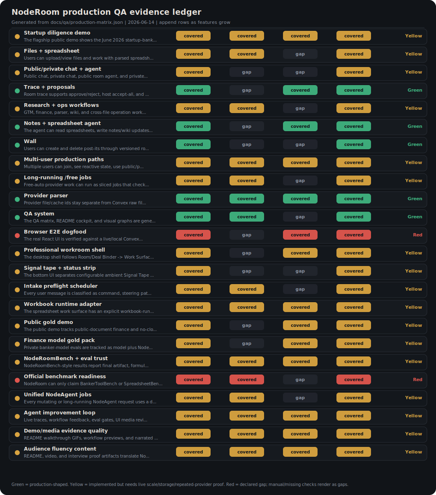
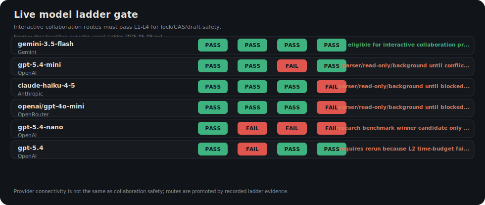

# Production Guarantee Matrix

Generated from `docs/qa/production-matrix.json` on 2026-06-13.

**Release rule:** A feature is production-ready only when deterministic tests, live/backend smoke where applicable, traceability, privacy boundaries, and documented failure behavior are all present.

## Continuous Append Protocol

- Add one row to `features[]` for every new user-facing feature, agent tool, provider route, or production invariant.
- Keep old rows unless the feature is removed; update status and evidence instead of silently deleting history.
- Run `npm run qa:matrix` after editing the source, then `npm run qa:matrix:check` in CI to catch README/doc/SVG drift.
- Do not promote a live model route until the relevant ladder rungs pass in a live run and the result is recorded.

## Feature Matrix

| Area | Status | Claim | Production gate | Evidence | Next review |
|---|---|---|---|---|---|
| Files + spreadsheet | Yellow | Users can upload/view files and work with parsed spreadsheets in the same room. | Parser fixtures, provider parser adapter tests, live file preview smoke, and Convex raw-file canonicalization. | `tests/spreadsheetParser.test.ts`, `tests/providerParserAdapter.test.ts`, `docs/PROFESSIONAL_SPREADSHEET_WORKFLOWS.md` | Add live Convex File Storage upload/download E2E once deployment auth is finalized. |
| Public/private chat + agent | Yellow | Public chat, private chat, public room agent, and private agent route messages to the right scope. | Scope separation tests, room member proof, and browser smoke for public/private panels. | `tests/roomEngine.test.ts`, `tests/agentRuntime.test.ts`, `docs/AGENT_RUNTIME.md` | Add browser E2E for public/private routing, optimistic send failure/retry, and stable clientMsgId bubble keys. |
| Trace + proposals | Green | Room trace supports approve/reject, host accept-all, and host-gated auto-accept with remembered consent. | Host-only controls, proposal resolution tests, UI consent modal, and no silent direct-write bypass. | `tests/roomEngine.test.ts`, `src/ui/RoomShell.tsx`, `src/ui/panels/Artifact.tsx` | Add audit assertion that accept-all records every accepted proposal id. |
| Research + ops workflows | Yellow | GTM, finance, parser, wiki, and cross-file operation workflows are covered by deterministic professional evals and live provider smoke. | Deterministic workflow evals pass, provider parser smoke is green, and model routes are ladder-gated before interactive promotion. | `tests/professionalWorkflows.test.ts`, `evals/professionalWorkflows.ts`, `docs/eval/live-provider-agent-ladder-2026-06-08.md` | Add dedicated live GTM and finance provider jobs with row-level trace assertions. |
| Notes + spreadsheet agent | Green | The agent can read spreadsheets, write notes/wiki updates, reconcile cells, and keep cross-artifact evidence links. | Cross-file RoomTools test, grounded wiki write test, and CAS conflict checks. | `tests/workflowEvals.test.ts`, `tests/wikiSkill.test.ts`, `docs/AGENT_WIKI.md` | Add LLM-generated wiki update eval with private-data leakage checks. |
| Wall | Green | Users can create and delete post-its through versioned room operations. | Create/delete operation tests and browser smoke for Wall tab. | `tests/roomEngine.test.ts`, `src/ui/panels/Artifact.tsx` | Add multi-user wall edit conflict browser test. |
| Multi-user production paths | Yellow | Multiple users can join, see reactive state, use public/private scopes, and avoid clobbering through locks/CAS/proposals/drafts. | Room auth proof, Convex codegen/typecheck, duplicate-operation idempotency, load/concurrency smoke, and deployment observability. | `tests/idempotencyRuntime.test.ts`, `tests/lockTtl.test.ts`, `docs/ARCHITECTURE.md` | Add concurrent browser/session load test and production SLO dashboard. |
| Long-running /free jobs | Yellow | Free-auto provider work can run as sliced jobs that checkpoint before platform limits and resume from durable state. | Forced multi-slice test, crash-after-checkpoint resume, duplicate stale lease rejection, and live /free smoke. | `tests/agentJobsSource.test.ts`, `tests/agentJobsRuntime.test.ts`, `tests/gatewayAndJournal.test.ts`, `docs/LONG_RUNNING_AGENTS.md`, `docs/eval/free-auto-ladder.md` | Add stricter budget clamps, per-tool abort propagation, provider request idempotency keys where supported, model health/quarantine, and real forced multi-slice Convex job-runner tests. |
| Provider parser | Green | Provider file/cache ids stay separate from Convex raw file ids while extraction writes evidence-bearing CellPayloads. | Adapter separation tests, live provider smoke, redacted errors, and artifact evidence checks. | `tests/providerParserAdapter.test.ts`, `tests/providerParserLive.test.ts`, `docs/STACK.md` | Add production provider Files API binary upload actions for PDFs/images/decks. |
| QA system | Green | The QA matrix, README cockpit, and visual graphs are generated from one appendable source of truth. | Matrix schema tests plus qa:matrix --check as a docs-sync drift gate, not a quality gate. | `docs/qa/production-matrix.json`, `scripts/qa-matrix.ts`, `tests/qaMatrix.test.ts` | Require each new user-facing feature PR to append or update one matrix row. |
| Browser E2E dogfood | Red | The real React UI is verified against a live/local Convex backend for optimistic reactivity, rollback, cross-user visibility, and privacy boundaries. | Playwright or equivalent real-browser specs for two-context cell edits, optimistic chat failure/retry, public/private leak checks, wall CRUD, job controls, and proposal conflict feedback. | `docs/audit/E2E_DOGFOOD_DESIGN.md`, `docs/audit/QA_FINDINGS.md` | Install and wire the real-DOM harness, add data-testid hooks only for asserted surfaces, and promote the row after the first two-context specs pass in CI. |
| Professional workroom shell | Yellow | The desktop shell follows Room/Deal Binder -> Work Surface -> Copilot, with proofs, sources, and gold comparisons opening on the center stage instead of competing side or bottom panels. | Browser layout E2E proves wide desktop binder, center work surface, right Copilot, compact overlays, no overflow, no lost spreadsheet affordances, plus live/Convex and Gemini UI judge walkthrough evidence. | `docs/TARGET_2026_06.md`, `docs/ARCHITECTURE.md`, `e2e/responsive-qa.spec.ts`, `e2e/work-surface-split.spec.ts`, `src/ui/RoomShell.tsx`, `src/ui/LeftRail.tsx`, `src/ui/panels/Artifact.tsx` | Add live/Convex shell smoke, richer binder proof/policy click-throughs, status drilldown tests, and Gemini UI judge before promoting the workroom shell to green. |
| Signal tape + status strip | Yellow | The bottom UI separates configurable ambient Signal Tape from the authoritative non-scrolling Status Strip for commit, conflict, eval, sync, cost, and runtime truth. | DOM/browser tests prove two distinct bottom rows, pause/reduced-motion/filter behavior, click-to-open related artifact, no unauthorized private data in the tape, and precise non-scrolling status events. | `docs/TARGET_2026_06.md`, `docs/GAPS_NOT_DONE.md`, `src/ui/RoomShell.tsx`, `e2e/responsive-qa.spec.ts`, `tests/signalStatus.test.ts` | Add dedicated browser status-event tests for commit, conflict, job, eval, cost, pause/filter controls, and click-through artifact drilldown. |
| Intake preflight scheduler | Yellow | Every user message is classified as command, steering patch, parallel subagent, wait, clarification, note, cancel, or priority change; the deterministic harness computes PlanPreview and owns scheduling authority. | Unit/runtime evals prove affected-set expansion, partial scheduling, intent claims, short commit leases, dedupe, cost authorization, privacy/formula checks, and that the LLM recommends while the harness schedules before live provider spend. | `docs/TARGET_2026_06.md`, `docs/NODEAGENT_ARCHITECTURE.md`, `src/agent/intakePreflight.ts`, `src/ui/IntakePlanPreview.tsx`, `tests/intakePreflightScheduler.test.ts`, `e2e/intake-plan-preview.spec.ts`, `evals/chatIntakeRuntime.ts` | Use the same PlanPreview envelope when submitted messages create /ask and /free jobs, record the chosen schedule in agentJobs, and add live backend proof before promoting to green. |
| Workbook runtime adapter | Yellow | The spreadsheet work surface has an explicit workbook-runtime adapter path for command/mutation/operation separation, formula dependency expansion, worker/headless validation, and spreadsheet-native overlays. | A POC loads the Q3 sheet into a candidate runtime, captures local mutations into Convex CAS ops, replays remote patches, preserves focus/selection, renders evidence/human/agent overlays, and runs headless formula/gold validation. | `docs/TARGET_2026_06.md`, `docs/architecture/MVP_WORKBOOK_STACK.md`, `docs/UI_EXCEL_PAPER.md`, `e2e/excel-grid.spec.ts` | Run the workbook-runtime POC before treating a workbook runtime as more than an architecture option. |
| Public gold demo | Yellow | The public demo tracks public-document finance and no-clobber proof rows with source URLs, expected answers, validators, and stable fingerprints. | Manifest check, public fixture downloader/cache hash, LiteParse/provider extraction, formula/citation/page or bbox validators, CellPayload evidence, and trace read/write-set validators all pass. | `docs/TARGET_2026_06.md`, `docs/demo/PUBLIC_GOLD_DEMO.md`, `docs/demo/public-gold-demo-manifest.json`, `scripts/validate-public-gold-demo.ts` | Do not call the public proof board a live parser proof until public fixtures are downloaded, extracted, and scored against the same manifest. |
| Finance model gold pack | Yellow | Private banker-model evals are tracked as model plus NodeRoom harness proof across solve, guide, collaborate, reconstruction, export, formula, value, citation, no-clobber, and trace dimensions. | Current solve batch stays fresh; guide zero-write, collaborate human-agent injection, withheld-data reconstruction, XLSX export/reopen, formula AST/value tie-out, citation coverage, and trace completeness lanes are added. | `docs/TARGET_2026_06.md`, `docs/eval/FINANCE_MODEL_EVAL.md`, `docs/eval/finance-model-live.json`, `evals/financeModelLive.ts` | Keep Solve measured, not best-run; add Guide/Collaborate/Reconstruction/export before claiming full banker work-product coverage. |
| NodeRoomBench + eval trust | Yellow | NodeRoomBench-style results report final artifact, formula, format/usability, collaboration trajectory, privacy, cost, latency, model route, harness, tool policy, budget, and evaluator instead of raw model-only scores. | Eval store records required metadata; eval:diff catches regressions, removed cases, model swaps, and check redefinitions; external benchmark adapters run benchmark-faithful mode without hidden gold access, evaluator edits, public answer lookup, or hardcoded cases. | `docs/TARGET_2026_06.md`, `docs/AGENT_EVAL.md`, `tests/evalTrustPolicy.test.ts`, `tests/benchmarkHarness.test.ts`, `tests/spreadsheetBenchAdapter.test.ts`, `tests/spreadsheetBenchStage.test.ts`, `tests/spreadsheetBenchRunner.test.ts`, `tests/spreadsheetBenchScorer.test.ts` | Add a NodeRoomBench package outline with cases, artifacts, gold, runners, validators, allowed/disallowed harness policy, and runner-level contamination checks. |
| Official benchmark readiness | Red | NodeRoom can only claim BankerToolBench or SpreadsheetBench progress after a benchmark-faithful adapter ingests official tasks, isolates gold, runs the harness, captures trajectory/cost/retries, and emits official deliverables or scores. | Readiness report exists; strict mode passes only when BankerToolBench and SpreadsheetBench adapters/runs are implemented without hidden-gold access, answer lookup, benchmark hardcoding, or evaluator mutation. | `docs/eval/OFFICIAL_BENCHMARK_READINESS.md`, `docs/eval/official-benchmark-readiness.json`, `docs/eval/bankertoolbench-ingest-smoke.json`, `docs/eval/bankertoolbench-stage-smoke.json`, `docs/eval/bankertoolbench-run-smoke.json`, `docs/eval/bankertoolbench-run-contamination-smoke.json`, `docs/eval/spreadsheetbench-v1-ingest-smoke.json`, `docs/eval/spreadsheetbench-v2-ingest-smoke.json`, `docs/eval/spreadsheetbench-v1-stage-smoke.json`, `docs/eval/spreadsheetbench-v2-stage-smoke.json`, `docs/eval/spreadsheetbench-v1-run-smoke.json`, `docs/eval/spreadsheetbench-v2-run-smoke.json`, `docs/eval/spreadsheetbench-edit-plan-stage-smoke.json`, `docs/eval/spreadsheetbench-edit-plan-run-smoke.json`, `docs/eval/spreadsheetbench-model-edit-plan-live-smoke.json`, `docs/eval/spreadsheetbench-v1-model-edit-plan-live-smoke.json`, `docs/eval/spreadsheetbench-v1-model-edit-plan-n5-live-smoke.json`, `docs/eval/spreadsheetbench-v1-model-edit-plan-retry-live-smoke.json`, `docs/eval/spreadsheetbench-v1-stage-contamination-smoke.json`, `docs/eval/spreadsheetbench-v1-run-n5-contamination-smoke.json`, `docs/eval/spreadsheetbench-v1-run-retry-contamination-smoke.json`, `docs/eval/spreadsheetbench-v2-stage-contamination-smoke.json`, `docs/eval/spreadsheetbench-v2-run-contamination-smoke.json`, `docs/eval/agent-workspace-sandbox-smoke.json`, `docs/eval/bankertoolbench-stage-contamination-smoke.json`, `docs/eval/spreadsheetbench-v1-score-smoke.json`, `docs/eval/spreadsheetbench-v2-score-smoke.json`, `scripts/official-benchmark-readiness.ts`, `scripts/bankertoolbench-ingest.ts`, `scripts/bankertoolbench-stage.ts`, `scripts/bankertoolbench-run.ts`, `scripts/benchmark-contamination-check.ts`, `scripts/spreadsheetbench-ingest.ts`, `scripts/spreadsheetbench-stage.ts`, `scripts/spreadsheetbench-run.ts`, `scripts/spreadsheetbench-score.ts`, `src/eval/bankerToolBenchAdapter.ts`, `src/eval/bankerToolBenchStage.ts`, `src/eval/bankerToolBenchRunner.ts`, `src/eval/benchmarkContamination.ts`, `src/eval/spreadsheetBenchAdapter.ts`, `src/eval/spreadsheetBenchStage.ts`, `src/eval/spreadsheetBenchRunner.ts`, `src/eval/spreadsheetBenchScorer.ts`, `src/eval/spreadsheetBenchChartScorer.ts`, `src/eval/agentWorkspaceSandbox.ts`, `tests/officialBenchmarkReadiness.test.ts`, `tests/bankerToolBenchAdapter.test.ts`, `tests/bankerToolBenchStage.test.ts`, `tests/bankerToolBenchRunner.test.ts`, `tests/benchmarkContamination.test.ts`, `tests/spreadsheetBenchAdapter.test.ts`, `tests/spreadsheetBenchStage.test.ts`, `tests/spreadsheetBenchRunner.test.ts`, `tests/spreadsheetBenchScorer.test.ts`, `tests/spreadsheetBenchChartScorer.test.ts`, `tests/agentWorkspaceSandbox.test.ts` | Next official slice: run model-edit-plan across larger official SpreadsheetBench bundles, harden structured edit-plan generation until retries recover real tasks, add rendered/VLM SpreadsheetBench V2 chart grading beyond the static XLSX chart-package scorer now wired into score/run reports, upgrade the Node permission subprocess proof to Docker/Harbor isolation when the daemon is available, wire BTB MCP financial tools, and replace the BTB local exact-package/exact-golden smoke with Harbor/Docker plus Gandalf verifier import without exposing rubric/canary/golden files to the agent. |
| Unified NodeAgent jobs | Yellow | Every mutating or long-running NodeAgent request uses a durable agentJobs root with request envelope, operation accounting, leases, and links to runs/steps; private read-only advise remains a one-call private reply. | Interactive /ask and /free both create or reuse agentJobs, artifact writes emit receipts, job details are browser-visible, notebook graph mutations enqueue embeddings, and live browser/backend smoke proves linked runs/steps. | `docs/NODEAGENT_ARCHITECTURE.md`, `convex/schema.ts`, `convex/agentJobs.ts`, `convex/agent.ts`, `tests/agentJobsSource.test.ts`, `tests/agentJobsRuntime.test.ts`, `tests/gatewayAndJournal.test.ts` | Replace source-only graph/embedding checks with Convex runtime tests, add browser assertion for the job detail drilldown, and add stale-receipt replay tests. |
| Agent improvement loop | Yellow | Live traces, workflow feedback, eval gates, UI media review, and Codex handoff artifacts continuously fuel README evidence. | Deterministic loop passes, live provider/Convex/UI media lanes run when keys are present, and failures generate a handoff before chart promotion. | `scripts/agent-improvement-loop.ts`, `scripts/gemini-ui-review.ts`, `docs/eval/agent-improvement-loop.md`, `docs/eval/agent-improvement-loop/gemini-ui-review.json`, `docs/eval/ui-recordings/live-ui-walkthrough-20260608.mp4` | Rerun the full-live loop under the v3 benchmark with provider, free-auto ladder, Convex, and media lanes current; promote only after repeated clean runs without skipped required lanes. |
| Demo/media evidence quality | Yellow | README walkthrough GIFs, workflow previews, and narrated episodes are judged as product evidence, not just attractive demos. | Gemini 3.5 Flash batch-judges every GIF/MP4 after capture/render refresh; P0 defects block publishing and P1 defects stay visible until fixed. | `scripts/gemini-demo-media-judge.ts`, `docs/eval/MEDIA_JUDGE.md`, `docs/eval/gemini-media-judges/latest.json` | Fix every current P1 defect listed under Open Defects in docs/eval/MEDIA_JUDGE.md, then rerun the batch judge and promote only when no P1/P0 defects remain. |
| Audience fluency content | Yellow | README, video, and interview proof artifacts translate NodeRoom features into researched high-trust professional workflow scenes instead of generic AI demos. | Audience context YAML, scenario brief, trust-signal checklist, deterministic content-fluency gate, rendered audience-specific episode, and video/content judge evidence with current media defects tracked. | `docs/skills/audience-fluency/SKILL.md`, `episodes/_audiences/family-office.yaml`, `episodes/_audiences/README.md`, `episodes/private-investment-room-v1/brief.md`, `episodes/noderoom-live-collab-v1/report.md` | Close the current media-judge P1 defects and run a content-fluency/trust-signal review before promoting this row to green. |

## Live Model Ladder Gate

Source: `docs/eval/live-provider-agent-ladder-2026-06-08.md`, `docs/eval/free-auto-router-ladder.json`

Gate: Interactive collaboration routes must pass L1-L4 for lock/CAS/draft safety.

| Model route | Provider | L1 | L2 | L3 | L4 | Recommended use |
|---|---|---:|---:|---:|---:|---|
| `gemini-3.5-flash` | Gemini | PASS | PASS | PASS | PASS | eligible for interactive collaboration promotion after repeated runs |
| `gpt-5.4-mini` | OpenAI | PASS | PASS | FAIL | PASS | parser/read-only/background until conflict rung passes |
| `claude-haiku-4-5` | Anthropic | PASS | PASS | PASS | FAIL | parser/read-only/background until blocked-range rung passes |
| `openai/gpt-4o-mini` | OpenRouter | PASS | PASS | PASS | FAIL | parser/read-only/background until blocked-range rung passes |
| `openrouter/free-auto` | OpenRouter free-auto router | PASS | FAIL | PASS | TIMEOUT | opt-in /free only; hit step budget on L2 despite correct value/provenance and timed out L4 |
| `openrouter/free-auto top-5 candidates` | OpenRouter router-expanded ladder | PASS | PASS | PASS | TIMEOUT | not promotable; summarizes routed top free candidates, see concrete rows |
| `nvidia/nemotron-3-super-120b-a12b:free` | OpenRouter free candidate | PASS | PASS | PASS | TIMEOUT | best free candidate for /free; not interactive because L4 times out |
| `nvidia/nemotron-3-ultra-550b-a55b:free` | OpenRouter free candidate | FAIL | FAIL | FAIL | FAIL | do not route; invalid JSON in live ladder |
| `qwen/qwen3-coder:free` | OpenRouter free candidate | FAIL | FAIL | FAIL | FAIL | do not route; provider retry errors in live ladder |
| `openrouter/owl-alpha` | OpenRouter free candidate | FAIL | FAIL | PASS | FAIL | not safe; mutates during read and misses required draft |
| `qwen/qwen3-next-80b-a3b-instruct:free` | OpenRouter free candidate | FAIL | FAIL | FAIL | FAIL | do not route; provider retry errors in live ladder |
| `gpt-5.4-nano` | OpenAI | PASS | FAIL | FAIL | FAIL | research benchmark winner candidate only when collaboration safety is not required |
| `gpt-5.4` | OpenAI | PASS | FAIL | PASS | PASS | requires rerun because L2 time-budget failure blocks promotion |

## Commands

```bash
npm run qa:matrix
npm run qa:matrix:check
npm run typecheck -- --pretty false
npx tsc --noEmit --project convex\tsconfig.json --pretty false
npm test
npm run ladder
npm run ladder:free
npm run benchmark:free
npm run provider-parser:smoke
npm run build
```

## Visuals





