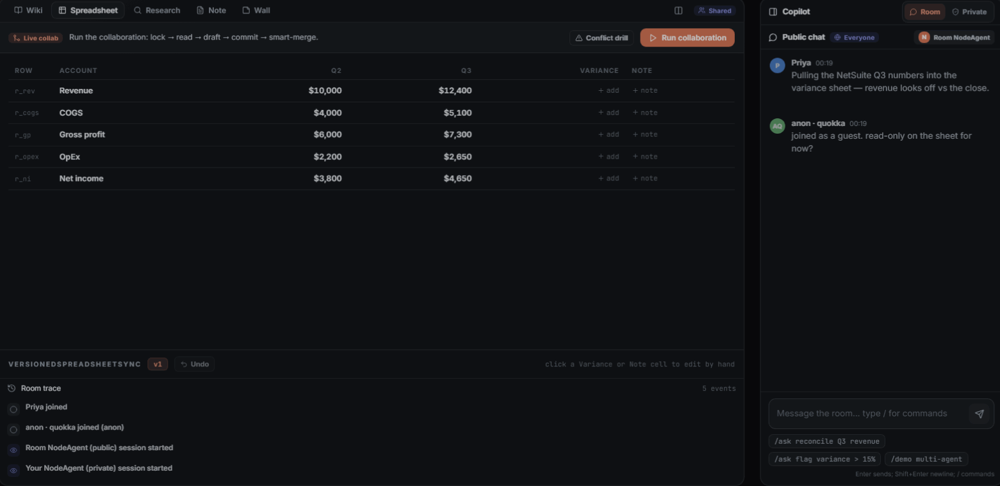
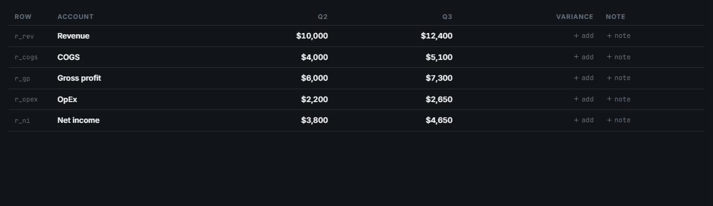
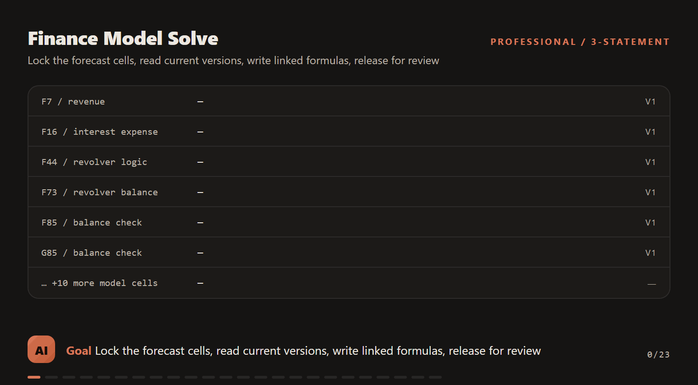

# NodeAgent Workflow Previews

These are product-facing previews of the workflows HALO is allowed to improve.
Room/trace previews are generated with:

```bash
npm run workflow:trace-previews
```

The heavier app-capture previews are refreshed with:

```bash
npm run workflow:previews:all
```

The GIFs have explicit evidence levels:

- `e2e/capture-previews.spec.ts` records the REAL app UI (memory mode) into GIFs; every shipped GIF is gated by the gemini-3.5-flash judge (`npm run qa:gif`). The old screenshot-slideshow generator was retired for honesty defects.
- `render-workflow-preview.ts` builds trace replays from recorded ladder JSON.
- `workflow:app-previews` captures the real NodeRoom DOM in memory mode.

A GIF is visual evidence, not a production gate. The current live evidence anchor is
`docs/eval/halo-runs/20260609T060208Z/summary.jsonl`: typecheck, unit tests,
browser E2E, agent improvement loop, eval diff, QA matrix, Convex boundaries,
OpenRouter smoke, provider parser smoke, Convex `/free` smoke, and the V2
benchmark all completed in cycle 1 before the free-auto ladder step.
Media quality is separately judged with Gemini video understanding in
[`docs/eval/MEDIA_JUDGE.md`](eval/MEDIA_JUDGE.md).

## HALO Workflow Rule

A HALO pass is not complete when it only adds an eval. It must preserve or
improve one of these user-agent workflows:

1. The user intent remains visible in the room UI.
2. The agent work is committed through the durable `agentJobs` and mutation
   receipt path, not hidden client-local state.
3. The trace shows what the agent read, locked, wrote, skipped, or proposed.
4. The README preview points to live evidence and the relevant eval gate.
5. If the workflow shape changes, `npm run workflow:previews:all` is refreshed.

## Preview Cards

### Public `/ask` Spreadsheet Reconciliation



- **User interaction:** type `/ask reconcile Q3 revenue` in public chat.
- **Agent contract:** create/reuse an `agentJobs` root, lock exact cells, read
  versions, write with CAS, release, and show trace receipts.
- **Evidence:** `docs/eval/halo-runs/20260609T060208Z/logs/cycle-001-free-job-smoke.log`,
  `docs/eval/agent-improvement-loop.md`.
- **Gate:** `evals/ladder.ts`, `tests/agentRuntime.test.ts`,
  `tests/agentJobsRuntime.test.ts`.

### GTM Research Enrichment


- **User interaction:** add/requeue companies, then run sourced enrichment.
- **Agent contract:** preserve CRM fields, update only pending/stale rows, carry
  evidence-bearing `CellPayload` values, and record source/freshness fields.
- **Evidence:** `docs/eval/PROFESSIONAL_WORKFLOW_EVALS.md`,
  `docs/PROFESSIONAL_SPREADSHEET_WORKFLOWS.md`,
  `docs/eval/results.json`,
  `docs/eval/traces/benchmark/20260610T2148086-deepseek-deepseek-v4-flash-deepseek-deepseek-v4-flash.json`.
- **Gate:** `tests/workflowEvals.test.ts`, `tests/providerParserAdapter.test.ts`,
  `scripts/provider-parser-smoke.ts`, `scripts/benchmark/run.ts`.

### Grounded Wiki And Note Update

*(Preview retired after Gemini 3.5 Flash review: the app capture showed native
Note → Spreadsheet navigation, but not the grounding action itself.)*

- **User interaction:** ask the agent to summarize a room artifact into the wiki
  or note.
- **Agent contract:** discover artifacts, read the source, write a grounded note
  with visible citations, and never publish private context unless promoted.
- **Evidence:** `docs/AGENT_WIKI.md`,
  `docs/skills/self-updating-wiki/SKILL.md`, `tests/wikiSkill.test.ts`.
- **Gate:** `tests/workflowEvals.test.ts`, `tests/wikiSkill.test.ts`,
  `src/agent/tools.ts`.

### Proposal Review And Wall Collaboration



- **User interaction:** turn Auto-allow off, inspect proposed edits, approve or
  reject, and collaborate on the wall.
- **Agent contract:** agent edits become host-reviewed proposals; wall edits are
  versioned artifact mutations; conflicts are surfaced instead of overwritten.
- **Evidence:** `docs/WALKTHROUGH.md`, `docs/PRODUCTION_GUARANTEE_MATRIX.md`.
- **Gate:** `tests/roomEngine.test.ts`, `tests/lockTtl.test.ts`,
  `e2e/chat.spec.ts`.

### Long-Running `/free` Job And HALO Handoff

*(Preview retired pending a judged real-app recording.)*

- **User interaction:** type `/free <goal>` for slow free-auto work and inspect
  job status, attempts, details, trace, and receipts.
- **Agent contract:** use the same `agentJobs` root as `/ask`, but force the
  free-auto model policy and checkpoint work across slices.
- **Evidence:** `docs/eval/HALO_OVERNIGHT_RUN.md`,
  `docs/eval/halo-runs/20260609T060208Z/status.json`,
  `docs/eval/halo-runs/20260609T060208Z/summary.jsonl`.
- **Gate:** `scripts/halo-overnight.ts`, `evals/evalStore.ts`,
  `evals/evalDiff.ts`, `tests/evalStore.test.ts`.

### Finance Model Solve



- **User interaction:** upload a three-statement modeling test and ask NodeAgent
  to complete the forecast model.
- **Agent contract:** lock the critical forecast cells, read versions, write
  linked formulas through CAS, release the range, and grade both final artifact
  values and trace receipts.
- **Evidence:** `docs/eval/traces/finance-model/finance_model_solve_synthetic.json`
  for committed media; `docs/eval/finance-model-live.json` for the latest
  redacted private live proof; full private traces stay under gitignored
  `docs/eval/finance-model-runs/`.
- **Gate:** `npm run eval:finance-model`, `npm run eval:finance-model -- --gold
  "C:\path\to\modeling-test.xlsx"`, `tests/financeModelRuntime.test.ts`,
  `evals/financeModelRuntime.ts`, and `evals/financeModelLive.ts --level=full`.
  Current full live promotion: `deepseek/deepseek-v4-flash` (16/16, 174.8s,
  $0.0792).

## HALO Trace Skill Previews

The room-level GIFs above show the product surface. These trace-replayed GIFs
show the lower-level ladder rungs HALO gates before a model/tool change can be
promoted:


They are generated by `scripts/render-workflow-preview.ts` from real
`docs/eval/traces/**` ladder JSON. This keeps the mini-preview honest: each
frame is sheet state after a real agent step, not a hand-authored animation.

## Research Ties

The workflow design is tied to current provider/platform guidance:

- [Convex functions](https://docs.convex.dev/functions/overview): queries are
  reactive reads, mutations are transactional writes, and actions are for
  external services.
- [Convex actions](https://docs.convex.dev/functions/actions): client-triggered
  work should generally be captured by a mutation that schedules an action, so
  invariants and idempotency are enforced before external work starts.
- [Convex scheduled functions](https://docs.convex.dev/scheduling/scheduled-functions):
  scheduled functions are stored durably and survive downtime, which matches
  NodeRoom's long-running job slices.
- [OpenAI agent evals](https://platform.openai.com/docs/guides/agent-evals)
  and [trace grading](https://platform.openai.com/docs/guides/trace-grading):
  agent quality should be evaluated reproducibly, with trace-level signals for
  workflow failures.
- [OpenAI Cookbook registry](https://github.com/openai/openai-cookbook/blob/main/registry.yaml):
  the agent improvement loop is trace-driven and turns feedback into evals,
  HALO-ranked harness changes, and a Codex handoff.
- [Braintrust systematic evaluation](https://www.braintrust.dev/docs/evaluate)
  and [trace inspection](https://www.braintrust.dev/docs/observe/examine-traces):
  regressions need traceable spans, CI gates, and production feedback that can
  become future datasets.
- [LangSmith evaluation concepts](https://docs.langchain.com/langsmith/evaluation-concepts):
  offline curated examples and online production traces should feed each other
  in a continuous improvement loop.
