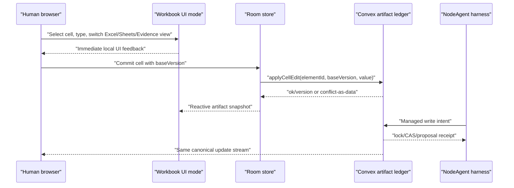

# MVP workbook stack: one truth lane, multiple view modes

NodeRoom should not fork the spreadsheet contract while it is still an MVP.
The right stack is:

1. **Local workbook UI/runtime layer** for fast selection, editing, formatting, and formula affordances.
2. **Convex artifact ledger** for durable elements, versions, locks, drafts, proposals, traces, and multiplayer sync.
3. **Harness-owned agent writes** where the model states intent and the runtime owns locks, CAS, proposals, retries, and receipts.
4. **Docs-style review layer** for inline accept/reject when policy requires host review.
5. **Evidence/document sidecar** for parsed files, screenshots, citations, and bounding boxes.

For the MVP, `ExcelGridSheet` stays the workbook UI/runtime layer and now exposes local view
modes: `Excel`, `Sheets`, and `Evidence`. These are presentation modes over the same selected
cell and the same commit path. They are deliberately local browser preferences, not room state.



## Why not make styles separate products?

Separating `Excel`, `Sheets`, and `Evidence` into different routes or data models would multiply
QA, trace semantics, and agent behavior. The user is changing how the workbook looks and what
evidence is emphasized; they are not changing the collaboration contract. A local segmented mode bar lets
an analyst use the mode that feels familiar while the host can still explain one backend story:
versions, locks, proposals, and traces remain canonical.

## Future runtime adapter

If the MVP grid hits its ceiling, the adapter boundary should be:

```ts
type WorkbookRuntimeAdapter = {
  render(snapshot: ArtifactSnapshot): ReactNode;
  getSelection(): CellRange;
  commit(input: { elementId: string; baseVersion: number; value: CellPayload }): Promise<EditFeedback>;
  showRemoteState(input: { locks: LockState[]; proposals: Proposal[]; presence: PresenceState[] }): void;
};
```

Candidate runtimes can be evaluated behind this adapter:

- **Univer first** when full workbook behavior, formulas, formatting, and Sheets-like collaboration chrome are the priority.
- **Glide Data Grid + HyperFormula** when huge tabular rendering and explicit formula ownership are the priority.
- **Extend-style UI** only as an evidence/review sidecar, not as the authoritative workbook runtime.

## Proof gate

The feature walkthrough target is `workbook-style-toggle`.
The verification loop is:

1. `npm run walkthroughs -- workbook-style-toggle`
2. `npm run walkthroughs:render -- workbook-style-toggle`
3. `npm run media:gemini-judge -- --only workbook-style-toggle`

The judge should see: upload -> Excel paper -> Sheets view -> Evidence view, with captions stating
that the visual mode changed while Convex versions, locks, and traces stayed canonical.
