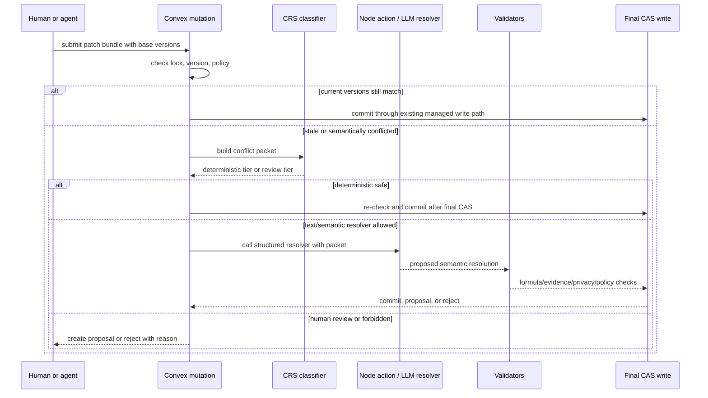

# Semantic Rebase: Compare-Reason-Swap

Status: policy scaffold implemented; durable runtime wiring still open.

CAS protects the cell. Semantic Rebase protects the meaning.

NodeRoom already has the hard write gate: managed locks, per-element
`baseVersion` checks, proposal routing, draft smart-merge, and final writes
through Convex mutations. Compare-Reason-Swap (CRS) is the layer above that
gate. It decides what should happen when a stale patch, draft conflict, or
proposal approval conflict is not just a physical write conflict but a business
meaning conflict.

## Runtime Boundary

CRS must not weaken CAS. The model may reason, but it never writes durable room
state directly.

## Implemented Now

`src/nodeagent/skills/spreadsheet/semanticRebase.ts` defines:

- `SemanticConflictPacket`
- `SemanticResolution`
- deterministic policy classification
- hard stops for formula-to-scalar overwrite, private evidence in public output,
  manual-claim verification, deleted human comments, and evaluator artifact
  mutation
- review routing for banker assumptions like revenue forecasts, EBITDA
  adjustments, debt schedule inputs, and client-facing judgement calls

`tests/semanticRebase.test.ts` covers the first policy surface.

## Still Open

The current implementation is intentionally not a full CRS runtime. Remaining
work:

- Add durable Convex tables or rows for semantic conflict packets and
  resolutions.
- Trigger CRS from stale algorithm patch bundles, `draft_conflict`, and proposal
  approval CAS conflicts.
- Add an LLM resolver action with structured output only.
- Add validators for formula preservation, evidence sufficiency, privacy
  boundary, review tier, and stale-again final CAS.
- Extend the existing proposal UI to show semantic conflict cards.
- Add all-or-none multi-op commits before claiming semantic multi-cell atomicity.

## Policy Tiers

| Tier | Behavior | Examples |
|---|---|---|
| Deterministic auto-merge | Commit only after validation and fresh final CAS. | Different cells with no dependency overlap; formatting-only changes; safe derived refresh. |
| LLM-assisted, validator-approved | Let the model propose a resolution, then validate and route. | Memo paragraph synthesis; note cleanup; chart annotation rewrite. |
| Human review required | Create a proposal; do not auto-commit. | Revenue forecast, EBITDA adjustment, debt schedule input, client-facing assumption. |
| Forbidden | Reject before the model resolver runs. | Formula-to-scalar overwrite, public output from private uploaded evidence, evaluator gold mutation, deleting human comments. |

## Interview Answer

Convex OCC and NodeRoom CAS prevent stale physical writes. They do not decide the
best business resolution when two people changed the same assumption, formula,
or memo paragraph. CRS adds a semantic packet with base/current/proposed state,
intent, evidence, dependencies, comments, privacy policy, and review tier. Safe
cases merge deterministically; risky cases become proposals; forbidden cases are
blocked; every successful result still passes a final CAS.
