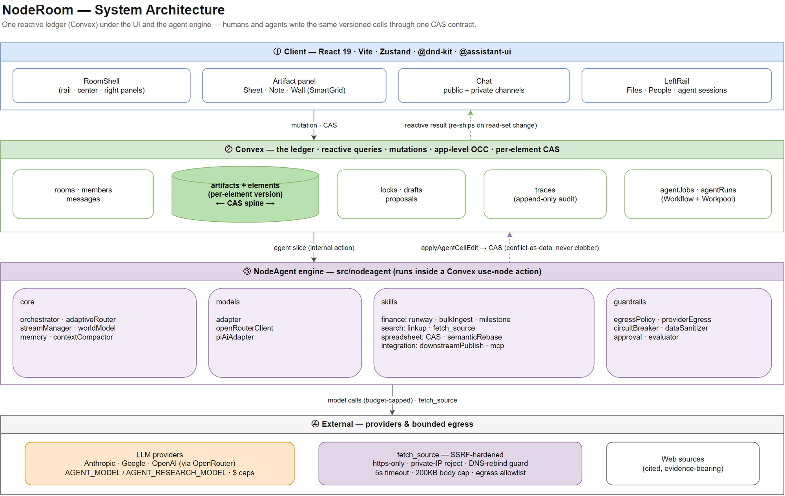
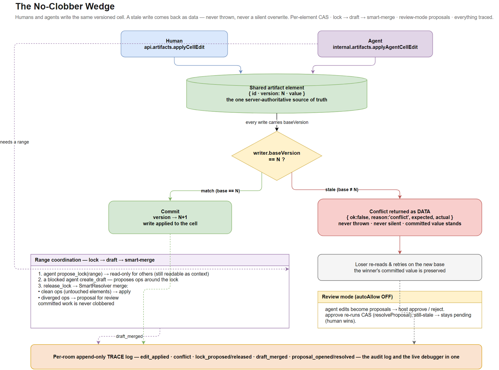
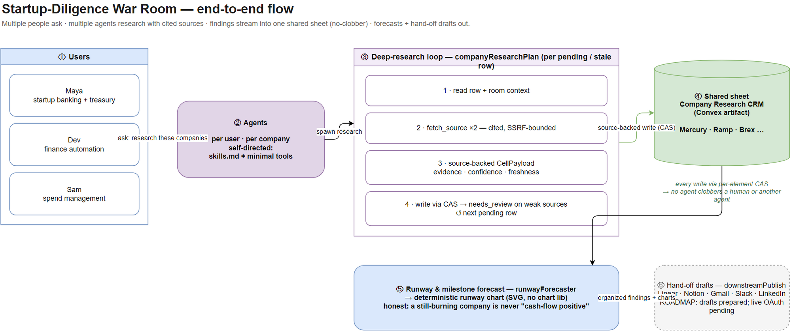

# NodeRoom — diagrams

Presentation visuals for NodeRoom. Each diagram ships three ways:

- **`.png`** — embed anywhere (renders on GitHub, slides, docs).
- **`.svg`** — scalable + editable (re-open in [diagrams.net](https://app.diagrams.net) — the XML is embedded).
- **`.drawio`** — the editable source.

Authored with the [drawio-skill](https://github.com/Agents365-ai/drawio-skill). To re-export after editing a `.drawio`, see [Regenerating](#regenerating).

---

## 1 · System architecture

One reactive ledger (Convex) sits under both the React UI and the NodeAgent engine — humans and agents write the **same versioned cells** through one CAS contract. Four tiers: Client → Convex ledger → NodeAgent engine (`core` / `models` / `skills` / `guardrails`) → external providers + SSRF-bounded `fetch_source`.



[SVG](./01-architecture.svg) · [editable source](./01-architecture.drawio)

---

## 2 · The no-clobber wedge

The headline mechanism. Humans and agents write the same element; a stale write comes back as **data** (`{ ok:false, reason:'conflict', … }`) — never thrown, never a silent overwrite. Per-element CAS, plus `lock → draft → smart-merge` for range coordination, review-mode proposals when `autoAllow` is off, and an append-only trace log.



[SVG](./02-no-clobber-wedge.svg) · [editable source](./02-no-clobber-wedge.drawio)

---

## 3 · Startup-diligence war room

The end-to-end demo arc: multiple people ask → multiple self-directed agents research with cited sources → findings stream into one shared sheet (no-clobber) → runway/milestone forecast → hand-off drafts out. The deep-research loop (`companyResearchPlan`) is the centerpiece.



[SVG](./03-diligence-war-room.svg) · [editable source](./03-diligence-war-room.drawio)

---

## Regenerating

The diagrams are authored as `.drawio` XML and exported with the draw.io desktop CLI (installed via `winget install JGraph.Draw`). On Windows the GUI binary returns immediately while exporting asynchronously, so use the **direct exe + absolute paths** and poll for the output file:

```bash
EXE="$LOCALAPPDATA/Microsoft/WinGet/Packages/JGraph.Draw_Microsoft.Winget.Source_8wekyb3d8bbwe/DrawIO.exe"
# scalable SVG (embeds editable XML)
"$EXE" -x -f svg -e -o docs/diagrams/01-architecture.svg docs/diagrams/01-architecture.drawio --no-sandbox --disable-gpu
# raster PNG preview (width-capped)
"$EXE" -x -f png --width 2000 -o docs/diagrams/01-architecture.png docs/diagrams/01-architecture.drawio --no-sandbox --disable-gpu
```

Lint a `.drawio` before exporting: `python ~/.claude/skills/drawio-skill/scripts/validate.py docs/diagrams/<name>.drawio`.
