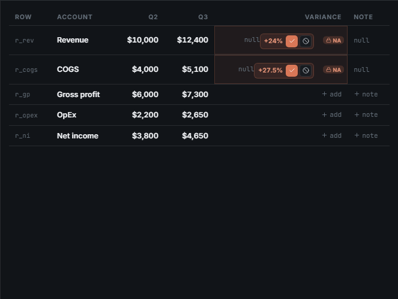
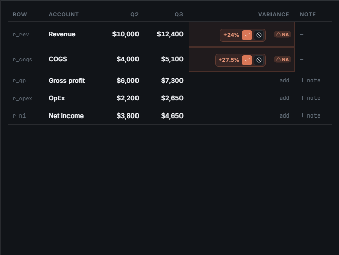
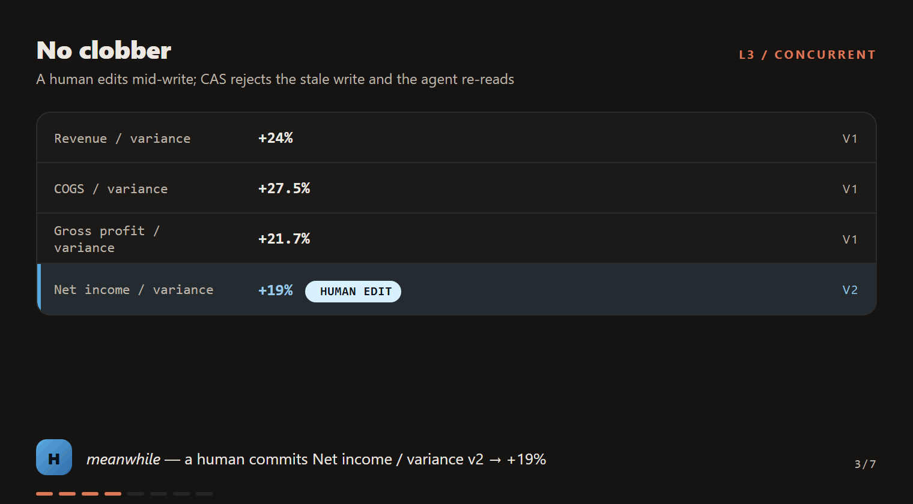
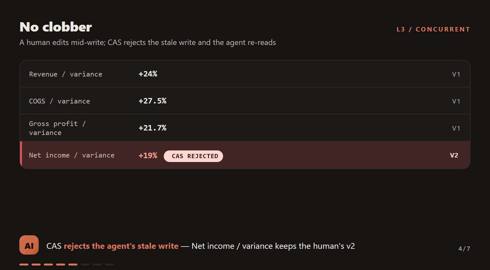

# How demo GIFs are judged — methodology, score guide, and evidence

Every demo GIF in this repo must pass a **gemini-3.5-flash vision judge** before it can be called
demo-ready. This page explains exactly what the scores mean, why a demo fails, and shows the
frames behind the verdicts — a number you can't interpret is a number you can't trust.

```bash
npm run qa:gif                       # judge every shipped GIF
npm run qa:gif -- finance-model-solve  # judge one
```

Verdicts persist to `docs/eval/gif-judge/<id>.json`. A FAIL exits 1 and blocks the
"demo ready" claim.

## What the judge actually sees (and why)

The judge **decodes the shipped `.gif` itself** — ImageMagick `-coalesce` reconstructs the
composed frames, `identify` reads the true per-frame display delays — then sends up to 12 sampled
frames *plus the real pacing* to gemini-3.5-flash with an adversarial rubric. It scores the exact
pixels and tempo a viewer gets, regardless of which pipeline produced the GIF.

Two design rules came from probing, not preference:

1. **Never send the `.gif` bytes directly to the model.** The Gemini API accepts `image/gif` but
   reads ONLY the first frame (probed live, 2026-06-11) — "judging" that way silently passes
   every animation defect.
2. **Judge the artifact, not the source.** Earlier versions judged pipeline-internal frames;
   decoding the shipped file means quantization artifacts, encoded delays, and producer bugs are
   all in scope.

## The five dimensions, in plain language

Each scores 0–10. **Pass bar: average ≥ 7 AND no dimension < 5.**

| Dimension | The question it answers | What a low score looks like |
|---|---|---|
| `readability` | Can you read every label, value, and badge at this size? | Gray-on-dark labels, 9px badges, clipped text |
| `pacing` | Given each frame's real display time, can a first-time viewer follow each change? | A formula flashed for 260ms; five seconds frozen on one state |
| `narrative_completeness` | Do the frames tell goal → actions → verified result? | A progress bar jumping 0%→100% with the actual work invisible |
| `visual_polish` | Alignment, spacing, contrast, nothing overlapping? | A lock badge drawn on top of the cell value |
| `honesty_no_artifacts` | Nothing misleading: no glitches, ghost frames, or UI claiming things that didn't happen | A status bar saying "writes F8" while the visible panel doesn't change |

**How to read the numbers:** the judge is prompted to be adversarial — it names the *worst*
problems it can find. In practice **7–8 is ship-quality**, **9+ is exceptional**, **5–6 means
specific named defects** (each verdict JSON lists them with frame numbers), and **< 5 is
structural** (the retired screenshot-slideshow previews scored 3.8–5.8: one played its narrative
backwards, another mixed frames from different recording sessions).

## Why you should trust this judge: it found real bugs

The first full sweep failed 7 of 15 GIFs — and the failures were genuine, not judge noise.
The two below were **shipped app bugs** no DOM test had caught:

**Literal `null` rendered in cells.** `EditableCell`'s disabled-empty branch rendered the word
"null" (every other empty cell in the codebase renders an em-dash). The judge flagged "+24%
badges rendered directly on top of 'null' text"; frame extraction confirmed it:

| Before (judge finding) | After (root fix) |
|---|---|
|  |  |

**Lock badges drawn over cell values.** `.lockbadge` was absolutely positioned at `right:6px`
over *right-aligned* text — guaranteed overlap on any locked cell with a value (visible in the
"before" image above). Locked/draft cells now reserve the badge's footprint.

## What the iteration loop built (evidence: the L3 conflict story)

`l3-no-clobber` — the demo of CAS rejecting a stale write — failed five judge rounds at 6.2–6.8.
Each round's critique drove a real change: the human's edit was indistinguishable from agent
actions → blue **H** actor chip + HUMAN EDIT pill; the conflict "came from nowhere" → a
three-beat sequence (agent attempts → human commits → CAS rejects); contrast and tempo tuned to
the judged midpoints. It now passes at 7.6:

| The human's commit arrives (blue, attributed) | CAS rejects the agent's stale write (red, explained) |
|---|---|
|  |  |

## Current scoreboard (2026-06-11, regenerate with `npm run qa:gif`)

| Demo | Avg | Read | Pace | Narrative | Polish | Honesty | Verdict |
|---|---|---|---|---|---|---|---|
| l6-long-horizon | 8.8 | 9 | 7 | 9 | 9 | 10 | PASS |
| l2-edit | 8.6 | 9 | 8 | 8 | 9 | 9 | PASS |
| l4-draft | 8.6 | 9 | 7 | 8 | 9 | 10 | PASS |
| app-proposals-review | 8.4 | 8 | 7 | 8 | 9 | 10 | PASS |
| app-wiki-note-grounding | 8.4 | 8 | 9 | 6 | 9 | 10 | PASS |
| app-ask-reconcile | 8.2 | 8 | 7 | 9 | 9 | 8 | PASS |
| app-research-enrich | 8.0 | 7 | 9 | 10 | 6 | 8 | PASS |
| app-variance-fill | 7.8 | 7 | 7 | 9 | 8 | 8 | PASS |
| finance-model-solve | 7.8 | 7 | 6 | 9 | 8 | 9 | PASS |
| l1-read | 7.8 | 8 | 9 | 7 | 8 | 7 | PASS |
| l3-no-clobber | 7.6 | 8 | 8 | 7 | 8 | 7 | PASS |
| l5-large-range | 7.2 | 9 | 6 | 5 | 9 | 7 | PASS |
| app-manual-edit | 6.2 | 6 | 7 | 6 | 5 | 7 | FAIL — re-recording |

**The one FAIL, explained:** `app-manual-edit` plateaued at 5.2–6.2 across five recordings. The
judge's cited issues are pacing/density critiques inherent to a tiny story — one cell's
edit→commit — where any held frame reads as dead air, plus the live activity ticker pulling
attention (`polish 5`: "the 'Priya joined' event abruptly disappears from the trace log"). It is
being re-recorded with tighter framing; its full frame-cited verdict, like every verdict, is in
`docs/eval/gif-judge/`.

## Known limits of the judge (read before chasing a score)

- **±0.4 variance between runs** on identical files — scores 6.6–7.0 are "at the bar", not
  meaningfully different. Never weaken the rubric or vote-shop to clear it (HONEST_SCORES).
- **It judges communication, not correctness.** A GIF can score 9 while showing a wrong formula —
  correctness is the eval harness's job (`docs/AGENT_EVAL.md`); the judge owns whether the demo
  *communicates honestly and legibly*.
- **Plateaus are real.** After ~3 rounds of oscillating critiques on the same GIF, the remaining
  gap is information density, not defects — document and move on.

## Related

- `scripts/judge-demo-gif.ts` — the judge (decode → sample → rubric → verdict)
- `e2e/capture-previews.spec.ts` — real-app recordings (frame dedupe, ≥900ms floor, demo pacing)
- `scripts/render-workflow-preview.ts` + `scripts/workflow-preview/` — trace-replayer previews
- `docs/AGENT_EVAL.md` — correctness evals (the other half of "is it good")
